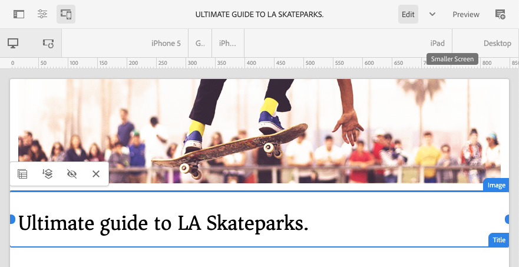

# Modifica del contenuto di una pagina con l’Editor pagina dell’AEM {#edit-content}

L’editor di pagine AEM è uno strumento utile per creare il contenuto di una pagina. Scopri come utilizzarlo per trascinare e rilasciare i contenuti e modificarli direttamente.

## Panoramica {#overview}

Nell’editor pagina puoi eseguire tre azioni di base per modificare il contenuto:

1. [Aggiunta di nuovi componenti](#adding-components) trascinandoli e rilasciandoli sulla pagina.
1. [Aggiunta di nuove risorse](#adding-asset) trascinandoli e rilasciandoli sulla pagina.
1. [Modifica diretta dei componenti](#edit-in-place) che esistono già nella pagina.

L’editor di pagine dell’AEM fornisce un’interfaccia utente intuitiva per eseguire queste attività, oltre a fornire accesso a funzioni più avanzate.

Inoltre, l’editor ti consente di organizzare il contenuto esistente nella pagina consentendo di:

* [Spostare i componenti](#moving-components)
* [Modifica layout componente](#editing-component-layout)
* [Modifica ereditarietà componente](#inherited-components)

## Aggiunta di componenti {#adding-components}

Puoi trascinare i nuovi componenti sulla pagina selezionandoli dalla sezione [browser componenti nel pannello laterale](/help/sites-cloud/authoring/page-editor/editor-side-panel.md#components-browser) e rilasciandole in un segnaposto di componente.

### Segnaposto Componente {#component-placeholder}

Il segnaposto del componente è un indicatore che mostra dove verrà posizionato un componente quando lo rilasci. Ha due apparizioni.

* Quando si aggiunge un nuovo componente alla pagina (trascinandolo dal browser dei componenti), questo viene visualizzato come una casella grigia con i dettagli del componente che si sta posizionando.

  

* Quando [spostamento di un componente esistente,](#movging-components) apparirà come un quadrato blu.

  

In entrambi i casi, la destinazione selezionata verrà visualizzata come un contorno blu sotto il componente che si sta trascinando. La destinazione se il componente viene posizionato al momento del rilascio.

### Aggiunta di un componente dal browser Componenti {#adding-a-component-from-the-components-browser}

Puoi aggiungere un nuovo componente utilizzando il [browser componenti](/help/sites-cloud/authoring/page-editor/editor-side-panel.md#components-browser). Il [segnaposto componente](#component-placeholder) mostra dove stai posizionando il componente.

1. Assicurati che l’editor di pagine sia in [**Modifica** modalità.](/help/sites-cloud/authoring/page-editor/introduction.md#mode-selector)
1. Apri [browser componenti.](/help/sites-cloud/authoring/page-editor/editor-side-panel.md#components-browser)
1. Trascina il componente richiesto su [posizione richiesta](#component-placeholder) e rilascio.
1. [Modifica](#edit-content) il componente appena posizionato.

>[!NOTE]
>
>Su un dispositivo mobile, il browser componenti occuperà l’intero schermo. Dopo aver iniziato a trascinare un componente, il browser si chiude per mostrare nuovamente la pagina per permetterti di posizionarlo.

### Aggiunta di un componente dal sistema paragrafo {#adding-a-component-from-the-paragraph-system}

È possibile aggiungere un nuovo componente utilizzando **Trascina qui i componenti** segnaposto del sistema paragrafo:

1. Assicurati che l’editor di pagine sia in [**Modifica** modalità.](/help/sites-cloud/authoring/page-editor/introduction.md#mode-selector)
1. Per selezionare e aggiungere un nuovo componente dal sistema paragrafo esistono due modi:

   * Seleziona l’opzione **Inserisci componente** (+) dalla barra degli strumenti di un componente esistente o dalla casella **Trascina qui i componenti**.

     

   * Se utilizzi un dispositivo desktop, puoi fare doppio clic sul pulsante **Trascina qui i componenti** casella.

1. Il **Inserisci nuovo componente** viene visualizzata una finestra di dialogo che consente di selezionare il componente richiesto. Tocca o fai clic sul componente da aggiungere.

   * Utilizza i filtri di ricerca per trovare il componente.
   * Per ulteriori informazioni sul componente, utilizza l’icona delle informazioni accanto ai nomi dei componenti.

   

1. Il componente selezionato viene aggiunto alla destinazione selezionata. Se necessario, [Modifica](#edit-content) il componente.

## Aggiunta di una risorsa {#adding-asset}

Puoi anche aggiungere un nuovo componente alla pagina trascinando una risorsa dal menu [browser risorse.](/help/sites-cloud/authoring/page-editor/editor-side-panel.md#assets-browser) Questo crea automaticamente un componente del tipo appropriato (e che contiene la risorsa).

Puoi configurare questo comportamento per l’installazione in uso. Consulta il documento [Guida di riferimento dei componenti](/help/implementing/developing/components/reference.md#component-placeholders) per ulteriori dettagli.

Per creare un componente trascinando uno dei tipi di risorsa indicati sopra:

1. Assicurati che la pagina sia in [**Modifica** modalità.](/help/sites-cloud/authoring/page-editor/introduction.md#mode-selector)
1. Apri il [browser Risorse](/help/sites-cloud/authoring/page-editor/editor-side-panel.md#assets-browser).
1. Trascina la risorsa richiesta nella posizione desiderata. Il [segnaposto componente](#component-placeholder) mostra dove è posizionato il componente, mentre viene visualizzata una destinazione in cui verrà inserito.
1. Rilascia la risorsa sul target. Nella posizione richiesta viene creato un componente appropriato per il tipo di risorsa, contenente la risorsa selezionata.
1. [Modifica](#edit-content) il componente, se necessario.

>[!NOTE]
>
>Su un dispositivo mobile, il browser Risorse occupa l’intero schermo. Quando inizi a trascinare una risorsa, il browser si chiuderà per mostrare nuovamente la pagina e permetterti di posizionarla.

Se sfogliando le risorse disponibili scopri che è necessario eseguire una rapida modifica a una risorsa, puoi avviare l’[editor risorse](/help/assets/manage-digital-assets.md) direttamente dal browser, facendo clic sull’icona di modifica accanto al nome della risorsa.

## Modifica diretta dei componenti {#edit-in-place}

Selezionando un componente si apre la barra degli strumenti del componente. Consente di accedere a varie azioni che possono essere eseguite sul componente.

Le azioni disponibili nella barra degli strumenti del componente sono appropriate per il componente selezionato. La visualizzazione dipende dal componente selezionato e potrebbe non essere descritta in questa sezione.

* **Modifica** consente di modificare il contenuto del componente, spesso sul posto. Il suo comportamento dipende dal componente.

  Pulsante 

* **Configura** consente di modificare alcuni parametri del componente non direttamente correlati al suo contenuto, normalmente in una finestra di dialogo. Il suo comportamento dipende dal componente.

  

* **Copia** copia il componente negli Appunti per incollarlo altrove. Il componente originale rimane invariato.

  

* **Taglia** copia il componente negli Appunti. Il componente originale viene rimosso.

  

* **Elimina** elimina il componente dalla pagina con la tua conferma.

  

* **Inserisci componente** apre la finestra di dialogo per [aggiungi un nuovo componente.](#adding-a-component-from-the-paragraph-system)

  

* **Incolla** incolla il componente dagli Appunti alla pagina. Se l’originale rimane, dipende dal fatto che sia stato utilizzato o meno **Copia** o **Taglia**.

   * È possibile utilizzare Incolla per collocare i componenti sulla stessa pagina o su una pagina diversa.
   * Se si incolla in un’altra pagina che era già aperta prima dell’operazione Taglia/Copia, per visualizzare il contenuto incollato è necessario aggiornare la pagina.
   * L’elemento viene incollato sopra l’elemento in cui selezioni l’azione Incolla.
   * L’azione Incolla viene mostrata solo se è presente contenuto negli Appunti.

  

* **Gruppo** consente di selezionare più componenti contemporaneamente. È possibile eseguire la stessa azione su un dispositivo desktop tramite **Ctrl+clic** o **Comando+clic**.

  

* **Elemento padre** seleziona il componente principale del componente selezionato.

  

* **Layout** consente di modificare [layout](#editing-component-layout) del componente selezionato.

   * Ciò vale solo per il componente selezionato e non attiva la [Modalità di layout](/help/sites-cloud/authoring/page-editor/introduction.md#mode-selector) per l’intera pagina.

  

* **Converti in variante di frammento di esperienza** consente di creare un’ [frammento esperienza](/help/sites-cloud/authoring/fragments/content-fragments.md) dal componente selezionato o aggiungilo a un frammento di esperienza esistente.

  

### Finestra di dialogo di modifica del componente   {#component-edit-dialog}

Alcuni componenti offrono opzioni di modifica aggiuntive rispetto a quelle disponibili direttamente. Puoi aprire la finestra di dialogo per modifica di un componente nella sezione [Icona Modifica (matita) della barra degli strumenti del componente](#component-toolbar) per accedere alle opzioni di configurazione aggiuntive.

Le opzioni di modifica effettive dipendono dal componente. Per alcuni componenti [alcune azioni saranno disponibili solo in modalità a schermo intero](#edit-content-full-screen-mode). Esempio:

* Componente testo

  

* Componente immagine

  

### Modifica componenti in modalità a tutto schermo {#edit-content-full-screen-mode}

Molti componenti offrono una modalità a schermo intero per la modifica accessibile con questo pulsante.

La modifica a schermo intero consente di visualizzare più opzioni di modifica rispetto all’editor locale, ad esempio per il componente Immagine.

Utilizza il **Riduci a icona** per attivare la modalità a schermo intero.

## Spostamento dei componenti {#moving-components}

Per spostare un componente:

1. Seleziona il componente da spostare tenendo premuto o facendo clic.
1. Trascina il componente nella nuova posizione.

   * L’editor pagina indica la posizione del componente con un [segnaposto](#component-placeholder) e dove il paragrafo può essere eliminato con una destinazione.

   

1. Rilascialo nella posizione desiderata.

>[!TIP]
>
>Per spostare un componente puoi anche utilizzare [Taglia e Incolla](#component-toolbar).

## Modifica del layout dei componenti {#editing-component-layout}

Invece di passare più volte dalla modalità di modifica alla [modalità di layout](/help/sites-cloud/authoring/page-editor/responsive-layout.md) per regolare le impostazioni di un componente, è possibile selezionare l’azione **Layout**. Questo permette di modificare rapidamente il layout di quello specifico componente, senza uscire dalla modalità di modifica.

1. In **Modifica** nella console sites, seleziona un componente per visualizzarne la barra degli strumenti.

1. Seleziona la **Layout** per regolare il layout del componente.

   

1. Una volta selezionata l’azione Layout, puoi modificare il layout del componente come faresti in [modalità di layout.](/help/sites-cloud/authoring/page-editor/responsive-layout.md#defining-layouts-layout-mode)

   * Vengono visualizzate le maniglie di ridimensionamento del componente.
   * La barra degli strumenti dell’emulatore viene visualizzata nella parte superiore dello schermo.
   * La barra degli strumenti del componente presenta le azioni di layout al posto delle azioni di modifica standard.

   

1. Dopo aver apportato le modifiche necessarie, tocca o fai clic sul pulsante **Chiudi** nel menu Azioni del componente per interrompere la modifica del layout del componente e la barra degli strumenti del componente torna al suo normale stato di modifica.

   

>[!TIP]
>
>L’azione Layout è limitata al componente selezionato. Ad esempio, se stai modificando il layout di un componente e fai clic su un altro componente, per il componente appena selezionato viene visualizzata la barra degli strumenti di modifica standard (non la barra degli strumenti di layout), mentre le maniglie di ridimensionamento e la barra degli strumenti dell’emulatore scompaiono.
>
>Se devi modificare il layout globale della pagina, che iinteresserà più componenti, passa alla [modalità di layout](/help/sites-cloud/authoring/page-editor/responsive-layout.md).

## Modifica dell’ereditarietà dei componenti {#inherited-components}

L’ereditarietà è il meccanismo in cui il contenuto può essere collegato in modo che la modifica di un elemento cambia automaticamente l’altro. I componenti ereditati possono essere il risultato di vari scenari, tra cui:

* [Gestione multisito](/help/sites-cloud/administering/msm/overview.md)
* [Lanci](/help/sites-cloud/authoring/launches/overview.md)

Puoi annullare e riabilitare l’ereditarietà. A seconda del componente, queste opzioni sono disponibili dalla barra degli strumenti del componente, se il componente fa parte di una Live Copy o di un lancio.

* **Annulla ereditarietà**

  

* **Riabilita ereditarietà** se l’ereditarietà è già annullata

  

* **Rollout** è disponibile anche nel blueprint o nella sorgente Live Copy

  
