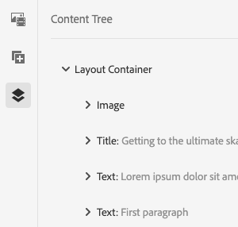

# Pannello laterale dell’Editor pagina {#side-panel}

Scopri come utilizzare il pannello laterale nell’editor di siti AEM per aggiungere componenti e risorse alla pagina.

## Modalità pannello laterale {#modes}

Il pannello laterale è sempre accessibile nell’editor di pagine toccando o facendo clic sul pulsante **Attiva/Disattiva pannello laterale** nella barra degli strumenti dell’editor pagina.

Quando apri il pannello laterale, questo si apre scorrendo dal lato sinistro e puoi quindi selezionare tra tre schede importanti:

* [Browser Componenti](#components-browser) per aggiungere nuovi contenuti alla pagina
* [Browser risorse](#assets-browser) per aggiungere nuove risorse alla pagina
* [Struttura contenuto](#content-tree) per sfogliare la struttura della pagina

## Browser Componenti   {#components-browser}

[Componenti](/help/implementing/developing/components/overview.md) sono i blocchi predefiniti utilizzati per creare contenuti con l’editor di pagine AEM. Posiziona più componenti in una pagina e configurane le opzioni per creare la pagina di contenuto.

Il browser Componenti mostra tutti componenti disponibili per la pagina corrente. Questi possono essere trascinati nella posizione appropriata, quindi modificati per aggiungere il contenuto.

Tocca o fai clic su **Componenti** nel pannello laterale per accedere al **Componenti** browser.

L&#39;aspetto e la gestione effettivi dipendono dal tipo di dispositivo in uso.

### Dispositivo mobile {#mobile-device-components-browser}

Quando si apre il browser Componenti su un dispositivo mobile, copre completamente la pagina in fase di modifica.

Per aggiungere un componente alla pagina, selezionalo e trascinalo verso destra. Il browser Componenti si chiude per mostrare nuovamente la pagina, dove puoi posizionare il componente.

>[!NOTE]
>
>Un dispositivo mobile viene rilevato quando la larghezza è inferiore a 1024 px.

### Dispositivo desktop {#desktop-device-components-browser}

Quando si apre il browser Componenti su un dispositivo desktop, questo viene visualizzato sul lato sinistro della finestra.

Per aggiungere un componente alla pagina, fai clic sul componente richiesto e trascinalo nella posizione desiderata.

### Utilizzo del browser Componenti {#using-component-browser}

Componenti in **Componenti** browser sono rappresentati da:

* Nome componente
* Gruppo di componenti (in grigio)
* Icona o abbreviazione
   * Le icone dei componenti standard sono monocromatiche.
   * Le abbreviazioni sono sempre i primi due caratteri del nome del componente.

Dalla barra degli strumenti nella parte superiore del browser **Componenti**, puoi effettuare le seguenti operazioni:

* Filtrare i componenti per nome
* Limita la visualizzazione a uno specifico gruppo selezionandolo dall’elenco a discesa.

Per una descrizione più dettagliata del componente, puoi selezionare l’icona delle informazioni accanto al componente nella **Componenti** browser (se disponibile). Ad esempio, per il **frammento di contenuto**:

Per informazioni più dettagliate sui componenti disponibili, vedi [Console Componenti.](/help/sites-cloud/authoring/components-console.md)

## Browser Risorse {#assets-browser}

Il **Risorse** il browser mostra tutto [risorse](/help/assets/overview.md) disponibili per l&#39;utilizzo nella pagina corrente.

Tocca o fai clic su **Risorse** per sfogliare le risorse.

Lo scorrimento infinito viene utilizzato per espandere l’elenco delle risorse in base alle esigenze durante lo scorrimento.

L’aspetto e la gestione effettivi dipendono dal tipo di dispositivo in uso:

### Dispositivo mobile {#mobile-device-assets-browser}

Quando si apre il browser Risorse su un dispositivo mobile, viene visualizzata completamente la pagina che si sta modificando.

Per aggiungere una risorsa alla pagina, seleziona e trascina la risorsa desiderata, quindi spostala verso destra. Il browser Risorse si chiude per mostrare nuovamente la pagina, dove puoi aggiungere la risorsa al componente richiesto.

>[!NOTE]
>
>Un dispositivo mobile viene rilevato quando la larghezza è inferiore a 1024 px.

### Dispositivo desktop {#desktop-device-assets-browser}

Quando si apre il browser Risorse su un dispositivo desktop, questo si apre sul lato sinistro della finestra.

Per aggiungere una risorsa alla pagina, selezionala e trascinala sul componente o sulla posizione desiderata.

### Utilizzo del browser Risorse {#using-assets-browser}

Per aggiungere una risorsa alla pagina, selezionala e trascinala nella posizione desiderata. Può trattarsi di:

* un componente esistente del tipo appropriato.
   * Ad esempio, puoi trascinare una risorsa di tipo immagine su un componente Immagine.
* A [segnaposto](/help/sites-cloud/authoring/page-editor/edit-content.md#component-placeholder) nel sistema paragrafo per creare un componente del tipo appropriato.
   * Ad esempio, puoi trascinare una risorsa di tipo immagine nel sistema paragrafo per creare un componente Immagine.

>[!NOTE]
>
>Il trascinamento e l’eliminazione delle risorse è disponibile per risorse e tipi di componenti specifici. Consulta [Inserimento di un componente tramite il browser Risorse](/help/sites-cloud/authoring/page-editor/edit-content.md#adding-a-component-from) per ulteriori dettagli.

Dalla barra degli strumenti nella parte superiore del browser Risorse puoi filtrare le risorse in base a:

* Nome
* Percorso
* Tipo di risorsa come: immagini, video, documenti, paragrafi, frammenti di contenuto e frammenti esperienza
* Caratteristiche della risorsa, ad esempio orientamento e stile
   * Disponibile solo per alcuni tipi di risorse

Se devi apportare rapidamente una modifica a una risorsa, puoi avviare [l’editor risorse](/help/assets/manage-digital-assets.md) direttamente dal browser Risorse facendo clic sull&#39;icona Modifica accanto al nome della risorsa.

## Struttura contenuto {#content-tree}

Il **Struttura contenuto** offre una panoramica di tutti i componenti della pagina in una gerarchia, per consentirti di visualizzare rapidamente come viene composta la pagina.

>[!NOTE]
>
>La struttura del contenuto non è disponibile quando si modifica una pagina su un dispositivo mobile (se la larghezza del browser è inferiore a 1024 px).

Tocca o fai clic su **Struttura contenuto** per accedere alla struttura del contenuto.

Una volta aperta è possibile visualizzare una struttura ad albero della pagina o del modello, che permette di capire come il contenuto è strutturato gerarchicamente. Inoltre, in una pagina complessa, consente di spostarsi più facilmente tra i componenti della pagina.

Poiché una pagina può essere composta da molti componenti dello stesso tipo, la struttura del contenuto visualizza un testo descrittivo (in grigio) dopo il nome del tipo di componente (in nero). Il testo descrittivo proviene da proprietà comuni del componente, ad esempio titolo o testo.

I tipi di componente vengono mostrati nella lingua dell’utente, mentre il testo della descrizione del componente proviene dalla lingua della pagina.

Fai clic sulla freccia accanto a un componente per comprimere o espandere quel livello.

Facendo clic sul componente, questo verrà evidenziato nell’editor pagina. Le azioni disponibili dipendono dallo stato della pagina. Ad esempio:

## Una pagina di base {#basic-page}

I componenti di una pagina di base avranno le consuete opzioni.

Se il componente su cui fai clic nella struttura ad albero è modificabile, a destra del nome compare un’icona a forma di chiave inglese. Facendo clic su questa icona si avvia la finestra di dialogo di modifica del componente.

### Una Live Copy {#live-copy}

Una pagina che fa parte di un [live copy](/help/sites-cloud/administering/msm/overview.md), in cui i componenti vengono ereditati da un’altra pagina, avrà opzioni diverse.

## Browser Contenuto associato {#associated-content-browser}

Se la pagina contiene frammenti di contenuto, puoi anche accedere a [browser per Contenuto associato.](/help/sites-cloud/authoring/fragments/content-fragments.md#using-associated-content)
