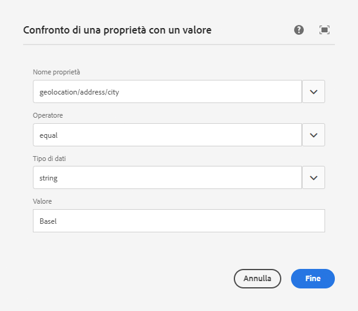

# Configurazione della segmentazione con ContextHub{#configuring-segmentation-with-contexthub}

La segmentazione è un concetto chiave per la creazione di una campagna. Per informazioni sul funzionamento della segmentazione e sui termini chiave, vedere [Informazioni sulla segmentazione](segmentation.md).

A seconda delle informazioni già raccolte sui visitatori del sito e degli obiettivi da raggiungere, dovrete definire i segmenti e le strategie necessari per il contenuto di destinazione.

Questi segmenti vengono quindi utilizzati per fornire a un visitatore contenuto con targeting specifico. [Le ](activities.md) attività qui definite possono essere incluse in qualsiasi pagina e definire per quale segmento di visitatori si applica il contenuto specializzato.

AEM consente di personalizzare facilmente le esperienze degli utenti. Consente inoltre di verificare i risultati delle definizioni dei segmenti.

## Accesso ai segmenti {#accessing-segments}

La console [Audiences](audiences.md) viene utilizzata per gestire i segmenti per ContextHub e le audience per l&#39;account Adobe Target . Questa documentazione descrive la gestione dei segmenti per ContextHub.

Per accedere ai tuoi segmenti, nella navigazione globale seleziona **Navigazione > Personalizzazione > Audiences**.


## Editor segmento {#segment-editor}

<!--The **Segment Editor** allows you to easily modify a segment. To edit a segment, select a segment in the [list of segments](/help/sites-administering/segmentation.md#accessing-segments) and click the **Edit** button.-->
L&#39; **Editor segmento** consente di modificare facilmente un segmento. Per modificare un segmento, selezionate un segmento nell&#39;elenco dei segmenti e fate clic sul pulsante **Modifica**.


Utilizzando il browser Componenti è possibile aggiungere contenitori **AND** e **OR** per definire la logica del segmento, quindi aggiungere componenti aggiuntivi per confrontare proprietà e valori o script di riferimento e altri segmenti per definire i criteri di selezione (vedere [Creazione di un nuovo segmento](#creating-a-new-segment)) per definire lo scenario esatto per la selezione del segmento.

Quando l&#39;intera istruzione restituisce true, il segmento ha risolto. Se sono applicabili più segmenti, viene utilizzato anche il fattore **Incrementa**. Per informazioni dettagliate sul fattore di incremento, vedere [Creazione di un nuovo segmento](#creating-a-new-segment).

>[!CAUTION]
>
>L&#39;editor segmenti non verifica la presenza di riferimenti circolari. Ad esempio, il segmento A fa riferimento a un altro segmento B, che a sua volta fa riferimento al segmento A. Devi accertarti che i tuoi segmenti non contengano riferimenti circolari.

### Contenitori {#containers}

I seguenti contenitori sono disponibili out-of-the-box e consentono di raggruppare confronti e riferimenti per la valutazione booleana. È possibile trascinarli dal Browser componenti all’editor. Per ulteriori informazioni, vedere la sezione [Utilizzo di AND e OR Containers](#using-and-and-or-containers).

|  |  |
|---|---|
| Contenitore E | Operatore AND booleano |
| Contenitore O | Operatore OR booleano |

### Confronti {#comparisons}

Per valutare le proprietà del segmento sono disponibili i seguenti confronti out-of-the-box. È possibile trascinarli dal Browser componenti all’editor.

|  |  |
|---|---|
| Property-Value | Confronta una proprietà di uno store con un valore definito |
| Property-Property | Confronta una proprietà di uno store con un&#39;altra proprietà |
| Riferimento segmento proprietà | Confronta una proprietà di uno store con un altro segmento di riferimento |
| Riferimento script di proprietà | Confronta una proprietà di uno store con i risultati di uno script |
| Riferimento segmento-Riferimento script | Confronta un segmento di riferimento con i risultati di uno script |

>[!NOTE]
>
>Quando si confrontano i valori, se il tipo di dati del confronto non è impostato (ovvero impostato su auto detection), il motore di segmentazione di ContextHub confronterà semplicemente i valori come farebbe javascript. Non riporta i valori ai tipi previsti, il che può portare a risultati fuorvianti. Esempio:
>
>`null < 30 // will return true`
>
>Pertanto, durante la creazione di un segmento [è necessario selezionare un **tipo di dati** ogni volta che i tipi di valori confrontati sono noti. ](#creating-a-new-segment) Esempio:
>
>Quando si confronta la proprietà `profile/age`, è già noto che il tipo confrontato sarà **number**, quindi anche se `profile/age` non è impostato, un confronto `profile/age` inferiore a 30 restituirà **false**, come previsto.

### Riferimenti {#references}

I seguenti riferimenti sono disponibili out-of-the-box per il collegamento diretto a uno script o a un altro segmento. È possibile trascinarli dal Browser componenti all’editor.

|  |  |
|---|---|
| Riferimento segmento | Valutazione del segmento a cui si fa riferimento |
| Riferimento script | Valutare lo script di riferimento. Per ulteriori informazioni, vedere la sezione [Utilizzo di riferimenti di script](#using-script-references). |

## Creazione di un nuovo segmento {#creating-a-new-segment}

Per definire il nuovo segmento:

1. Dopo [l&#39;accesso ai segmenti](#accessing-segments), [passare alla cartella](#organizing-segments) in cui si desidera creare il segmento o lasciarlo nella directory principale.

1. Toccate o fate clic sul pulsante **Crea** e selezionate **Crea segmento ContextHub**.

   

1. In **Nuovo segmento ContextHub**, immettete un titolo per il segmento e un valore di incremento, se necessario, quindi toccate o fate clic su **Crea**.

   

   Ogni segmento ha un parametro di incremento che viene utilizzato come fattore di ponderazione. Un numero più alto indica che il segmento sarà selezionato in preferenza rispetto a un segmento con un numero inferiore nelle istanze in cui più segmenti sono validi.

   * Valore minimo: `0`
   * Valore massimo: `1000000`

1. Dalla console dei segmenti, modifica il segmento appena creato per aprirlo nell’editor segmenti.
1. Trascina un confronto o un riferimento all’editor segmenti che verrà visualizzato nel contenitore AND predefinito.
1. Tocca o fai doppio clic sull&#39;opzione di configurazione del nuovo riferimento o segmento per modificare i parametri specifici. In questo esempio, stiamo provando persone a Basilea.

   

   Impostate sempre un **Tipo di dati**, se possibile, per garantire che i confronti vengano valutati correttamente. Per ulteriori informazioni, vedere [Confronti](#comparisons).

1. Fare clic su **Fine** per salvare la definizione:
1. Aggiungi altri componenti in base alle esigenze. È possibile formulare espressioni booleane utilizzando i componenti contenitore per confronti AND e OR (vedere [Utilizzo di AND e OR Containers](#using-and-and-or-containers) di seguito). Con l&#39;editor segmenti è possibile eliminare i componenti non più necessari o trascinarli in nuove posizioni all&#39;interno dell&#39;istruzione.

### Utilizzo di AND e OR Containers {#using-and-and-or-containers}

I componenti AND e OR del contenitore consentono di creare segmenti complessi in AEM. A tal fine, è importante essere consapevoli di alcuni punti fondamentali:

* Il livello principale della definizione è sempre il contenitore AND creato inizialmente. Questo non può essere modificato, ma non ha un effetto sul resto della definizione del segmento.
* Verificare che la nidificazione del contenitore abbia senso. I contenitori possono essere visualizzati come parentesi dell&#39;espressione booleana.

L’esempio seguente è utilizzato per selezionare i visitatori che sono considerati nel nostro gruppo di destinazione svizzero:

```text
 People in Basel

 OR

 People in Zürich
```

Per iniziare, posizionate un componente contenitore OR all’interno del contenitore AND predefinito. All&#39;interno del contenitore OR è possibile aggiungere la proprietà o i componenti di riferimento.


Potete nidificare più operatori AND e OR come necessario.

### Utilizzo dei riferimenti di script {#using-script-references}

Utilizzando il componente Riferimento script, la valutazione di una proprietà del segmento può essere delegata a uno script esterno. Una volta configurato correttamente, lo script può essere utilizzato come qualsiasi altro componente di una condizione di segmento.

#### Definizione di uno script come riferimento {#defining-a-script-to-reference}

1. Aggiungi file a `contexthub.segment-engine.scripts` clientlib.
1. Implementare una funzione che restituisce un valore. Esempio:

   ```javascript
   ContextHub.console.log(ContextHub.Shared.timestamp(), '[loading] contexthub.segment-engine.scripts - script.profile-info.js');
   
   (function() {
       'use strict';
   
       /**
        * Sample script returning profile information. Returns user info if data is available, false otherwise.
        *
        * @returns {Boolean}
        */
       var getProfileInfo = function() {
           /* let the SegmentEngine know when script should be re-run */
           this.dependOn(ContextHub.SegmentEngine.Property('profile/age'));
           this.dependOn(ContextHub.SegmentEngine.Property('profile/givenName'));
   
           /* variables */
           var name = ContextHub.get('profile/givenName');
           var age = ContextHub.get('profile/age');
   
           return name === 'Joe' && age === 123;
       };
   
       /* register function */
       ContextHub.SegmentEngine.ScriptManager.register('getProfileInfo', getProfileInfo);
   
   })();
   ```

1. Registra lo script con `ContextHub.SegmentEngine.ScriptManager.register`.

Se lo script dipende da proprietà aggiuntive, lo script deve chiamare `this.dependOn()`. Ad esempio, se lo script dipende da `profile/age`:

```javascript
this.dependOn(ContextHub.SegmentEngine.Property('profile/age'));
```

#### Riferimento a uno script {#referencing-a-script}

1. Crea segmento ContextHub.
1. Aggiungete il componente **Riferimento script** nella posizione desiderata del segmento.
1. Aprire la finestra di dialogo di modifica del componente **Riferimento script**. Se [è configurato correttamente](#defining-a-script-to-reference), lo script deve essere disponibile nel menu a discesa **Nome script**.

## Organizzazione dei segmenti {#organizing-segments}

Se hai molti segmenti, possono diventare difficili da gestire come elenco semplice. In questi casi, può essere utile creare cartelle per gestire i segmenti.

### Creare una nuova cartella {#create-folder}

1. Dopo [l&#39;accesso ai segmenti](#accessing-segments), fare clic o toccare il pulsante **Crea** e selezionare **Cartella**.

   

1. Specificare un **Titolo** e un **Nome** per la cartella.
   * Il **Titolo** deve essere descrittivo.
   * Il **Nome** diventerà il nome del nodo nella directory archivio.
      * Verrà generato automaticamente in base al titolo e verrà modificato in base alle convenzioni di denominazione [AEM.](/help/implementing/developing/introduction/naming-conventions.md)
      * Può essere regolato se necessario.

   

1. Tocca o fai clic su **Crea**.

   

1. La cartella verrà visualizzata nell&#39;elenco dei segmenti.
   * La modalità di ordinamento delle colonne influisce sulla posizione nell’elenco della nuova cartella.
   * Potete toccare o fare clic sulle intestazioni di colonna per regolare l’ordinamento.
      

### Modifica cartelle esistenti {#modify-folders}

1. Dopo [l&#39;accesso ai segmenti](#accessing-segments), tocca o fai clic sulla cartella che desideri modificare per selezionarla.

   

1. Toccate o fate clic su **Rinomina** nella barra degli strumenti per rinominare la cartella.

1. Immetti un nuovo **Titolo cartella** e tocca o fai clic su **Salva**.

   

>[!NOTE]
>
>Quando si rinominano le cartelle, è possibile modificare solo il titolo. Impossibile modificare il nome.

### Eliminare una cartella

1. Dopo [l&#39;accesso ai segmenti](#accessing-segments), tocca o fai clic sulla cartella che desideri modificare per selezionarla.

   

1. Toccate o fate clic su **Elimina** nella barra degli strumenti per eliminare la cartella.

1. Viene visualizzata una finestra di dialogo con un elenco di cartelle selezionate per l’eliminazione.

   

   * Toccate o fate clic su **Elimina** per confermare.
   * Toccate o fate clic su **Annulla** per interrompere.

1. Se una delle cartelle selezionate contiene sottocartelle o segmenti, l’eliminazione deve essere confermata.

   

   * Toccate o fate clic su **Forza eliminazione** per confermare.
   * Toccate o fate clic su **Annulla** per interrompere.

>[!NOTE]
>
> Non è possibile spostare un segmento da una cartella all’altra.

## Verifica dell&#39;applicazione di un segmento {#testing-the-application-of-a-segment}

Una volta definito il segmento, è possibile testare i potenziali risultati con l&#39;aiuto di **[ContextHub](contexthub.md).**

1. Anteprima di una pagina
1. Fate clic sull’icona ContextHub per visualizzare la barra degli strumenti ContextHub
1. Selezionare una persona che corrisponda al segmento creato
1. ContextHub risolverà i segmenti applicabili alla persona selezionata

Ad esempio, la nostra definizione di segmento semplice per identificare gli utenti in Basilea è basata sulla posizione dell’utente. Quando si carica una persona specifica che soddisfa tali criteri, viene visualizzato se il segmento è stato risolto correttamente:


Oppure, se non è stato risolto:


>[!NOTE]
>
>Tutte le caratteristiche vengono risolte immediatamente, anche se la maggior parte delle modifiche apportate al ricaricamento della pagina.

Tali test possono essere eseguiti anche sulle pagine di contenuto e in combinazione con contenuti mirati e relative **Attività** e **Esperienze**.

Se avete impostato un&#39;attività e un&#39;esperienza, potete facilmente verificare il segmento con l&#39;attività. Per informazioni dettagliate sulla configurazione di un&#39;attività, consultate la relativa [documentazione sull&#39;authoring di contenuto di destinazione](targeted-content.md).

1. In modalità di modifica di una pagina in cui sono stati impostati contenuti mirati, potete vedere che il contenuto è indirizzato tramite l&#39;icona a forma di freccia sul contenuto.
1. Passate alla modalità di anteprima e utilizzate il context hub, passate a una persona che non corrisponde alla segmentazione configurata per l&#39;esperienza.
1. Passate a una persona che non corrisponde alla segmentazione configurata per l&#39;esperienza e verificate che l&#39;esperienza cambia di conseguenza.

## Utilizzo del segmento {#using-your-segment}

I segmenti vengono utilizzati per controllare il contenuto effettivo visualizzato da audience target specifiche. Per ulteriori informazioni sui tipi di pubblico e i segmenti e sull&#39;[Creazione di contenuti mirati](targeted-content.md) sull&#39;utilizzo di tipi di pubblico e segmenti per il targeting dei contenuti, vedere [Gestione dell&#39;audience](audiences.md).
