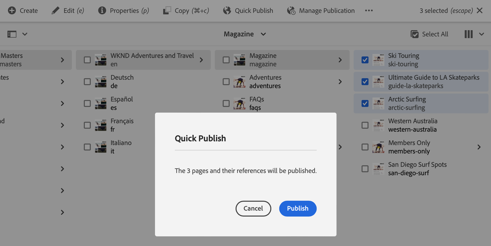

# Guida rapida all’authoring {#quick-guide-to-authoring}

Inizia qui per una guida rapida di alto livello per iniziare a creare contenuti utilizzando **Sites** console.

>[!TIP]
>
>Questa guida rapida si concentra sull’authoring di Sites, tuttavia la maggior parte dei concetti sono ampiamente applicabili ad altre console.

## Tutto inizia nella console Sites. {#sites-console}

Per creare nuovi contenuti o visualizzare e gestire quelli esistenti, la panoramica centrale è la **Sites** console.

Quando accedi per la prima volta all’AEM, arrivi alla schermata di navigazione globale. Tocca o fai clic su **Sites** per aprire **Sites** console.

Per accedere alla navigazione globale da qualsiasi altra posizione in AEM, tocca o fai clic sul pulsante **Adobe Experience Manager** in alto a sinistra in qualsiasi schermata AEM, che apre una sovrapposizione a discesa della navigazione globale.

Una volta nella **Sites** , il contenuto è semplice da navigare ed è presentato in una vista a colonne per impostazione predefinita.

## Viste {#views}

Per impostazione predefinita, il **Sites** la console si apre in **Colonna** visualizzazione. Ogni livello di gerarchia viene visualizzato come una colonna che si presta bene a contenuti organizzati gerarchicamente in base al web.

Tocca o fai clic su una voce in una colonna per selezionarla o aprire il livello successivo nella gerarchia. Un elemento selezionato è indicato con un segno di spunta.

Sono disponibili due visualizzazioni aggiuntive:

* **Vista a schede** - Questa vista presenta ogni voce come una scheda facilmente manipolabile, rendendo le opzioni aggiuntive facilmente accessibili.
* **Vista a elenco** - Presenta un singolo livello di gerarchia come un singolo elenco, fornendo maggiori dettagli sui singoli elementi.

Utilizza il commutatore di visualizzazione in alto a sinistra dello schermo per passare da una visualizzazione all’altra. In questo documento viene utilizzata la visualizzazione colonne predefinita.

## Navigazione nel contenuto {#navigating}

**Vista a colonne** presenta il contenuto come una serie di colonne a cascata. Se si seleziona un elemento nella colonna corrente, i relativi dettagli vengono visualizzati nella colonna successiva a destra, se si tratta di un documento, oppure nel contenuto del livello gerarchico successivo, se si tratta di una cartella.

In questo modo puoi scorrere la struttura del contenuto verso l’alto o verso il basso.

Per passare rapidamente da un livello all’altro, puoi utilizzare le breadcrumb nella parte superiore della pagina.

In qualsiasi momento puoi anche utilizzare l’icona di ricerca in alto a destra dello schermo per individuare un contenuto particolare.

La ricerca viene visualizzata come sovrapposizione a discesa sull’intera console. Immetti i termini di ricerca per trovare il contenuto.

## Creazione di contenuti {#creating}

Per creare una nuova pagina, passa alla posizione in cui desideri che si trovi nella gerarchia dei contenuti e quindi tocca o fai clic sul pulsante **Crea** nella barra degli strumenti.

Le opzioni disponibili dipendono dal contesto. Se ti trovi nella directory principale della struttura del contenuto, puoi creare un sito completamente nuovo. In caso contrario, puoi creare nuove pagine o altri contenuti correlati alla pagina.

A seconda di ciò che selezioni per creare, la procedura guidata appropriata inizierà a guidarti attraverso il processo di creazione.

## Modifica contenuto {#editing}

Per modificare una pagina, tocca o fai clic su per selezionarla nella **Sites** console. Quindi, nella barra degli strumenti visualizzata, tocca o fai clic sul pulsante **Modifica** icona.

Verrà aperta la pagina nell’editor appropriato per il contenuto.

Se desideri semplicemente aggiornare le proprietà di una pagina, ad esempio i tag o il nome, puoi toccare o fare clic sul pulsante **Proprietà** nella barra degli strumenti.

## Organizzazione dei contenuti {#organizing}

Per spostare o copiare una pagina, selezionala nella console, quindi nella barra degli strumenti tocca o fai clic su **Sposta** o **Copia**. Viene avviata una procedura guidata che illustra i passaggi necessari per spostare o copiare la pagina, definendo il nome e la posizione della pagina risultante.

## Pubblicazione del contenuto {#publishing}

Una volta apportate le modifiche desiderate al contenuto, utilizzando **Sites** console, puoi pubblicare il contenuto. Seleziona il contenuto da pubblicare e tocca o fai clic sul pulsante **Pubblicazione rapida** nella barra degli strumenti.

Conferma la pubblicazione toccando o facendo clic su **Pubblica** nella finestra di dialogo.

## Risorse aggiuntive {#additional-resources}

Questa è solo una breve introduzione alla potenza dell’authoring dei contenuti di Sites e come tale non copre ogni argomento o opzione.

Di seguito sono riportate alcune altre risorse che approfondiscono tutte le funzioni della console e trattano argomenti relativi all’authoring dei contenuti in generale.

* [Operazioni di base](/help/sites-cloud/authoring/basic-handling.md)
* [Concetti di authoring](/help/sites-cloud/authoring/author-publish.md)
* [Console Sites](/help/sites-cloud/authoring/sites-console/introduction.md)
* [Editor pagina](/help/sites-cloud/authoring/page-editor/introduction.md)
* [Pubblicazione delle pagine](/help/sites-cloud/authoring/sites-console/publishing-pages.md)
