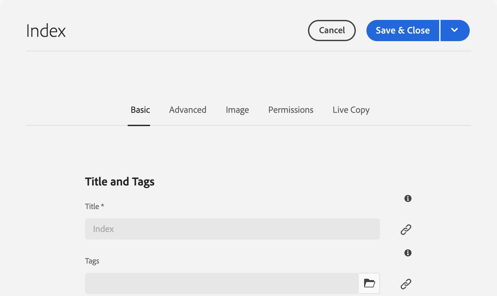

# Modifica delle proprietà di una pagina {#page-properties}

Scopri come modificare [le proprietà di una pagina](/help/sites-cloud/authoring/sites-console/page-properties.md) e il comportamento della pagina e come viene gestita.

>[!TIP]
>
>Per informazioni dettagliate sulle singole proprietà di pagina disponibili, vedere il documento [Proprietà pagina.](/help/sites-cloud/authoring/sites-console/page-properties.md)

## Dove modificare le proprietà della pagina {#where}

È possibile modificare le proprietà di pagina da diverse posizioni in AEM.

* [Dalla sezione ](#from-the-sites-console)
* [Dall’Editor pagina](#from-the-page-editor)
* [Dall’editor universale](#from-the-universal-editor)

Utilizzando la console Sites è inoltre possibile [modificare le proprietà di più pagine contemporaneamente.](#editing-multiple-pages)

### Dalla console Sites {#from-the-sites-console}

Quando esplori il contenuto nella console **Sites**, puoi utilizzare il pulsante **Proprietà** nella barra degli strumenti per modificare le proprietà della pagina:

1. Utilizzando la console [**Sites**,](/help/sites-cloud/authoring/sites-console/introduction.md) passa alla posizione della pagina per la quale desideri visualizzare e modificare le proprietà.
1. Seleziona l’opzione **Proprietà** per la pagina desiderata, utilizzando:
   * [Azioni rapide](/help/sites-cloud/authoring/basic-handling.md#quick-actions)
   * [Modalità di selezione](/help/sites-cloud/authoring/basic-handling.md#selecting-resources)
   * Le proprietà di pagina vengono visualizzate utilizzando le relative schede.
1. Visualizza o modifica le proprietà a seconda delle esigenze.
1. Quindi, seleziona **Salva** per salvare le modifiche e **Chiudi** per tornare alla console.

### Dall’Editor pagina {#from-the-page-editor}

Quando modifichi una pagina utilizzando l&#39;Editor pagina, puoi utilizzare **Informazioni pagina** per definire le proprietà della pagina:

1. Nell&#39;[Editor pagine](/help/sites-cloud/authoring/page-editor/introduction.md), apri la pagina per la quale desideri modificare le proprietà.
1. Seleziona l’icona **Informazioni pagina** per aprire il menu di selezione.
1. Seleziona **Apri proprietà** e viene visualizzata una finestra di dialogo che consente di modificare le proprietà, ordinate in base alla scheda appropriata. A destra della barra degli strumenti sono disponibili i seguenti pulsanti:
   * **Annulla**
   * **Salva e chiudi**
1. Usa il pulsante **Salva e chiudi** per salvare le modifiche.

## Dall’editor universale {#from-the-universal-editor}

Quando modifichi una pagina utilizzando l&#39;Editor universale, puoi utilizzare l&#39;icona **Proprietà pagina** per modificare le proprietà:

1. In [Universal Editor](/help/sites-cloud/authoring/universal-editor/authoring.md#page-properties), aprire la pagina per la quale si desidera modificare le proprietà.
1. Seleziona l&#39;icona **Proprietà pagina** nella barra degli strumenti.
1. La finestra delle proprietà di pagina di AEM si apre in una nuova scheda del browser come se si modificassero le proprietà di pagina dall&#39;[Editor pagina.](#from-the-page-editor) A destra della barra degli strumenti sono disponibili i seguenti pulsanti:
   * **Annulla**
   * **Salva e chiudi**
1. Usa il pulsante **Salva e chiudi** per salvare le modifiche.
1. Torna alla scheda del browser di Universal Editor.

## Modifica delle proprietà di più pagine {#editing-multiple-pages}

Dalla console [**Sites**](/help/sites-cloud/authoring/sites-console/introduction.md) è possibile selezionare più pagine e quindi utilizzare **Visualizza proprietà** per visualizzare e/o modificare le proprietà della pagina. Questa operazione è definita modifica in serie delle proprietà della pagina.

Puoi selezionare più pagine per la modifica in serie utilizzando diversi metodi, tra i quali:

* Quando esplori la console **Sites**
* Dopo l’utilizzo di **Ricerca** per individuare un set di pagine

Dopo aver selezionato le pagine e aver toccato o fatto clic sull&#39;opzione **Proprietà**, vengono visualizzate le proprietà collettive:

Puoi eseguire la modifica in serie solo su pagine che:

* condividono lo stesso tipo di risorsa;
* Non fanno parte di una Live Copy
   * Se una delle pagine selezionate fa parte di una Live Copy, all’apertura delle proprietà viene visualizzato un messaggio.

La finestra di modifica in serie è divisa in due parti verticalmente:

* Il lato sinistro contiene un elenco delle pagine selezionate per la modifica in serie.

   * Puoi selezionare/deselezionare le pagine in base alle esigenze.
   * Per impostazione predefinita, sono selezionati tutti.

* A destra è riportato un elenco di [proprietà disponibili per la modifica in serie.](/help/implementing/developing/extending/bulk-editor.md)

   * Come per la visualizzazione delle proprietà di una singola pagina, le proprietà sono ordinate in schede.
   * Puoi vedere le proprietà che sono disponibili su tutte le pagine selezionate e che sono state esplicitamente definite come disponibili per la modifica in serie.
   * Se la tua selezione include una sola pagina, tutte le proprietà sono visibili.
   * Vengono visualizzate solo le proprietà con un valore comune.
   * Se il campo ha più valori (ad esempio Tag), questi verranno visualizzati solo se *tutti* sono comuni. Se solo alcune sono comuni, verranno visualizzate solo durante la modifica.

* I campi in comune ma con valori diversi nelle varie pagine sono contraddistinti da uno speciale valore, ad esempio il testo `<Mixed Entries>`.

Puoi aggiornare i valori nei campi disponibili nelle pagine selezionate. I nuovi valori vengono applicati a tutte le pagine selezionate quando si seleziona **Fine**. Quando il campo ha più valori (ad esempio Tag), puoi aggiungere un nuovo valore o rimuovere un valore comune.

## Ereditarietà proprietà {#inheritance}

Se la pagina è basata su una blueprint o in altro modo eredita il contenuto da un&#39;altra pagina, l&#39;ereditarietà si riflette nella finestra **Proprietà pagina** per il singolo campo.

Impossibile modificare le proprietà ereditate. Tocca o fai clic sull&#39;icona **Annulla ereditarietà** accanto a un determinato campo per interromperne l&#39;ereditarietà.

Conferma l&#39;annullamento nel modale **Annulla ereditarietà**.

Una volta annullata l’ereditarietà di un campo, questo diventa modificabile.

Per ripristinare l&#39;ereditarietà, tocca o fai clic sull&#39;icona **Ripristina ereditarietà** accanto al campo.

Conferma la reversione nel modale **Ripristina ereditarietà**.

Seleziona **Sincronizza pagina dopo aver ripristinato l&#39;ereditarietà** per aggiornare il campo con i valori più recenti nella blueprint. In caso contrario, i valori verranno aggiornati alla successiva sincronizzazione della Live Copy.

>[!TIP]
>
>Per ulteriori informazioni sull&#39;ereditarietà, vedere il documento [Gestione multisito e traduzione](/help/sites-cloud/administering/msm-and-translation.md)
