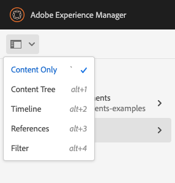

# Console Sites {#sites-console}

Scopri come utilizzare la console **Sites** per gestire e organizzare le pagine di AEM.

## Orientamento {#orientation}

La console **Sites** ti consente di visualizzare la gerarchia delle pagine.

Offre diverse visualizzazioni e barre degli strumenti per facilitare la gestione e l’organizzazione delle pagine.

* [La barra degli strumenti della console](#toolbar) è sempre presente per facilitare la navigazione.
* [Tre visualizzazioni diverse](#views) ti consentono di individuare e selezionare facilmente la pagina.
* [La barra degli strumenti delle azioni](#action-toolbar) viene visualizzata quando si seleziona un elemento per intervenire su di esso.
* [Il pannello laterale](#side-panel) dispone di più opzioni per visualizzare informazioni dettagliate su una pagina selezionata.

## Barra degli strumenti della console {#console-toolbar}

La barra degli strumenti della console è sempre presente nella console e consente di orientarsi nel contenuto e di navigare all’interno dello stesso.

### Selettore pannello laterale {#side-panel-selector}

Il selettore del pannello laterale ti consente di visualizzare ulteriori informazioni sull’elemento selezionato nella console.

Le opzioni visualizzate dipendono dalla console corrente. Ad esempio, in **Sites** puoi selezionare solo il contenuto (opzione predefinita), la timeline, i riferimenti o il pannello laterale del filtro.

Per ulteriori informazioni sul pannello laterale, vedere [Pannello laterale console Sites](/help/sites-cloud/authoring/sites-console/console-side-panel.md).

### Breadcrumb {#breadcrumbs}

Situate al centro della barra, le breadcrumb mostrano sempre la descrizione dell’elemento attualmente selezionato e consentono di navigare tra i livelli del sito web.

Tocca o fai clic sul testo della breadcrumb per visualizzare un elenco a discesa dei livelli della gerarchia dell’elemento attualmente selezionato. Tocca o fai clic su una voce per passare a tale posizione.

### Seleziona tutto {#select-all}

Toccando o facendo clic sul pulsante **Seleziona tutto** vengono selezionati tutti gli elementi nella visualizzazione corrente della console.

Dopo aver selezionato tutti gli elementi, il conteggio degli elementi selezionati viene visualizzato in alto a destra nella barra degli strumenti, dove è visualizzato il pulsante **Seleziona tutto**.

Per deselezionare tutti gli elementi e uscire dalla modalità di selezione, puoi fare una delle seguenti operazioni:

* Tocca o fai clic su **X** accanto al conteggio.
* Utilizzo della chiave **escape**.

### Pulsante Crea {#create-button}

Il pulsante **Crea** ti consente di aggiungere nuove pagine al sito e di creare ulteriori oggetti Sites, ad esempio Live Copy o Launches.

Dopo aver fatto clic su, le opzioni visualizzate sono appropriate per la console o il contesto. I più comuni sono:

* [Pagina](/help/sites-cloud/authoring/sites-console/creating-pages.md)
* [Sito](/help/sites-cloud/administering/site-creation/create-site.md)
* [Live Copy ](/help/sites-cloud/administering/msm/overview.md)
* [Lancio](/help/sites-cloud/authoring/launches/overview.md)
* [Copia per lingua](/help/sites-cloud/administering/translation/overview.md)
* [Rapporto CSV](/help/sites-cloud/authoring/sites-console/csv-export.md)

Consulta i collegamenti a queste funzioni per informazioni dettagliate sul loro funzionamento.

## Visualizzazioni e selezione delle pagine {#views}

La console **Sites** offre tre diverse visualizzazioni della gerarchia dei contenuti. Puoi visualizzare, navigare e selezionare (per ulteriori azioni) le risorse con una qualsiasi delle viste disponibili.

* [Vista a colonne](#column-view)
* [Vista a schede](#card-view)
* [Vista a elenco ](#list-view)

L&#39;icona **Visualizza** all&#39;estrema destra della barra degli strumenti di AEM indica la visualizzazione corrente selezionata.

Toccando o facendo clic su di essa è possibile selezionare una vista diversa.

Puoi alternare tra le viste a colonne, a schede e a elenco. La vista a elenco mostra anche le impostazioni di visualizzazione.

>[!NOTE]
>
>L’opzione **Impostazioni vista** è disponibile solo in modalità **Vista a elenco**.

In tutte le viste la visualizzazione, la navigazione e la selezione funzionano allo stesso modo, ma con lievi variazioni a seconda della vista attiva.

>[!NOTE]
>
>Per impostazione predefinita, AEM Assets non visualizza le rappresentazioni originali delle risorse nell’interfaccia utente come miniature in nessuna delle viste. Se sei un amministratore, puoi utilizzare le sovrapposizioni per configurare AEM Assets in modo da visualizzare le rappresentazioni originali come miniature.

### Selezionare le risorse  {#selecting-resources}

La selezione di una specifica risorsa dipende dalla combinazione della vista e del dispositivo utilizzati:

| Visualizzazione | Seleziona Touch | Seleziona Desktop | Deseleziona Touch | Deseleziona Desktop |
|---|---|---|---|---|
| Colonna | Seleziona la miniatura | Fai clic sulla miniatura | Seleziona la miniatura | Fai clic sulla miniatura |
| Scheda | Seleziona e tieni premuto sulla scheda | Passa il puntatore del mouse, quindi utilizza l’azione rapida con il segno di spunta | Seleziona la scheda | Fai clic sulla scheda |
| Elenco | Seleziona la miniatura | Fai clic sulla miniatura | Seleziona la miniatura | Fai clic sulla miniatura |

#### Esempio di selezione {#selecting-example}

1. Ad esempio, nella vista a schede:

   

1. Dopo la selezione di una risorsa, l’intestazione superiore è coperta dalla [barra delle azioni](#actions-toolbar), che permette di accedere alle azioni applicabili alla risorsa selezionata.

1. Per uscire dalla modalità di selezione, seleziona la **X** in alto a destra oppure premi **Esc**.

### Vista a colonne {#column-view}

La vista a colonne consente la navigazione visiva di una struttura del contenuto attraverso una serie di colonne a cascata. Questa visualizzazione consente di visualizzare e scorrere la struttura ad albero del sito web.

Quando si seleziona una risorsa nella prima colonna a sinistra, vengono visualizzate le risorse secondarie in una colonna a destra. Quando si seleziona una risorsa nella colonna a destra, vengono visualizzate le risorse secondarie in un’altra colonna a destra, e così via.

* Per spostarti verso l’alto o il basso nella struttura ad albero, tocca o fai clic sul nome della risorsa o sulla freccia a destra del nome.

   * Il nome della risorsa e la freccia vengono evidenziati quando tocchi o fai clic su tali elementi.
   * Gli elementi secondari della risorsa che hai toccato o su cui hai fatto clic vengono visualizzati nella colonna a destra di tale risorsa.
   * Se selezioni un nome di risorsa senza elementi secondari, i relativi dettagli vengono visualizzati nella colonna finale.

* Quando tocchi o fai clic sulla miniatura, la risorsa viene selezionata.

   * Quando una risorsa è selezionata, sulla miniatura compare un segno di spunta e il nome della risorsa viene evidenziato.
   * I dettagli della risorsa selezionata sono visualizzati nella colonna finale.
   * La barra degli strumenti delle azioni diventa disponibile.

* Quando una pagina viene selezionata nella vista a colonne, viene visualizzata nella colonna finale con i seguenti dettagli:

   * Titolo pagina
   * Nome pagina (parte dell’URL della pagina)
   * Modello su cui si basa la pagina
   * Dettagli di modifica
   * Lingua della pagina
   * Dettagli di pubblicazione e anteprima

### Vista a schede {#card-view}

Nella vista a schede, ogni elemento al livello corrente nella gerarchia viene visualizzato come una scheda di grandi dimensioni.

* Le schede forniscono informazioni quali:

   * Una rappresentazione visiva del contenuto della pagina.
   * Titolo della pagina.
   * Date importanti (ad esempio ultima modifica, ultima pubblicazione).
   * Se la pagina è bloccata, nascosta o fa parte di una Live Copy.
   * Indica se è necessario agire sull’elemento come parte di un flusso di lavoro.

La vista a schede offre anche [azioni rapide](#quick-actions) per elementi quali la selezione e azioni comuni come la modifica.

Per spostarti verso il basso nella struttura, tocca o fai clic sulle schede (facendo attenzione a non toccare le azioni rapide); per tornare verso l&#39;alto utilizza le [breadcrumb nell&#39;intestazione](#the-header).

### Vista a elenco {#list-view}

La vista Elenco fornisce informazioni per ogni risorsa al livello corrente di un elenco.

* Per spostarti verso il basso nella struttura, tocca o fai clic sul nome delle risorse; per tornare verso l’alto utilizza le [breadcrumb nell’intestazione](#the-header).
* Per selezionare facilmente tutti gli elementi nell&#39;elenco, utilizzare la casella di controllo [**Seleziona tutto** nella barra degli strumenti](#select-all).

* Per seleziona le colonne da visualizzare utilizza l’opzione **Impostazioni vista** sotto il pulsante Viste. È possibile visualizzare le colonne seguenti:

   * **Nome**: nome della pagina, utile in un ambiente di authoring multilingue poiché fa parte dell’URL della pagina e non viene modificato indipendentemente dalla lingua
   * **Modificato**: data dell’ultima modifica e dell’utente che l’ha eseguita
   * **Pubblicato**: stato della pubblicazione
   * **Anteprima**: stato anteprima
   * **Modello**: modello su cui si basa la pagina
   * **Operazione**
   * **Flusso di lavoro**: flusso di lavoro attualmente applicato alla pagina. Ulteriori informazioni sono disponibili quando passate il mouse o aprite la timeline.
   * **Tradotto**
   * **Visualizzazioni pagina**
   * **Visitatori univoci**
   * **Ora a pagina**

Per impostazione predefinita, la colonna **Nome** è visualizzata e costituisce una porzione dell’URL della pagina. In alcuni casi, l’autore potrebbe dover accedere a pagine in una lingua diversa; poiché il nome della pagina di solito non cambia, può essere di grande aiuto se si tratta di una lingua che l’autore non conosce.

* Cambia l’ordine degli elementi utilizzando la barra verticale punteggiata all’estrema destra di ciascun elemento dell’elenco.

Selezionare la barra di selezione verticale e trascinare l&#39;elemento in una nuova posizione nell&#39;elenco.

>[!NOTE]
>
>La modifica dell’ordine funziona solo all’interno di una cartella ordinata il cui valore `jcr:primaryType` è impostato su `sling:OrderedFolder`.

## Barra delle azioni  {#actions-toolbar}

Ogni volta che viene selezionata una risorsa, è possibile eseguire varie azioni sull&#39;elemento selezionato. Queste azioni vengono visualizzate nella barra delle azioni.

La barra delle azioni viene visualizzata solo quando una risorsa è selezionata nella console. L’azione disponibile nella barra degli strumenti delle azioni cambia per riflettere le azioni che puoi eseguire sugli elementi specifici selezionati. Le azioni più comuni sono:

* [**Crea**](#create-action) - Crea nuovo contenuto o azioni relative al contenuto
* **Modifica** - A seconda di come è stata creata la pagina selezionata, l&#39;azione **Modifica** aprirà l&#39;editor appropriato.
   * [Editor pagina](/help/sites-cloud/authoring/page-editor/introduction.md) - Per le pagine create con l&#39;Editor pagina di AEM
   * [Editor universale](/help/sites-cloud/authoring/universal-editor/authoring.md) - Per le pagine create con l&#39;editor universale
* [**Proprietà**](/help/sites-cloud/authoring/sites-console/edit-page-properties.md) - Apre la finestra delle proprietà della pagina
* [**Blocca**](/help/sites-cloud/authoring/sites-console/managing-pages.md#locking-a-page) - Blocca una pagina per impedire ad altri utenti di modificarla
* [**Copia**](/help/sites-cloud/authoring/sites-console/managing-pages.md#copying-and-pasting-a-page) - Copia una pagina
* [**Sposta**](/help/sites-cloud/authoring/sites-console/managing-pages.md#moving-or-renaming-a-page) - Sposta o rinomina una pagina
* [**Pubblicazione rapida**](/help/sites-cloud/authoring/sites-console/publishing-pages.md#quick-publish) - Pubblicazione immediata di una o più pagine
* [**Gestisci pubblicazione**](/help/sites-cloud/authoring/sites-console/publishing-pages.md#manage-publication) - Pianifica una o più pagine per la pubblicazione
* [**Ripristina**](/help/sites-cloud/authoring/sites-console/page-versions.md#restore-version) - Ripristina una versione di una pagina o di un albero di pagine
* [**Elimina**](/help/sites-cloud/authoring/sites-console/managing-pages.md#deleting-a-page) - Elimina una o più pagine

A causa del poco spazio disponibile in alcune finestre, la barra può facilmente superare lo spazio a disposizione. In questo caso compaiono altre opzioni. Toccando o facendo clic sui puntini di sospensione (i tre punti o **...**) si apre un selettore a discesa contenente tutte le azioni che non rientrano nella barra.

### Crea azione {#create-action}

L&#39;azione Crea offre opzioni simili al pulsante [**Crea** della barra degli strumenti](#create-button) per la creazione di nuove pagine ed elementi simili.

Inoltre, consente di creare azioni relative alla pagina.

* [**Flusso di lavoro**](/help/sites-cloud/authoring/workflows/overview.md) - Applica un flusso di lavoro a una pagina
* [**Versione**](/help/sites-cloud/authoring/sites-console/page-versions.md) - Crea una versione di una pagina

## Modelli

Puoi vedere facilmente su quale modello si basa la pagina quando la selezioni in [**Vista a colonne**](/help/sites-cloud/authoring/basic-handling.md#column-view) o [**Vista a elenco**](/help/sites-cloud/authoring/basic-handling.md#list-view).

## Assistente AI in AEM

Per i clienti che hanno [completato i criteri dei prerequisiti](/help/implementing/cloud-manager/ai-assistant-in-aem.md#get-access), l&#39;Assistente per l&#39;intelligenza artificiale in AEM è disponibile per gli utenti della loro organizzazione. Consulta [Assistente AI in AEM](/help/implementing/cloud-manager/ai-assistant-in-aem.md).

