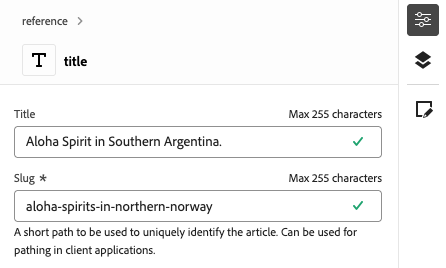
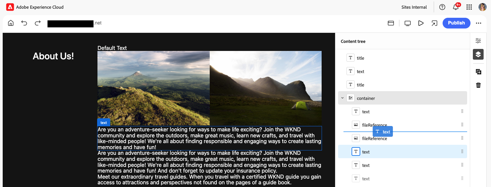

# Authoring dei contenuti con l’editor universale {#authoring}

Scopri quanto è semplice e intuitivo per gli autori di contenuti creare contenuti utilizzando l’editor universale.

## Introduzione {#introduction}

Universal Editor consente di modificare qualsiasi aspetto di qualsiasi contenuto in qualsiasi implementazione, in modo da offrire esperienze eccezionali e velocizzare la realizzazione dei contenuti.

A questo scopo, l’editor universale offre agli autori di contenuti un’interfaccia utente intuitiva che richiede una formazione minima per poter entrare e iniziare a modificare i contenuti. Questo documento descrive l’esperienza di authoring dell’editor universale.

>[!NOTE]
>
>In questo documento si presuppone che tu abbia già familiarità con le modalità di accesso e navigazione all’Editor universale. In caso contrario, vedere [Accesso e navigazione nell&#39;editor universale](/help/sites-cloud/authoring/universal-editor/navigation.md).

>[!TIP]
>
>Per un&#39;introduzione più dettagliata all&#39;editor universale, vedere [Introduzione all&#39;editor universale](/help/implementing/universal-editor/introduction.md).

## Modifica del contenuto {#editing-content}

La modifica del contenuto è semplice e intuitiva. Quando passi il mouse sul contenuto nell’editor, il contenuto modificabile viene evidenziato con un sottile contorno blu.

>[!TIP]
>
>Per impostazione predefinita, tocca o fai clic sul contenuto per selezionarlo per la modifica. Se desideri esplorare il contenuto tramite i seguenti collegamenti, passa alla [modalità anteprima](/help/sites-cloud/authoring/universal-editor/navigation.md#preview-mode).

A seconda del contenuto selezionato, è possibile che siano disponibili diverse opzioni di modifica diretta e che siano disponibili ulteriori informazioni e opzioni per il contenuto nel [pannello delle proprietà](/help/sites-cloud/authoring/universal-editor/navigation.md#properties-rail).

### Modifica del testo normale {#edit-plain-text}

Per modificare il testo nella posizione desiderata, fai doppio clic o tocca due volte il componente.

Il contorno blu sottile si trasforma in un contorno blu pesante per indicare la selezione e viene visualizzato un cursore. Apportare le modifiche e premere Invio/Ritorna o selezionare all&#39;esterno della casella di testo per salvare le modifiche.

Quando selezioni il componente testo, i relativi dettagli vengono visualizzati nel [pannello delle proprietà](/help/sites-cloud/authoring/universal-editor/navigation.md#properties-rail). Potete anche modificare il testo nel pannello.

Inoltre, i dettagli sul testo sono disponibili nel pannello delle proprietà. Le modifiche vengono salvate automaticamente quando lo stato attivo lascia il campo modificato nel pannello delle proprietà.

### Modifica del testo formattato {#edit-rich-text}

Per modificare il testo nella posizione desiderata, fai doppio clic o tocca due volte il componente.

Per comodità, le opzioni di formattazione e i dettagli del testo sono disponibili in due posizioni.

#### Menu di scelta rapida {#context-menu}

Il menu di scelta rapida si apre sopra il blocco di testo RTF e offre opzioni di formattazione di base nel contesto. A causa di limiti di spazio, alcune opzioni potrebbero essere nascoste dietro il pulsante con i puntini di sospensione.

Le modifiche vengono salvate automaticamente quando lo stato attivo lascia il campo modificato.

#### Pannello Proprietà {#properties-rail}

Nel [pannello delle proprietà](/help/sites-cloud/authoring/universal-editor/navigation.md#properties-rail) viene visualizzato un elemento per il testo selezionato. Tocca la voce per aprire una finestra di dialogo che presenta un’area di lavoro più grande per modificare il testo.

Tocca o fai clic rispettivamente su **Annulla** o **Fine** per ignorare o salvare le modifiche.

#### Opzioni di formattazione RTF {#formatting-options}

L’editor Rich Text di Universal Editor consente all’autore di applicare la formattazione di testo standard. Per impostazione predefinita, sono disponibili le seguenti opzioni.

* Paragrafo (h1, h2, h3, ecc.)
* Grassetto
* Corsivo
* Sottolineato
* Apice
* Pedice
* Elenco puntato
* Elenco numerato
* Collegamento

L’editor Rich Text può essere configurato in modo da nascondere le opzioni o mostrare opzioni aggiuntive a seconda delle esigenze degli autori. Per ulteriori informazioni, vedere il documento [Configurazione dell&#39;editor Rich Text per Universal Editor](/help/implementing/universal-editor/configure-rte.md).

### Editing di file multimediali {#edit-media}

Puoi visualizzarne i dettagli nel [pannello delle proprietà](/help/sites-cloud/authoring/universal-editor/navigation.md#properties-rail).

1. Tocca o fai clic sull’anteprima dell’immagine selezionata nel pannello proprietà.
1. Viene visualizzata la finestra [selettore risorse](/help/assets/overview-asset-selector.md#using-asset-selector) che consente di selezionare una risorsa.
1. Seleziona per selezionare una nuova risorsa.
1. Seleziona **Seleziona** per tornare al pannello delle proprietà in cui è stata sostituita la risorsa.

Le modifiche vengono salvate automaticamente nel contenuto.

### Modificare i frammenti di contenuto {#edit-content-fragment}

Se selezioni un [frammento di contenuto](/help/sites-cloud/administering/content-fragments/overview.md), puoi modificarne i dettagli nel [pannello delle proprietà](/help/sites-cloud/authoring/universal-editor/navigation.md#properties-rail).

I campi definiti nel modello di contenuto del frammento di contenuto selezionato vengono visualizzati e modificabili nel pannello delle proprietà.

Se selezioni un campo correlato a un frammento di contenuto, il frammento di contenuto viene caricato nel pannello dei componenti e il campo viene scorruto automaticamente in.

Le modifiche vengono salvate automaticamente quando lo stato attivo lascia il campo modificato nel pannello delle proprietà.

Se invece desideri modificare il frammento di contenuto nell&#39;[Editor frammento di contenuto](/help/sites-cloud/administering/content-fragments/authoring.md), tocca o fai clic sul pulsante [**Apri nell&#39;editor CF**](/help/sites-cloud/authoring/universal-editor/navigation.md#edit) nel pannello delle proprietà.

>[!TIP]
>
>Utilizzare il tasto di scelta rapida `e` per modificare il frammento di contenuto selezionato nell&#39;editor frammenti di contenuto.

A seconda delle esigenze del flusso di lavoro, può essere utile modificare il frammento di contenuto nell’editor universale o direttamente nell’editor frammento di contenuto.

>[!NOTE]
>
>L’editor universale [convalida i campi dei frammenti di contenuto in base ai relativi modelli](/help/assets/content-fragments/content-fragments-models.md#validation), consentendo di applicare regole di integrità dei dati, ad esempio i pattern delle espressioni regolari e i vincoli di univocità.
>
>In questo modo, il contenuto soddisfa i requisiti aziendali specifici prima della pubblicazione.

### Aggiunta di componenti ai contenitori {#adding-components}

1. Selezionare un componente contenitore nella [struttura contenuto](/help/sites-cloud/authoring/universal-editor/navigation.md#content-tree-mode) o nell&#39;editor.

   

1. Quindi selezionate l&#39;icona Aggiungi nel pannello delle proprietà.

   

1. Se per il contenitore sono consentiti più componenti, seleziona quello che desideri inserire dal menu a discesa. Se è consentito un solo componente, questo viene inserito automaticamente.

Il componente viene inserito nel contenitore e può essere modificato nell’editor.

>[!TIP]
>
>Utilizzare il tasto di scelta rapida `a` per aggiungere un componente al contenitore selezionato.

### Duplicazione di componenti nei contenitori {#duplicating-components}

1. Selezionare un componente in un contenitore utilizzando la [struttura contenuto](/help/sites-cloud/authoring/universal-editor/navigation.md#content-tree-mode) o l&#39;editor.
1. Quindi seleziona l&#39;icona **Duplica** nel pannello delle proprietà.

   
1. Il componente viene duplicato e inserito sotto il componente selezionato.

Il componente viene inserito nel contenitore e può essere modificato nell’editor.

### Eliminazione di componenti dai contenitori {#deleting-components}

1. Selezionare un componente contenitore nella [struttura contenuto](/help/sites-cloud/authoring/universal-editor/navigation.md#content-tree-mode) o nell&#39;editor.
1. Seleziona l’icona della freccia del contenitore per espanderne il contenuto nella struttura del contenuto.
1. Quindi, nella struttura del contenuto, seleziona un componente all’interno del contenitore.
1. Selezionate l&#39;icona Elimina nel pannello delle proprietà.

   

Il componente selezionato è stato eliminato.

>[!TIP]
>
>Utilizzare il tasto di scelta rapida `Shift+Backspace` per eliminare il componente selezionato dal relativo contenitore.

### Riordinamento dei componenti {#reordering-components}

1. Se non è già in [modalità struttura contenuto](/help/sites-cloud/authoring/universal-editor/navigation.md#content-tree-mode), passare a tale modalità.
1. Seleziona un componente contenitore nella struttura del contenuto o nell’editor.
1. Seleziona l’icona della freccia del contenitore per espanderne il contenuto nella struttura del contenuto.
1. Trascina le icone delle maniglie accanto ai componenti all’interno del contenitore per mostrare che puoi riorganizzarli. Trascina i componenti per riordinarli all’interno del contenitore.

   

1. Il componente trascinato è disattivato nella struttura del contenuto, mentre il punto di inserimento è rappresentato da una linea blu. Rilasciate il componente per posizionarlo nella nuova posizione.

I componenti vengono riordinati sia nella struttura del contenuto che nell’editor.

>[!NOTE]
>
>I componenti possono essere spostati tra contenitori solo se il filtro [componente](/help/implementing/universal-editor/filtering.md) dei contenitori di destinazione consente il componente selezionato.

### Annulla e Ripristina {#undo-redo}

Selezionare i pulsanti Annulla o Ripristina per annullare o ripristinare l&#39;ultima modifica nell&#39;editor.

* Annullamento e ripristino possono essere eseguiti per modifiche apportate nel contesto, effettuate tramite il pannello Proprietà, nonché aggiunta, duplicazione, spostamento ed eliminazione di blocchi.
* Le operazioni Annulla e Ripristina sono limitate alla sessione corrente del browser.

>[!TIP]
>
>Utilizzare il tasto di scelta rapida `Command-Z` o `Shift-Command-Z` rispettivamente per annullare o ripetere l&#39;operazione.

### Copiare e incollare {#copy-paste}

È possibile copiare e incollare i componenti che si trovano all&#39;interno di [ contenitori.](/help/implementing/universal-editor/field-types.md#container) Questo è possibile solo se il contenitore di destinazione non ha [filtri configurati](/help/implementing/universal-editor/filtering.md) o ha filtri che consentono di incollare il componente.

Copiare e incollare possono essere nella stessa scheda del browser o tra schede del browser, a condizione che le schede siano già aperte. Non è possibile copiare un elemento e quindi aprire una nuova scheda del browser per incollarlo.

1. Seleziona un componente nell’editor o nella struttura del contenuto.
1. L&#39;icona **Copia** viene visualizzata nel pannello [proprietà.](/help/sites-cloud/authoring/universal-editor/navigation.md#properties-panel) Tocca o fai clic su di esso.
1. L&#39;icona **Incolla** viene visualizzata nel pannello delle proprietà.
1. Selezionare il componente _dopo_ che si desidera incollare.
1. Tocca o fai clic su Incolla.
1. Il componente copiato viene incollato _dopo_ il componente selezionato.

>[!TIP]
>
>Utilizzare la scelta rapida `Command-C` o `Command-V` rispettivamente per copiare o incollare.

## Anteprima del contenuto {#previewing-content}

Quando hai finito di modificare il contenuto, spesso desideri navigare in esso per vedere come si presenta nel contenuto di altre pagine. In [modalità anteprima](/help/sites-cloud/authoring/universal-editor/navigation.md#preview-mode) puoi fare clic sui collegamenti per navigare nel contenuto come farebbe un lettore. Il contenuto viene riprodotto nell’editor così come verrebbe pubblicato.

In modalità anteprima, toccando o facendo clic sul contenuto si reagisce come se si trattasse di un normale lettore. Se si desidera selezionare il contenuto da modificare, uscire dalla [modalità anteprima](/help/sites-cloud/authoring/universal-editor/navigation.md#preview-mode).

## Modifica dell’ereditarietà dei componenti {#inheritance}

L’ereditarietà è il meccanismo in cui il contenuto può essere collegato in modo che la modifica di un elemento cambia automaticamente l’altro.

Utilizzando l’Editor universale, puoi annullare l’ereditarietà dei contenuti semplicemente aggiornandone il contenuto. L’editor disabilita automaticamente l’ereditarietà per tutte le modifiche apportate dagli autori sulla pagina, garantendo che il contenuto modificato venga mantenuto quando gli aggiornamenti vengono sincronizzati dalla blueprint.

Se l&#39;estensione **AEM Multi-Site-Management (MSM)** è abilitata per il programma, sono disponibili [opzioni aggiuntive sulla barra degli strumenti](#inheritance-extension) per visualizzare e modificare lo stato di ereditarietà di un singolo componente nell&#39;editor universale.

Per ulteriori dettagli sul funzionamento dell&#39;ereditarietà mediante l&#39;Editor universale, vedere [Ereditarietà contenuto nell&#39;Editor universale](/help/sites-cloud/authoring/universal-editor/inheritance.md).

## Funzioni opzionali della barra degli strumenti {#toolbar-options}

Ulteriori funzioni sono disponibili come estensioni di Universal Editor per facilitare l’ulteriore gestione di pagine e contenuti. [Le estensioni devono essere abilitate nel programma da un amministratore](/help/implementing/universal-editor/extending.md) prima di essere visibili come autore di contenuto nella [barra degli strumenti di Universal Editor.](/help/sites-cloud/authoring/universal-editor/navigation.md#universal-editor-toolbar)

### Ereditarietà {#inheritance-extension}

L&#39;estensione **AEM Multi-Site-Management (MSM)** visualizza lo stato di ereditarietà corrente del componente selezionato e consente di [interrompere o ripristinare l&#39;ereditarietà.](/help/sites-cloud/authoring/universal-editor/inheritance.md)

L&#39;icona **Ereditarietà installata** nella barra degli strumenti di Universal Editor indica che l&#39;ereditarietà è ancora attiva per il componente selezionato.

Tocca o fai clic sull’icona per interrompere l’ereditarietà del componente selezionato. L’ereditarietà viene interrotta automaticamente se si modifica il componente.

L&#39;icona **Ereditarietà interrotta** indica che l&#39;ereditarietà è stata interrotta per il componente selezionato.

Tocca o fai clic sull&#39;icona per ripristinare l&#39;ereditarietà per il componente selezionato. Per visualizzare il contenuto ereditato, ricarica la pagina per aggiornare il contenuto.

Per informazioni su come abilitare questa estensione, [consulta la documentazione di Extension Manager.](https://developer.adobe.com/uix/docs/extension-manager/feature-highlights/#enablingdisabling-extensions)

>[!NOTE]
>
>Le icone **Ereditarietà installata** e **Ereditarietà interrotta** vengono visualizzate solo quando un componente è stato selezionato e la pagina è basata su una blueprint.

>[!NOTE]
>
>L&#39;estensione **AEM Multi-Site-Management (MSM)** funziona solo per le pagine, non per i frammenti di contenuto.

### Accesso alle proprietà di pagina {#page-properties}

L&#39;estensione **AEM Page Properties** consente di accedere rapidamente alla [finestra Proprietà pagina](/help/sites-cloud/authoring/sites-console/page-properties.md) per la pagina in corso di modifica.

Tocca o fai clic sull&#39;icona **Proprietà pagina** nella barra degli strumenti di Universal Editor per aprire le proprietà della pagina in una nuova scheda del browser.

Per informazioni su come abilitare questa estensione, [consulta la documentazione di Extension Manager.](https://developer.adobe.com/uix/docs/extension-manager/feature-highlights/#enablingdisabling-extensions)

>[!NOTE]
>
>L&#39;estensione **AEM Page Properties** funziona solo per le pagine, non per i frammenti di contenuto.

### Accedere alla console Sites {#sites-console}

L&#39;estensione **AEM Site Admin** consente di accedere rapidamente alla pagina in fase di modifica nella [console Sites di AEM](/help/sites-cloud/authoring/sites-console/introduction.md), consentendo di esplorare la struttura del sito o di eseguire azioni a livello di pagina nella console.

Tocca o fai clic sull’icona per aprire la console Sites in una nuova scheda del browser, per passare alla pagina attualmente nell’editor.

Per informazioni su come abilitare questa estensione, [consulta la documentazione di Extension Manager.](https://developer.adobe.com/uix/docs/extension-manager/feature-highlights/#enablingdisabling-extensions)

### Blocco e sblocco delle pagine {#locking-pages}

L&#39;estensione **AEM Page Lock** visualizza lo stato di blocco corrente della pagina nell&#39;editor e consente di [bloccare o sbloccare la pagina.](/help/sites-cloud/authoring/sites-console/managing-pages.md#locking-a-page)

L&#39;icona **Sbloccato** nella barra degli strumenti di Universal Editor indica che la pagina attualmente nell&#39;editor non è bloccata.

Tocca o fai clic sull’icona per bloccare la pagina.

L&#39;icona **Bloccato** nella barra degli strumenti di Universal Editor indica che la pagina attualmente nell&#39;editor è bloccata. Passa il mouse sull’icona per visualizzare una descrizione comando che indica l’utente che ha bloccato la pagina.

Tocca o fai clic sull’icona per sbloccare la pagina se sei l’utente che l’ha bloccata.

Per informazioni su come abilitare questa estensione, [consulta la documentazione di Extension Manager.](https://developer.adobe.com/uix/docs/extension-manager/feature-highlights/#enablingdisabling-extensions)

>[!NOTE]
>
>L&#39;estensione **AEM Page Lock** funziona solo per le pagine, non per i frammenti di contenuto.

### Flussi di lavoro {#workflows}

L&#39;estensione **AEM Workflows** ti consente di [avviare un flusso di lavoro](/help/sites-cloud/authoring/workflows/overview.md) sulla pagina che si trova attualmente nell&#39;editor.

Tocca o fai clic sull&#39;icona **Flussi di lavoro** nella barra degli strumenti di Universal Editor per aprire il modale **Avvia un flusso di lavoro**. Nella finestra sono elencati i possibili contenuti a cui è possibile applicare un flusso di lavoro.

1. Nel menu a discesa **Modello flusso di lavoro**, seleziona il flusso di lavoro da applicare.
1. Fornisci una descrizione per il flusso di lavoro nel campo **Name**.
1. Nell&#39;elenco **Contenuto da includere nel flusso di lavoro** utilizzare le caselle di controllo per definire il contenuto da includere nel flusso di lavoro.
1. Tocca o fai clic su **Avvia flusso di lavoro** per avviare il flusso di lavoro o su **Chiudi** per interromperlo.

Per informazioni su come abilitare questa estensione, [consulta la documentazione di Extension Manager.](https://developer.adobe.com/uix/docs/extension-manager/feature-highlights/#enablingdisabling-extensions)

### Accesso sviluppatore {#developer-login}

L&#39;estensione di accesso per sviluppatori **AEM Universal Editor** è utile per gli sviluppatori che sviluppano localmente, consentendo un modo pratico per eseguire l&#39;autenticazione in un SDK AEM locale a scopo di test.

Tocca o fai clic sull&#39;icona **Accesso sviluppatore** nella barra degli strumenti di Universal Editor per fornire le credenziali di accesso locali per accedere al tuo SDK AEM locale.

Per informazioni su come abilitare questa estensione, [consulta la documentazione di Extension Manager.](https://developer.adobe.com/uix/docs/extension-manager/feature-highlights/#enablingdisabling-extensions)

## Funzioni facoltative del pannello Proprietà {#properties-panel-options}

Ulteriori funzioni sono disponibili come estensioni di Universal Editor per facilitare l’ulteriore gestione del contenuto della pagina. [Queste estensioni devono essere abilitate nel programma da un amministratore](/help/implementing/universal-editor/extending.md) prima di essere visibili come autore di contenuto nel [pannello delle proprietà dell&#39;editor universale.](/help/sites-cloud/authoring/universal-editor/navigation.md#properties-rail)

### Generare varianti {#generate-variations}

L&#39;estensione **Genera varianti** consente di utilizzare l&#39;intelligenza artificiale generativa (AI) per creare varianti per il contenuto direttamente nel pannello delle proprietà.

Tocca o fai clic sull&#39;icona **Genera varianti** nel pannello delle proprietà dell&#39;editor universale per ricevere consigli e creare varianti. Per ulteriori dettagli sulla generazione delle varianti, consulta il documento [Generate Variations - Integrated in AEM Editors](/help/generative-ai/generate-variations-integrated-editor.md).

Per informazioni su come abilitare questa estensione, [consulta la documentazione di Extension Manager.](https://developer.adobe.com/uix/docs/extension-manager/feature-highlights/#enablingdisabling-extensions)

## Risorse aggiuntive {#additional-resources}

Per informazioni su come pubblicare contenuti con l’editor universale, consulta questo documento.

* [Pubblicazione di contenuti con l’editor universale](publishing.md): scopri in che modo l’editor universale pubblica i contenuti e in che modo le app possono gestire i contenuti pubblicati.

Per ulteriori informazioni sui dettagli tecnici dell’editor universale, consulta questi documenti per gli sviluppatori.

* [Introduzione all&#39;editor universale](/help/implementing/universal-editor/introduction.md): scopri come l&#39;editor universale consente di modificare qualsiasi aspetto di qualsiasi contenuto in qualsiasi implementazione per offrire esperienze eccezionali e velocizzare la creazione dei contenuti.
* [Guida introduttiva all’editor universale in AEM](/help/implementing/universal-editor/getting-started.md): scopri come accedere all’editor universale e come iniziare a instrumentare la prima app AEM per utilizzarla.
* [Architettura dell’editor universale](/help/implementing/universal-editor/architecture.md): scopri l’architettura dell’editor universale e il flusso di dati tra i suoi servizi e livelli.
* [Attributi e tipi](/help/implementing/universal-editor/attributes-types.md): scopri gli attributi e i tipi di dati richiesti dall’editor universale.
* [Autenticazione dell’editor universale](/help/implementing/universal-editor/authentication.md): scopri come l’editor universale effettua l’autenticazione.
