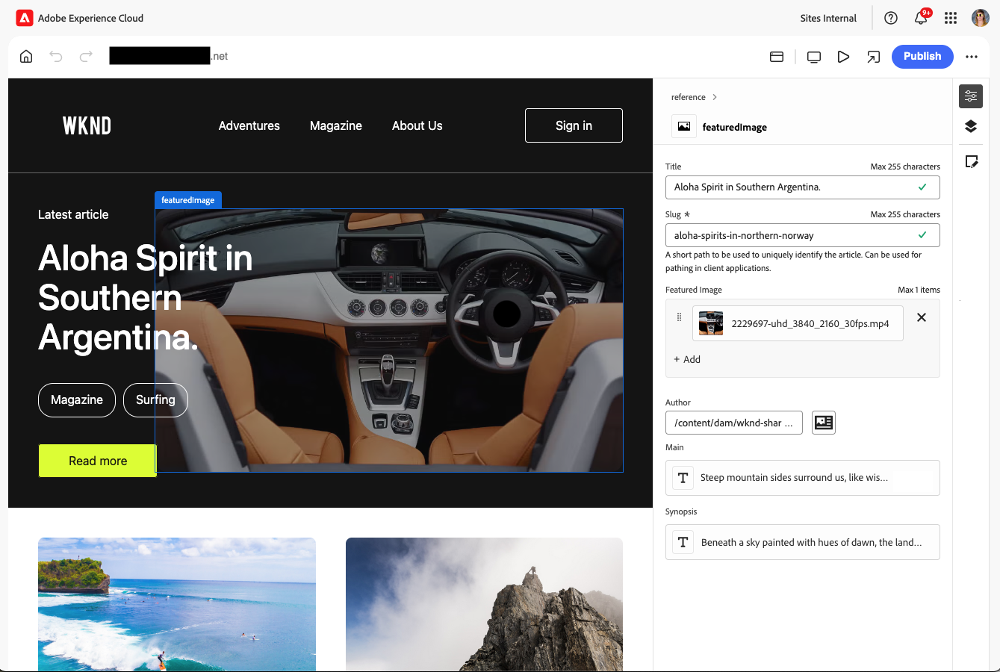

# Accesso e navigazione nell’editor universale {#navigating}

Scopri le nozioni di base sull’accesso e la navigazione nell’Editor universale.

## Introduzione {#introduction}

L’editor universale consente di modificare ogni aspetto di qualsiasi contenuto in qualsiasi implementazione in modo da offrire esperienze eccezionali, velocizzare la preparazione dei contenuti e fornire un’esperienza di sviluppo all’avanguardia.

A questo scopo, l’editor universale offre agli autori di contenuti un’interfaccia utente intuitiva che richiede una formazione minima per poter entrare e iniziare a modificare i contenuti. Questo documento descrive come spostarsi nell’Editor universale.

>[!TIP]
>
>* Per informazioni dettagliate sull&#39;authoring mediante l&#39;editor universale, vedere il documento [Authoring dei contenuti con l&#39;editor universale](/help/sites-cloud/authoring/universal-editor/authoring.md).
>* Per un&#39;introduzione più dettagliata all&#39;editor universale, vedere [Introduzione all&#39;editor universale](/help/implementing/universal-editor/introduction.md).

## Preparare l’app {#prepare-app}

Per creare contenuti per un’app utilizzando l’editor universale, l’app deve essere preparata da uno sviluppatore per supportare l’editor.

>[!TIP]
>
>Consulta il documento [Guida introduttiva all’editor universale in AEM](/help/implementing/universal-editor/getting-started.md) per un esempio su come configurare un’app AEM per utilizzare l’editor universale.

## Accesso all’editor universale {#accessing}

Una volta che l’app è dotata di strumenti per funzionare con Universal Editor, questo può essere accessibile sia all’interno di AEM as a Cloud Service che direttamente senza accedere ad AEM.

### Accesso in AEM as a Cloud Service {#accessing-aem}

1. Accedi all’istanza di authoring di AEM as a Cloud Service.
1. Utilizzare la console [**Sites**](/help/sites-cloud/authoring/sites-console/introduction.md) per passare alla pagina creata per l&#39;utilizzo con l&#39;editor universale che si desidera modificare.
1. Modifica la pagina.
1. Viene aperto Universal Editor per modificare la pagina selezionata.

>[!NOTE]
>
>Durante la modifica di una pagina nella console [**Sites**](/help/sites-cloud/authoring/sites-console/introduction.md), la console aprirà l&#39;editor appropriato per il [modello](/help/sites-cloud/authoring/page-editor/templates.md) della pagina, ovvero l&#39;editor universale descritto in questo documento o l&#39;[editor pagine](/help/sites-cloud/authoring/page-editor/introduction.md).

### Accesso diretto {#accessing-directly}

1. Accedi all’editor universale. Per accedere è necessario un Adobe ID e [accedere all&#39;editor universale](/help/implementing/universal-editor/getting-started.md#request-access).

1. Dopo aver effettuato l&#39;accesso, immettere l&#39;URL della pagina che si desidera modificare nella [barra dei percorsi](#location-bar), in modo da poter iniziare a modificare il contenuto, ad esempio testo o contenuto multimediale.

## Comprendere l’interfaccia utente {#ui}

L’interfaccia utente è divisa in queste aree principali.

* [Intestazione di Experience Cloud](#experience-cloud-header)
* [Barra degli strumenti Editor universale](#universal-editor-toolbar)
* [L’editor](#editor)
* [Pannello delle proprietà](#properties-rail)

>[!TIP]
>
>Universal Editor offre numerose [opzioni di personalizzazione](/help/implementing/universal-editor/customizing.md) e [punti di estensione](/help/implementing/universal-editor/extending.md) che possono essere modificati e aggiunti alle funzionalità dell&#39;editor. Per questo motivo, potresti vedere opzioni diverse da quelle standard qui documentate.

### Barra di navigazione superiore di Experience Platform {#experience-cloud-header}

La barra di navigazione superiore di Experience Platform è sempre presente nella parte superiore dello schermo. È un ancoraggio che indica dove ti trovi all’interno di Experience Cloud e ti aiuta a passare ad altre app di Experience Cloud.

Per informazioni dettagliate sulla barra di navigazione superiore di Experience Platform, consulta la [guida dell&#39;interfaccia utente di Adobe Experience Platform](https://experienceleague.adobe.com/it/docs/experience-platform/landing/platform-ui/ui-guide#top-navigation-bar)

#### Account {#user-properties}

Toccando o facendo clic sull’icona dell’account si apre un menu con le impostazioni utente.

Per l&#39;editor universale, sotto l&#39;intestazione **Impostazioni prodotto**, è possibile passare dalla versione di produzione corrente dell&#39;editor universale alla versione di anteprima in arrivo.

### Barra degli strumenti Editor universale {#universal-editor-toolbar}

La barra degli strumenti di Universal Editor è sempre presente nella parte superiore dello schermo immediatamente sotto [l&#39;intestazione di Experience Cloud](#experience-cloud-header). Ti consente di accedere rapidamente a un’altra pagina per modificare e pubblicare la pagina corrente.

A seconda della configurazione del programma, può anche presentare [funzionalità aggiuntive che sono state abilitate come estensioni dall&#39;amministratore.](#additional-toolbar-buttons)

#### Pulsante Home {#home-button}

Il pulsante Home consente di tornare alla pagina iniziale di Universal Editor

Nella pagina iniziale è possibile immettere l&#39;URL del sito che si desidera modificare con l&#39;editor universale.

>[!NOTE]
>
>Qualsiasi pagina che si desidera modificare con l&#39;Editor universale deve essere [dotata di strumenti per supportare l&#39;Editor universale](/help/implementing/universal-editor/getting-started.md).

Una sezione **Collegamenti rapidi** fornisce risorse di aiuto e una sezione **Recenti** fornisce collegamenti alle pagine aperte di recente con l&#39;editor universale.

#### Barra della posizione {#location-bar}

La barra della posizione mostra l’indirizzo della pagina che stai modificando. Selezionare questa opzione per immettere l&#39;indirizzo di un&#39;altra pagina da modificare.

>[!TIP]
>
>Utilizzare il tasto di scelta rapida `l` (la lettera l) per aprire la barra degli indirizzi.

>[!NOTE]
>
>Qualsiasi pagina che si desidera modificare con l&#39;Editor universale deve essere [dotata di strumenti per supportare l&#39;Editor universale](/help/implementing/universal-editor/getting-started.md).

#### Annulla e Ripristina {#undo-redo}

Selezionare i pulsanti Annulla o Ripristina per annullare o ripristinare l&#39;ultima modifica nell&#39;editor. Per ulteriori informazioni, vedere il documento [Authoring dei contenuti con Universal Editor](/help/sites-cloud/authoring/universal-editor/authoring.md#undo-redo).

>[!TIP]
>
>Utilizzare il tasto di scelta rapida `Command-Z` o `Shift-Command-Z` rispettivamente per annullare o ripetere l&#39;operazione.

#### Intestazioni di autenticazione {#authentication-settings}

Se devi [impostare un&#39;intestazione di autenticazione personalizzata a scopo di sviluppo locale](/help/implementing/universal-editor/developer-overview.md#auth-header), seleziona l&#39;icona delle intestazioni di autenticazione.

#### Modalità reattiva {#emulator}

Seleziona l’icona della modalità reattiva per definire il rendering della pagina da parte dell’Editor universale.

Toccando o facendo clic sull’icona della modalità reattiva vengono visualizzate le opzioni.

Per impostazione predefinita, l’editor si apre in layout desktop, dove l’altezza e la larghezza vengono definite automaticamente dal browser.

Puoi anche scegliere di emulare un dispositivo mobile e nell’editor universale:

* Definirne l’orientamento
* Definire la larghezza e l’altezza
* Modificare l’orientamento

#### Anteprima {#preview-mode}

In modalità anteprima, la pagina viene riprodotta nell’editor come verrebbe visualizzata sul servizio pubblicato. Questo consente all’autore di contenuto di navigare nel contenuto facendo clic sui collegamenti e così via.

>[!TIP]
>
>Utilizzare il tasto di scelta rapida `p` per passare alla modalità anteprima e viceversa.

#### Apri pagina {#open-page}

Seleziona l’icona Apri pagina per aprire la pagina che stai modificando nella relativa scheda del browser, libera dall’editor per visualizzare l’anteprima del contenuto.

>[!TIP]
>
>Utilizzare il tasto di scelta rapida `o` (la lettera o) per aprire l&#39;anteprima dell&#39;app.

>[!TIP]
>
>L&#39;URL di anteprima dell&#39;app [&#x200B; può essere personalizzato](/help/implementing/universal-editor/customizing.md#custom-preview-urls).

>[!NOTE]
>
>Il pulsante Apri pagina [&#x200B; può essere disabilitato](/help/implementing/universal-editor/customizing.md#open-page) e pertanto potrebbe non essere visualizzato nell&#39;editor.

#### Pubblicazione {#publish}

Seleziona il pulsante Pubblica per pubblicare le modifiche al contenuto live per l’utilizzo da parte dei lettori o in un ambiente di anteprima per la revisione.

>[!TIP]
>
>Per ulteriori informazioni sulla pubblicazione con Universal Editor, vedere il documento [Pubblicazione di contenuti con Universal Editor](publishing.md).

>[!NOTE]
>
>Il pulsante di pubblicazione [può essere disabilitato](/help/implementing/universal-editor/customizing.md#disable-publish) e pertanto potrebbe non essere visualizzato nell&#39;editor.

#### Puntini di sospensione {#ellipsis}

Altre opzioni standard sono accessibili tramite il pulsante con i puntini di sospensione.

Ad esempio, la possibilità di annullare la pubblicazione di una pagina (ovvero di annullare l&#39;azione del pulsante [**Pubblica**](#publish)) è accessibile tramite il pulsante con i puntini di sospensione.

#### Pulsanti aggiuntivi {#additional-toolbar-buttons}

Universal Editor offre un&#39;esperienza di authoring personalizzabile ed estensibile. Se nella barra degli strumenti sono presenti pulsanti aggiuntivi, l’editor universale è stato esteso.

* Per informazioni dettagliate sul funzionamento di una singola estensione, [consulta la documentazione di authoring di Universal Editor.](/help/sites-cloud/authoring/universal-editor/authoring.md#toolbar-options)
* Per informazioni dettagliate sulle possibilità di estensione, vedere [Estensione dell&#39;editor universale.](/help/implementing/universal-editor/extending.md)
* Per informazioni dettagliate su come installare una singola estensione, consulta la [documentazione di Extension Manager.](https://developer.adobe.com/uix/docs/extension-manager/extension-developed-by-adobe/)

### L’editor {#editor}

L’editor occupa la maggior parte della finestra ed è l’area in cui viene eseguito il rendering della pagina specificata nella [barra della posizione](#location-bar).

Se l&#39;editor è in [modalità anteprima](#preview-mode), il contenuto sarà navigabile e potrai seguire i collegamenti, ma non potrai modificarlo.

### Pannello Proprietà {#properties-rail}

Il pannello delle proprietà è sempre presente lungo il lato destro dell’editor. A seconda della modalità, può mostrare i dettagli di un componente selezionato nel contenuto o la gerarchia dei contenuti della pagina.

A seconda della configurazione del programma, può anche presentare [funzionalità aggiuntive che sono state abilitate come estensioni dall&#39;amministratore.](#additional-properties-panel-buttons)

#### Modalità proprietà {#properties-mode}

In modalità proprietà, il pannello mostra le proprietà del componente attualmente selezionato nell’editor. Questa è la modalità predefinita del pannello delle proprietà quando viene caricata una pagina.

A seconda del tipo di componente selezionato, i dettagli possono essere visualizzati e modificati nel pannello delle proprietà.

Non tutti i componenti hanno dettagli che possono essere visualizzati e/o modificati.

>[!TIP]
>
>Usa il tasto di scelta rapida `d` per passare alla modalità proprietà.

#### Modalità struttura contenuto {#content-tree-mode}

In modalità struttura contenuto, il pannello mostra la gerarchia del contenuto della pagina.

* Quando si seleziona un elemento nella struttura del contenuto, l’editor scorre fino a quel contenuto e lo seleziona.
* Quando si fa doppio clic su un elemento nella struttura del contenuto, l&#39;editor scorre fino al contenuto selezionato e apre le proprietà associate in modalità [proprietà.](#properties-mode)

>[!TIP]
>
>Usa il tasto di scelta rapida `f` per passare alla modalità struttura contenuto.

##### Apri in editor frammenti contenuto {#edit}

Durante la modifica, le opzioni per il componente selezionato vengono visualizzate nel pannello delle proprietà, dove è possibile modificarlo. Se il componente selezionato è un frammento di contenuto, è inoltre possibile selezionare il pulsante **Apri in CF Editor**.

Toccando o facendo clic sul pulsante **Apri in CF Editor** si apre l&#39;[Editor frammento di contenuto](/help/assets/content-fragments/content-fragments-managing.md#opening-the-fragment-editor) in una nuova scheda. Questo ti consente di accedere a tutte le funzionalità dell’editor di frammenti di contenuto per modificare il frammento di contenuto associato.

A seconda delle esigenze del flusso di lavoro, può essere utile modificare il frammento di contenuto nell’editor universale o direttamente nell’editor frammento di contenuto.

>[!TIP]
>
>Utilizzare il tasto di scelta rapida `e` per aprire un frammento di contenuto selezionato nell&#39;editor frammenti di contenuto.

##### Aggiungere {#add}

Se selezioni un componente contenitore nella struttura del contenuto o nell’editor, l’opzione aggiungi viene visualizzata nel pannello delle proprietà.

Toccando o facendo clic sul pulsante Aggiungi si apre un menu a discesa dei componenti disponibili per [aggiungi al contenitore selezionato](/help/sites-cloud/authoring/universal-editor/authoring.md#adding-components).

>[!TIP]
>
>Utilizzare il tasto di scelta rapida `a` per aggiungere un componente a un componente contenitore selezionato.

##### Duplica {#duplicate}

Se selezioni un componente all’interno di un componente contenitore nella struttura del contenuto o nell’editor, nel pannello delle proprietà viene visualizzata l’opzione di duplicazione.

Toccando o facendo clic sul pulsante di duplicazione [viene duplicato il componente selezionato](/help/sites-cloud/authoring/universal-editor/authoring.md#duplicating-components).

##### Eliminare {#delete}

Se selezioni un componente all’interno di un componente contenitore nella struttura del contenuto o nell’editor, l’opzione Elimina viene visualizzata nel pannello delle proprietà.

Toccando o facendo clic sul pulsante Elimina [il componente viene eliminato](/help/sites-cloud/authoring/universal-editor/authoring.md#deleting-components).

>[!TIP]
>
>Utilizzare il tasto di scelta rapida `Shift+Backspace` per eliminare un componente selezionato da un contenitore.

##### Copiare e incollare {#copy-paste}

È possibile copiare e incollare i componenti che si trovano all&#39;interno di [contenitori.](/help/implementing/universal-editor/field-types.md#container)

>[!TIP]
>
>Utilizzare la scelta rapida `Command-C` o `Command-V` rispettivamente per copiare o incollare.

Per ulteriori informazioni, vedere il documento [Authoring dei contenuti con Universal Editor](/help/sites-cloud/authoring/universal-editor/authoring.md#copy-paste).

#### Pulsanti aggiuntivi {#additional-properties-panel-buttons}

Universal Editor offre un&#39;esperienza di authoring personalizzabile ed estensibile. Se nel pannello delle proprietà sono presenti pulsanti aggiuntivi, l&#39;Editor universale è stato esteso.

* Per informazioni dettagliate sul funzionamento di una singola estensione, [consulta la documentazione di authoring di Universal Editor.](/help/sites-cloud/authoring/universal-editor/authoring.md#properties-panel-options)
* Per informazioni dettagliate sulle possibilità di estensione, vedere [Estensione dell&#39;editor universale.](/help/implementing/universal-editor/extending.md)
* Per informazioni dettagliate su come installare una singola estensione, consulta la [documentazione di Extension Manager.](https://developer.adobe.com/uix/docs/extension-manager/extension-developed-by-adobe/)

## Passaggi successivi {#next-steps}

Ora che sai come accedere e navigare nell&#39;Editor universale, puoi [creare contenuti con esso](/help/sites-cloud/authoring/universal-editor/authoring.md).
