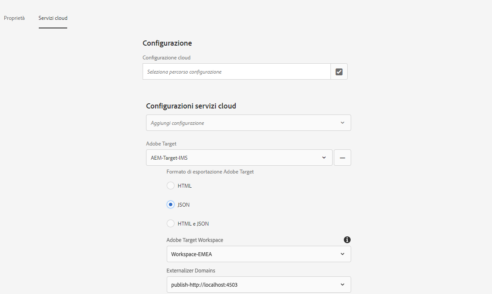
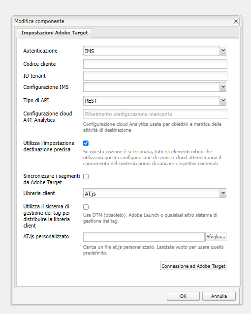
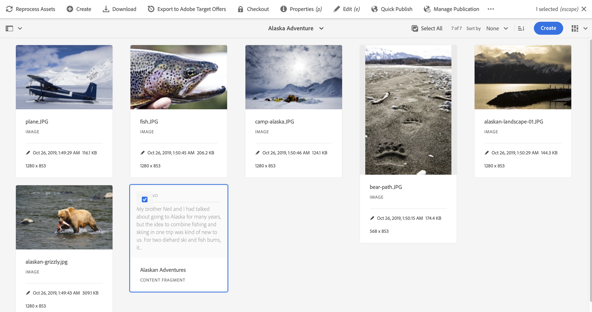

# Esportazione di frammenti di contenuto in Adobe Target {#exporting-content-fragments-to-adobe-target}

>[!CAUTION]
>
>AEM deve essere integrato con Adobe Target secondo le istruzioni contenute in [Integrazione con Adobe Target](/help/sites-cloud/integrating/integrating-adobe-target.md).

Puoi esportare i [frammenti di contenuto](/help/sites-cloud/authoring/fragments/content-fragments.md) creati in Adobe Experience Manager as a Cloud Service (AEM) in Adobe Target (Target). Puoi quindi utilizzarli come offerte nelle attività di Target, per testare e personalizzare le esperienze su larga scala.

È disponibile l’opzione per esportare un frammento di contenuto in Adobe Target:

* JSON: supporto per la distribuzione di contenuti headless

<!-- * GraphQL query ??? -->

Per preparare l’istanza per l’esportazione di frammenti di contenuto AEM in Adobe Target, è necessario:

* [Procedi all’integrazione con Adobe Target](/help/sites-cloud/integrating/integrating-adobe-target.md)
* [Aggiungere la configurazione cloud](#add-the-cloud-configuration)
* [Aggiungere la configurazione precedente](#add-the-legacy-configuration)

Dopo di che puoi:

* [Esportare un frammento di contenuto in Adobe Target](#exporting-a-content-fragment-to-adobe-target)
* [Utilizzare i frammenti di contenuto in Adobe Target](#using-your-content-fragments-in-adobe-target)
* E anche [Eliminare un frammento di contenuto già esportato in Adobe Target](#deleting-a-content-fragment-already-exported-to-adobe-target)

I frammenti di contenuto possono essere esportati nell’area di lavoro predefinita o in aree di lavoro definite dall’utente in Adobe Target.

>[!NOTE]
>
>Le aree di lavoro di Adobe Target non sono già esistenti in Adobe Target. Vengono definite e gestite in Adobe IMS (Identity Management System), quindi selezionate per l’utilizzo nelle soluzioni tramite la console Adobe Developer.

>[!NOTE]
>
>Le aree di lavoro di Adobe Target possono essere utilizzate per consentire ai membri di un’organizzazione (gruppo) di creare e gestire offerte e attività riservate all’organizzazione; senza dare accesso ad altri utenti. Ad esempio, organizzazioni specifiche per paese nell&#39;ambito di un’azienda globale.

## Prerequisiti {#prerequisites}

È necessaria l’azione seguente:

1. È necessario [integrare AEM con Adobe Target](/help/sites-cloud/integrating/integrating-adobe-target.md).

<!-- link rewriter - targets in content-fragments-customizing do not exist yet

1. Content Fragments are exported from the AEM author instance, so you need to [Configure the AEM Link Externalizer](/help/implementing/developing/extending/content-fragments-customizing.md#configuring-the-aem-link-externalizer) on the author instance to ensure that any references within the Content Fragment are externalized for web delivery.

   >[!NOTE]
   >
   >For link rewriting not covered by the default, the [Content Fragment Link Rewriter Provider](/help/implementing/developing/extending/content-fragments-customizing.md#the-content-fragment-link-rewriter-provider-html) is available. With this, customized rules can be developed for your instance.
-->

## Aggiungere la configurazione cloud {#add-the-cloud-configuration}

Prima di esportare un frammento è necessario aggiungere la **Configurazione cloud** di **Adobe Target** al frammento o alla cartella. Questo consente anche di:

* specificare le opzioni di formato da utilizzare per l’esportazione
* selezionare un’area di lavoro di Target come destinazione

Le opzioni richieste possono essere selezionate in **Proprietà** della cartella richiesta; la specifica viene ereditata in base alle esigenze.

1. Passa alla console **Assets**.

1. Apri **Proprietà** per la cartella appropriata.

   >[!NOTE]
   >
   >Se aggiungi la configurazione cloud alla cartella principale del frammento di contenuto, questa viene ereditata da tutti gli elementi secondari.

1. Seleziona la scheda **Servizi cloud**.

1. In **Configurazione Cloud Service**, seleziona la configurazione di destinazione dall&#39;elenco a discesa.

1. Seleziona la tua area di lavoro Adobe Target.

   Ad esempio:

   

1. **Salva e chiudi**.

## Aggiungere la configurazione precedente {#add-the-legacy-configuration}

<!-- This is effectively the Manually Integrating with Adobe Target {#manually-integrating-with-adobe-target} section from 6.5 -->

>[!IMPORTANT]
>
>L’aggiunta di una nuova configurazione legacy è lo scenario di un caso speciale supportato solo per l’esportazione di frammenti di contenuto.

Dopo l’[aggiunta della configurazione cloud](#add-the-cloud-configuration) per utilizzare Experience Platform Launch, per l’integrare iniziale di AEM con Adobe Target, è inoltre necessario eseguire l’integrazione manuale con Adobe Target utilizzando una configurazione precedente.

### Creazione di una configurazione cloud di Target {#creating-a-target-cloud-configuration}

Per consentire ad AEM di interagire con Adobe Target, crea una configurazione cloud di Target. Per creare la configurazione, fornisci il codice client Adobe Target e le credenziali utente.

Puoi creare la configurazione cloud di Target una sola volta perché tale configurazione può essere associata a più campagne AEM. Se disponi di diversi codici client Adobe Target, crea una configurazione per ogni codice client.

Puoi impostare la configurazione cloud in modo da sincronizzare i segmenti da Adobe Target. Se abiliti la sincronizzazione, i segmenti vengono importati in background da Target non appena viene salvata la configurazione cloud.

Segui la procedura seguente per creare una configurazione cloud di Target in AEM:

1. Passa a **Servizi cloud precedenti** tramite **Logo AEM** > **Strumenti** > **Servizi cloud** > **Servizi cloud precedenti**.
Ad esempio: ([http://localhost:4502/libs/cq/core/content/tools/cloudservices.html](http://localhost:4502/libs/cq/core/content/tools/cloudservices.html))

   Viene visualizzata la pagina **Adobe Experience Cloud**.

1. Nella sezione **Adobe Target**, fai clic su **Configura ora**.
1. Nella finestra di dialogo **Crea configurazione**:

   1. Assegna alla configurazione un **Titolo**.
   1. Seleziona il modello **Configurazione Adobe Target**.
   1. Fai clic su **Crea**.

Ora puoi selezionare la nuova configurazione da modificare.

1. Viene visualizzata la finestra di dialogo di modifica.

   

   <!-- Can this still occur?

   >[!NOTE]
   >
   >When configuring A4T with AEM, you may see a Configuration reference missing entry. To be able to select the analytics framework, do the following:
   >
   >1. Navigate to **Tools** &gt; **General** &gt; **CRXDE Lite**.
   >1. Navigate to **/libs/cq/analytics/components/testandtargetpage/dialog/items/tabs/items/tab1_general/items/a4tAnalyticsConfig**
   >1. Set the property **disable** to **false**.
   >1. Select **Save All**.

   -->

1. In **Impostazioni Adobe Target** fornisci i valori per queste proprietà.

   * **Autenticazione**: per impostazione predefinita, IMS (le credenziali utente sono obsolete)

   * **Codice client**: il codice client dell’account di Target

   * **ID tenant**: ID del tenant

   * **Configurazione IMS**: seleziona la configurazione desiderata dall’elenco a discesa

   * **Tipo di API**: impostazione predefinita REST (XML è obsoleto)

   * **Configurazione A4T Analytics Cloud**: seleziona la configurazione cloud di Analytics utilizzata per gli obiettivi e le metriche delle attività di destinazione. È necessario se utilizzi Adobe Analytics come origine per la generazione di rapporti durante il targeting del contenuto.

     <!-- Is this needed?
     If you do not see your cloud configuration, see note in [Configuring A4T Analytics Cloud Configuration](#configuring-a-t-analytics-cloud-configuration).
     -->

   * **Utilizza targeting accurato:** per impostazione predefinita questa casella di controllo è selezionata. Se questa opzione è selezionata, la configurazione del servizio cloud attenderà il caricamento del contesto prima di caricare il contenuto. Vedi la nota che segue.

   * **Sincronizza segmenti da Adobe Target:** seleziona questa opzione per scaricare i segmenti definiti in Target e utilizzarli in AEM. Seleziona questa opzione quando la proprietà Tipo API è REST, perché i segmenti in linea non sono supportati e devi sempre utilizzare i segmenti da Target. Il termine AEM &quot;segmento&quot; equivale al termine Target &quot;pubblico&quot;.

   * **Libreria client:** questo valore predefinito è AT.js (mbox.js è obsoleto)

     >[!NOTE]
     >
     >Il file della libreria di Target, [AT.JS](https://experienceleague.adobe.com/docs/target-dev/developer/client-side/at-js-implementation/at-js/how-atjs-works.html?lang=it), è una nuova libreria di implementazione di Adobe Target progettata sia per le tipiche implementazioni web che per le applicazioni a pagina singola.
     >
     >mbox.js è stato dichiarato obsoleto e verrà rimosso in una fase successiva.
     >
     >Adobe consiglia di utilizzare AT.js invece di mbox.js come libreria client.
     >
     >AT.js offre diversi miglioramenti rispetto alla libreria mbox.js:
     >
     >* Tempi di caricamento delle pagine migliorati per le implementazioni web
     >* Maggiore sicurezza
     >* Migliori opzioni di implementazione per le applicazioni a pagina singola
     >* AT.js contiene i componenti inclusi in target.js, quindi non effettua più chiamate a target.js
     >
     >Puoi selezionare AT.js o mbox.js nel menu a discesa **Libreria client**.

   * **Utilizza Tag Management System per distribuire la libreria client**: seleziona questa opzione per utilizzare la libreria client da Adobe Launch o da un altro sistema di gestione tag (o DTM, che è obsoleto).

   * **AT.js personalizzato**: sfoglia per caricare il tuo AT.js personalizzato. Lascia vuoto per utilizzare la libreria predefinita.

     >[!NOTE]
     >
     >Per impostazione predefinita, quando scegli di accedere alla procedura guidata di configurazione di Adobe Target, il targeting accurato è abilitato.
     >
     >Il targeting accurato significa che la configurazione del servizio cloud attende il caricamento del contesto prima di caricare il contenuto. Di conseguenza, in termini di prestazioni, un targeting accurato può creare un ritardo di alcuni millisecondi prima del caricamento del contenuto.
     >
     >Il targeting accurato è sempre abilitato nell’istanza di authoring. Tuttavia, nell&#39;istanza di pubblicazione puoi scegliere di disattivare il targeting accurato a livello globale cancellando il segno di spunta accanto a Targeting accurato nella configurazione del servizio cloud (**http://localhost:4502/etc/cloudservices.html**). Puoi inoltre attivare e disattivare il targeting accurato per i singoli componenti indipendentemente dall’impostazione nella configurazione del servizio cloud.
     >
     >Se hai ***già*** creato i componenti di destinazione e modificato questa impostazione, le modifiche non influiscono su tali componenti. Devi apportare le modifiche direttamente a tali componenti.

1. Fai clic su **Connetti ad Adobe Target** per inizializzare la connessione con Target. Se la connessione ha esito positivo, viene visualizzato il messaggio **Connessione riuscita**. Fai clic su **OK** sul messaggio e quindi **OK** nella finestra di dialogo.

### Aggiunta di un framework Target {#adding-a-target-framework}

<!-- Is this section needed? -->

Dopo aver impostato la configurazione cloud di Target, aggiungi un framework di Target. Il framework identifica i parametri predefiniti inviati ad Adobe Target dai componenti [ContextHub](/help/implementing/developing/personalization/configuring-contexthub.md). Target utilizza i parametri per determinare i segmenti che si applicano al contesto corrente.

Puoi creare più framework per una singola configurazione di Target. I framework multipli sono utili quando devi inviare un diverso set di parametri a Target per diverse sezioni del sito Web. Crea un framework per ogni set di parametri da inviare. Associa ogni sezione del sito Web al framework appropriato. Nota che una pagina web può utilizzare un solo framework alla volta.

1. Nella pagina di configurazione di Target, fai clic su **+** (segno più) accanto a Configurazioni disponibili.

1. Nella finestra di dialogo Crea framework, specifica un **Titolo**, seleziona **Framework Adobe Target** e fai clic su **Crea**.

   <!--  -->

   Viene visualizzata la pagina framework. La barra laterale fornisce componenti che rappresentano informazioni provenienti da [ContextHub](/help/implementing/developing/personalization/configuring-contexthub.md) che puoi mappare.

   <!--  -->

1. Trascina il componente ClientContext che rappresenta i dati da utilizzare per la mappatura sulla destinazione di rilascio. In alternativa, trascina il componente **Archivio ContextHub** nel framework.

   >[!NOTE]
   >
   >Durante la mappatura, i parametri vengono passati a una mbox tramite stringhe semplici. Non è possibile mappare array da ContextHub.

   Ad esempio, per utilizzare i **Dati profilo** relativi ai visitatori del sito per controllare la campagna di Adobe Target, trascina il componente **Dati profilo** nella pagina. Vengono visualizzate le variabili dei dati di profilo disponibili per la mappatura per i parametri di Adobe Target.

   <!--  -->

1. Seleziona le variabili da rendere visibili al sistema Adobe Target selezionando la casella di selezione **Condividi** nelle colonne appropriate.

   <!--  -->

   >[!NOTE]
   >
   >La sincronizzazione dei parametri è solo unidirezionale, cioè da AEM ad Adobe Target.

Il framework viene creato. Per replicare il framework nell’istanza di pubblicazione, utilizza l’opzione **Attiva framework** dalla barra laterale.

<!--
### Associating Activities With the Target Cloud Configuration  {#associating-activities-with-the-target-cloud-configuration}

Associate your [AEM activities](/help/sites-cloud/authoring/personalization/activities.md) with your Target cloud configuration so that you can mirror the activities in [Adobe Target](https://experienceleague.adobe.com/docs/target/using/experiences/offers/manage-content.html).

>[!NOTE]
>
>What types of activities are available is determined by the following:
>
>* If the **xt_only** option is enabled on the Adobe Target tenant (clientcode) used on the AEM side to connect to Adobe Target, then you can create **only** XT activities in AEM.
>
>* If the **xt_only** options is **not** enabled on the Adobe Target tenant (clientcode), then you can create **both** XT and A/B activities in AEM.
>
>**Additional note:** **xt_only** options is a setting applied on a certain Target tenant (clientcode) and can only be modified directly in Adobe Target. You cannot enable or disable this option in AEM.
-->

<!--
### Associating the Target Framework With Your Site {#associating-the-target-framework-with-your-site}

After you create a Target framework in AEM, associate your web pages with the framework. The targeted components on the pages send the framework-defined data to Adobe Target for tracking. (See [Content Targeting](/help/sites-cloud/authoring/personalization/targeted-content.md).)

When you associate a page with the framework, the child pages inherit the association.

1. In the **Sites** console, navigate to the site that you want to configure.
1. Using either [quick actions](/help/sites-cloud/authoring/basic-handling.md#quick-actions) or [selection mode](/help/sites-cloud/authoring/basic-handling.md#selecting-resources), select **View Properties.**
1. Select the **Cloud Services** tab.
1. Select **Edit**.
1. Select **Add Configuration** under **Cloud Service Configurations** and select **Adobe Target**.

  

1. Select the framework you want under **Configuration Reference**.

   >[!NOTE]
   >
   >Make sure that you select the specific **framework** that you created and not the Target cloud configuration under which it was created.

1. Select **Done**.
1. Activate the root page of the website to replicate it to the publish server. (See [How To Publish Pages](/help/sites-cloud/authoring/sites-console/publishing-pages.md).)

   >[!NOTE]
   >
   >If the framework you attached to the page was not activated yet, a wizard opens which lets you publish it as well.
-->

## Esportazione di un frammento di contenuto in Adobe Target {#exporting-a-content-fragment-to-adobe-target}

>[!CAUTION]
>
>Per le risorse multimediali, come le immagini, viene esportato solo un riferimento in Target. La risorsa stessa rimane memorizzata in AEM Assets e viene distribuita dall’istanza di pubblicazione AEM.
>
>Per questo motivo è necessario pubblicare il Frammento di contenuto, con tutte le relative risorse, prima di esportarlo in Target.

Per esportare un frammento di contenuto da AEM in Target (dopo aver specificato la configurazione cloud):

1. Passa al frammento di contenuto nella console **Assets**.
1. Seleziona il frammento di contenuto che desideri esportare in Target.

1. Seleziona **Esporta in offerte Adobe Target**.

   

   <!-- this note does not seem to be accurate for CFs -->

   <!--
   
   >[!NOTE]
   >
   >If the Content Fragment has already been exported, select **Update in Adobe Target**.
   
   -->

1. Seleziona **Esporta senza pubblicare** o **Pubblica** come richiesto.

   >[!NOTE]
   >
   >Le azioni effettive visualizzate dipenderanno dallo stato del frammento e delle risorse correlate.
   >
   >Se tutto è già stato pubblicato e da allora non è stato modificato nulla, questo passaggio verrà ignorato.

   >[!NOTE]
   >
   >Selezionando **Pubblica**, il frammento di contenuto verrà pubblicato immediatamente e verrà inviato a Target.

1. Selezionare **OK** nella finestra di dialogo di conferma.

   Il frammento di contenuto ora dovrebbe trovarsi in Target.

   >[!NOTE]
   >
   >[Vari dettagli](/help/sites-cloud/authoring/fragments/content-fragments.md#details-of-your-content-fragment) dell’esportazione possono essere visualizzati nella **Vista a elenco** della console e nelle **Proprietà**.

   >[!NOTE]
   >
   >Quando visualizzi un frammento di contenuto in Adobe Target, la data dell’*ultima modifica* visualizzata corrisponde alla data dell’ultima modifica apportata al frammento in AEM, non alla data dell’ultima esportazione del frammento in Adobe Target.

>[!NOTE]
>
>In alternativa, è possibile eseguire l’esportazione dall’editor di pagine utilizzando comandi comparabili nel menu [Informazioni pagina](/help/sites-cloud/authoring/page-editor/introduction.md#page-information).

## Utilizzo dei frammenti di contenuto in Adobe Target {#using-your-content-fragments-in-adobe-target}

Dopo aver eseguito le attività precedenti, il frammento di contenuto viene visualizzato nella pagina Offerte di Target. Consulta [documentazione specifica di Target](https://experienceleague.adobe.com/docs/target/using/integrate/aem/fragments/content-fragments-aem.html?lang=it) per scoprire cosa puoi ottenere.

>[!NOTE]
>
>Quando visualizzi un frammento di contenuto in Adobe Target, la data dell’*ultima modifica* visualizzata corrisponde alla data dell’ultima modifica del frammento in AEM, non alla data dell’ultima esportazione del frammento in Adobe Target.

## Eliminazione di un frammento di contenuto già esportato in Adobe Target {#deleting-a-content-fragment-already-exported-to-adobe-target}

Come nel caso dell’esportazione, anche l’eliminazione di un frammento di contenuto da Adobe Target può essere selezionata dalla barra degli strumenti superiore della console **Assets** una volta selezionato il frammento:

L’eliminazione di un frammento di contenuto già esportato in Target potrebbe causare problemi se il frammento è già utilizzato in un’offerta di Target. L’eliminazione del frammento renderebbe l’offerta inutilizzabile mentre il contenuto del frammento è distribuito da AEM.

<!-- if the information about deleting-if-used correct, or is it not allowed at all? -->

Per evitare tali situazioni:

* Se il frammento di contenuto non è attualmente utilizzato in un’attività, AEM consente all’utente di eliminarlo senza alcun messaggio di avviso.
* Se il frammento di contenuto è attualmente utilizzato da un’attività in Target, un messaggio di errore avvisa l’utente AEM delle possibili conseguenze che l’eliminazione del frammento avrà sull’attività.

  Il messaggio di errore in AEM non impedisce all’utente di eliminare (anche forzatamente) il frammento di contenuto. Se il frammento di contenuto viene eliminato:

   * L’offerta Target con il frammento di contenuto di AEM potrebbe mostrare un comportamento indesiderato

      * L’offerta continuerà ad essere renderizzata, poiché il frammento di contenuto è stato inviato a Target
      * Eventuali riferimenti nel frammento di contenuto potrebbero non funzionare correttamente se le risorse a cui si fa riferimento sono state eliminate anche in AEM.

   * Naturalmente, non è possibile apportare eventuali ulteriori modifiche al frammento di contenuto in quanto questo non esiste più in AEM.

## Ulteriori risorse {#further-resources}

Per ulteriori informazioni, consulta:

<!--
* [Creating a Target Cloud Configuration](/help/sites-cloud/integrating/integrating-adobe-target.md#create-configuration)
-->

* [Componenti core - Frammenti di contenuto](https://experienceleague.adobe.com/docs/experience-manager-core-components/using/wcm-components/content-fragment-component.html?lang=it)

* [Sviluppo Adobe Target](https://developers.adobetarget.com/)

* [Adobe Target - Utilizzo di frammenti di contenuto di AEM nelle attività di Target per facilitare l’ottimizzazione o la personalizzazione](https://experienceleague.adobe.com/docs/target/using/integrate/aem/fragments/content-fragments-aem.html?lang=it)

* [Adobe Target - Panoramica dei frammenti di esperienza e dei frammenti di contenuto di AEM](https://experienceleague.adobe.com/docs/target/using/integrate/aem/fragments/aem-experience-and-content-fragments.html?lang=it)
