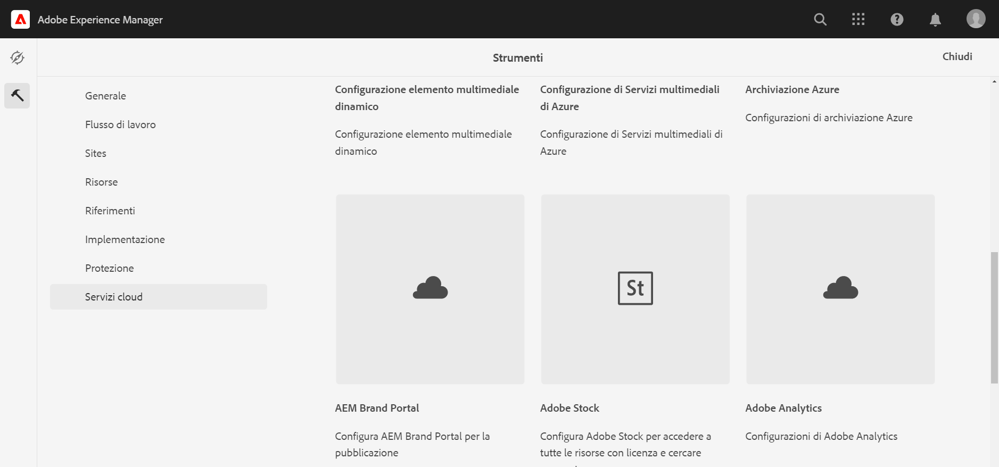
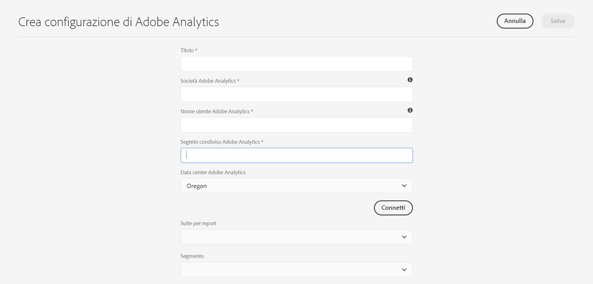

# Integrazione con Adobe Analytics{#integrating-with-adobe-analytics}

L’integrazione di Adobe Analytics e AEM come Cloud Service consente di tenere traccia dell’attività della pagina web. L&#39;integrazione richiede:

* utilizzo dell’interfaccia utente touch per creare una configurazione di Analytics in AEM come Cloud Service.
* aggiunta e configurazione di Adobe Analytics come estensione in [Adobe Launch](#analytics-launch). Per ulteriori dettagli su Adobe Launch, consulta [questa pagina](https://docs.adobe.com/content/help/en/launch/using/intro/get-started/quick-start.html).

Rispetto alle versioni precedenti di AEM, il supporto del framework non viene fornito nella configurazione di Analytics in AEM come Cloud Service. Ora invece viene eseguito tramite Adobe Launch, che è lo strumento di fatto per la strumentazione di un sito AEM con funzionalità di Analytics (librerie JS). In Adobe Launch, viene creata una proprietà in cui è possibile configurare l&#39;estensione Adobe Analytics e creare regole per inviare dati ad Adobe Analytics. Adobe Launch ha sostituito l’attività di analisi fornita da sitecatalyst.

>[!NOTE]
>
>I clienti Adobe Experience Manager as a Cloud Service che non dispongono di un account Analytics esistente possono richiedere l’accesso ad Analytics Foundation Pack, ad Experience Cloud. Questo Foundation Pack fornisce un utilizzo limitato del volume di Analytics.

## Creazione della configurazione Adobe Analytics {#analytics-configuration}

1. Passa a **Strumenti** → **Cloud Services**.
2. Seleziona **Adobe Analytics**.
   
3. Selezionare il pulsante **Crea**.
4. Compila i dettagli (vedi sotto) e fai clic su **Connetti**.

### Parametri di configurazione {#configuration-parameters}

I campi di configurazione presenti nella finestra Configurazione Adobe Analytics sono:

| Proprietà | Descrizione |
|---|---|
| Azienda | Società di accesso Adobe Analytics |
| Nome utente | Utente API di Adobe Analytics |
| Password | Password Adobe Analytics utilizzata per l&#39;autenticazione |
| Datacenter | Il data center Adobe Analytics a cui è associato il tuo account (server ad esempio San Jose, Londra) |
| Segmento | Opzione per utilizzare un segmento di Analytics definito nella suite di rapporti corrente. I rapporti di Analytics verranno filtrati in base al segmento. Per ulteriori informazioni, consulta [questa pagina](https://docs.adobe.com/content/help/en/analytics/components/segmentation/seg-overview.html) . |
| Suite per report | Un archivio in cui puoi inviare dati e richiamare rapporti. Una suite di rapporti definisce il reporting indipendente e completo su un sito web scelto, su un insieme di siti web o su un sottoinsieme di pagine web. Puoi visualizzare i rapporti recuperati da una singola suite di rapporti e modificare questo campo in una configurazione in qualsiasi momento in base alle tue esigenze. |

### Aggiunta di una configurazione a un sito {#add-configuration}

Per applicare una configurazione dell&#39;interfaccia utente touch a un sito, vai a: **Siti** → **Seleziona una pagina del sito** → **Proprietà** → **Avanzate** → **Configurazione** → seleziona il tenant di configurazione.

## Integrazione di Adobe Analytics sui siti AEM utilizzando Adobe Launch {#analytics-launch}

Adobe Analytics può essere aggiunto come estensione nella proprietà Launch. È possibile definire regole per eseguire la mappatura e effettuare una chiamata post ad Adobe Analytics:

* Guarda [questo video](https://docs.adobe.com/content/help/en/analytics-learn/tutorials/implementation/via-adobe-launch/basic-configuration-of-the-analytics-launch-extension.html) per scoprire come configurare l&#39;estensione Analytics in Launch per un sito di base.

* Per informazioni dettagliate su come creare regole e inviare dati ad Adobe Analytics, consulta [questa pagina](https://docs.adobe.com/content/help/en/core-services-learn/implementing-in-websites-with-launch/implement-solutions/analytics.html) .

>[!NOTE]
>
>I framework esistenti (legacy) continuano a funzionare, ma non possono essere configurati nell’interfaccia utente touch. È consigliabile ricreare le configurazioni di mappatura delle variabili in Launch.

>[!NOTE]
>
>La configurazione IMS (account tecnici) per Launch è preconfigurata in AEM come Cloud Service. Gli utenti non devono creare questa configurazione.
