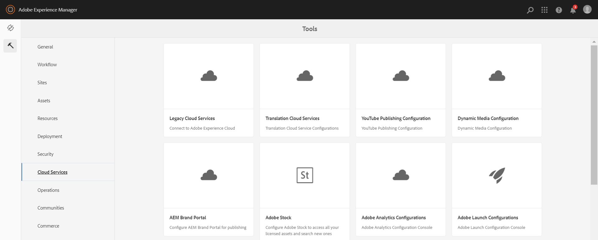
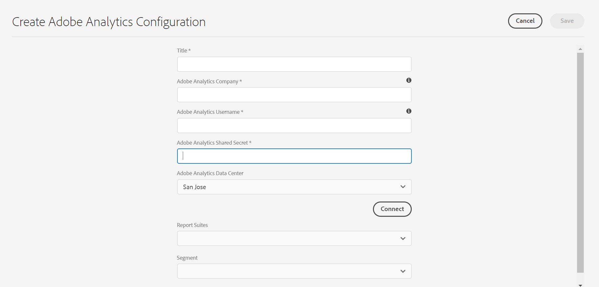

# Integrazione con Adobe Analytics{#integrating-with-adobe-analytics}

L’integrazione  Adobe Analytics e AEM come Cloud Service consente di tenere traccia dell’attività della pagina Web. L&#39;integrazione richiede:

* utilizzo dell&#39;interfaccia utente touch per creare una configurazione Analytics  in AEM come Cloud Service.
* aggiunta e configurazione  Adobe Analytics come estensione in [Adobe Launch].(https://docs.adobe.com/content/help/en/launch/using/intro/get-started/quick-start.html).

Rispetto alle versioni precedenti di AEM, il supporto del framework non viene fornito in  Analytics Configuration in AEM come Cloud Service. Al contrario, ora viene eseguito tramite  Adobe Launch, che è lo strumento di fatto per la strumentazione di un sito AEM con  funzionalità Analytics (librerie JS). In  Adobe Launch, viene creata una proprietà in cui è possibile configurare l&#39;estensione Adobe Analytics  e creare regole per l&#39;invio di dati  Adobe Analytics.  Adobe Launch ha sostituito l&#39;attività di analisi fornita da sitecatalyst.

>[!NOTE]
>
> Adobe Experience Manager come clienti di Cloud Service che non dispongono di un account  Analytics esistente, può richiedere l&#39;accesso al  Analytics Foundation Pack per  Experience Cloud. Questo Foundation Pack fornisce un utilizzo limitato del volume di  Analytics.

## Creazione della configurazione Analytics  {#analytics-configuration}

1. Passare a **Strumenti** → **Cloud Services**.
2. Selezionate **configurazioni**Adobe Analytics.
   
3. Fate clic sul pulsante **Crea** .
4. Compila i dettagli (vedi di seguito) e fai clic su **Connect**.

### Parametri di configurazione {#configuration-parameters}

I campi di configurazione presenti nella finestra Configurazione Adobe Analytics  sono:

| Proprietà | Descrizione |
|---|---|
| Azienda |  Adobe Analytics Login Company |
| Nome utente |  utente API Adobe Analytics |
| Password |  password Adobe Analytics utilizzata per l&#39;autenticazione |
| Datacenter |  centro dati Adobe Analytics a cui è associato l&#39;account (server ad esempio San Jose, Londra) |
| Segmento | Opzione per utilizzare un segmento Analytics  definito nella suite di rapporti corrente. I report Analytics  verranno filtrati in base al segmento. Per ulteriori informazioni, consultate [questa pagina](https://docs.adobe.com/content/help/en/analytics/components/segmentation/seg-overview.html) . |
| Suite per report | Un repository in cui è possibile inviare dati e richiamare rapporti. Una suite di rapporti definisce il reporting completo e indipendente su un sito Web scelto, un set di siti Web o un sottoinsieme di pagine Web. Puoi visualizzare i rapporti recuperati da una singola suite di rapporti e modificare questo campo in una configurazione in qualsiasi momento in base alle tue esigenze. |

### Aggiunta di una configurazione a un sito {#add-configuration}

Per applicare una configurazione dell&#39;interfaccia utente touch a un sito, passare a: **Siti** → **Selezionare una pagina** del sito → **Proprietà** → **Avanzate** → **Configurazione** → selezionare il tenant di configurazione.

## Integrazione  Adobe Analytics su AEM siti utilizzando  lancio Adobe

 Adobe Analytics può essere aggiunto come estensione nella proprietà Launch. Le regole possono essere definite per eseguire la mappatura ed effettuare una chiamata post a  Adobe Analytics:

* Guardate [questo video](https://docs.adobe.com/content/help/en/analytics-learn/tutorials/implementation/via-adobe-launch/basic-configuration-of-the-analytics-launch-extension.html) per apprendere come configurare l’estensione Analytics  in Launch per un sito di base.

* Consulta [questa pagina](https://docs.adobe.com/content/help/en/core-services-learn/implementing-in-websites-with-launch/implement-solutions/analytics.html) per informazioni dettagliate su come creare regole e inviare dati a  Adobe Analytics.

>[!NOTE]
>
>I framework esistenti (legacy) funzionano ancora, ma non possono essere configurati nell&#39;interfaccia utente touch. È consigliabile rigenerare le configurazioni di mappatura delle variabili in Launch.

>[!NOTE]
>
>La configurazione IMS (account tecnici) per Launch è preconfigurata in AEM come Cloud Service. Gli utenti non devono creare questa configurazione.
