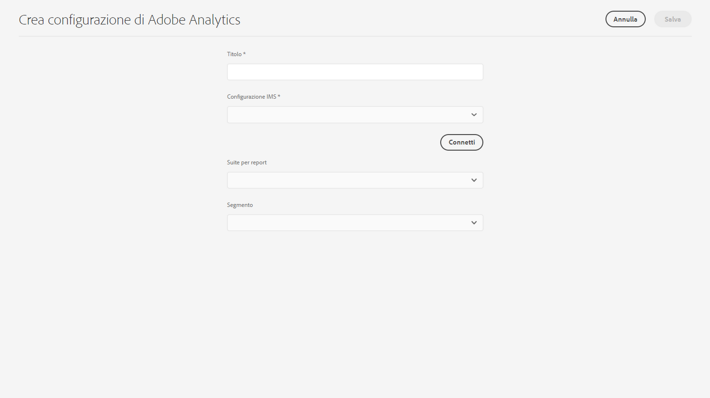

# Integrazione con Adobe Analytics {#integrating-with-adobe-analytics}

L’integrazione di Adobe Analytics e AEM as a Cloud Service consente di monitorare l’attività della pagina web. L&#39;integrazione richiede:

* utilizzo dell’interfaccia utente touch per creare una configurazione di Analytics in AEM as a Cloud Service. Per integrare Adobe Analytics con AEM as a Cloud Service è necessaria l’autenticazione IMS.
* aggiunta e configurazione di Adobe Analytics come estensione in [Adobe Launch](#analytics-launch). Per ulteriori dettagli su Adobe Launch, consulta [questa pagina](https://experienceleague.adobe.com/docs/experience-platform/tags/get-started/quick-start.html?lang=it).

Rispetto alle versioni precedenti di AEM, il supporto del framework non viene fornito nella configurazione di Analytics in AEM as a Cloud Service. Ora invece viene eseguito tramite Adobe Launch, che è lo strumento per la strumentazione di un sito AEM con funzionalità di Analytics (librerie JS). In Adobe Launch, viene creata una proprietà in cui è possibile configurare l&#39;estensione Adobe Analytics e creare regole per inviare dati ad Adobe Analytics. Adobe Launch ha sostituito l’attività di analisi fornita da SiteCatalyst.

>[!NOTE]
>
>I clienti Adobe Experience Manager as a Cloud Service che non dispongono di un account Analytics esistente possono richiedere l’accesso ad Analytics Foundation Pack per Experience Cloud. Tale Foundation Pack fornisce un utilizzo limitato del volume di Analytics.

## Creazione della configurazione di Adobe Analytics {#analytics-configuration}

1. Passa a **Strumenti** → **Cloud Services**.
2. Seleziona **Adobe Analytics**.
   
3. Seleziona il pulante **Crea**.
4. Compila i dettagli (vedi sotto) e fai clic su **Connetti**.

### Parametri di configurazione {#configuration-parameters}

I campi presenti nella finestra di configurazione sono i seguenti:

| Proprietà | Descrizione |
|---|---|
| Titolo | Nome della configurazione |
| Configurazione IMS | Seleziona la configurazione IMS (vedi il capitolo seguente) |
| Segmento | Opzione per utilizzare un segmento di Analytics definito nella suite di reporting corrente. I rapporti di Analytics vengono filtrati in base al segmento. Consulta [questa pagina](https://experienceleague.adobe.com/docs/analytics/components/segmentation/seg-overview.html?lang=it) per ulteriori dettagli. |
| Suite per report | Un archivio in cui puoi inviare dati e richiamare rapporti. Una suite di reporting definisce il reporting indipendente e completo su un sito Web scelto, su un insieme di siti Web o su un sottoinsieme di pagine Web. Puoi visualizzare i rapporti recuperati da una singola suite e modificare questo campo in una configurazione in qualsiasi momento in base alle tue esigenze. |

### Adobe Analytics con autenticazione IMS {#configuration-parameters-ims}

È necessaria una configurazione IMS per integrare correttamente Adobe Analytics con AEM as a Cloud Service. Questa configurazione deve essere creata in modo da visualizzare [pagina](/help/sites-cloud/integrating/integration-adobe-analytics-ims.md) per scoprire come creare la configurazione IMS di Analytics.

### Aggiunta di una configurazione a un sito {#add-configuration}

Per applicare una configurazione dell’interfaccia utente touch a un sito, vai a: **Sites** → **Seleziona una pagina del sito** → **Proprietà** → **Avanzate** → **Configurazione** → selezionare il tenant di configurazione.

## Integrazione di Adobe Analytics su AEM Sites utilizzando Adobe Launch {#analytics-launch}

Adobe Analytics può essere aggiunto come estensione nella proprietà Launch. È possibile definire regole per eseguire la mappatura ed effettuare una chiamata post ad Adobe Analytics:

* Guarda [questo video](https://experienceleague.adobe.com/docs/analytics-learn/tutorials/implementation/via-adobe-launch/basic-configuration-of-the-analytics-launch-extension.html?lang=it) per scoprire come configurare l’estensione Analytics in Launch per un sito di base.

* Consulta [questa pagina](https://experienceleague.adobe.com/docs/core-services-learn/implementing-in-websites-with-launch/implement-solutions/analytics.html?lang=it) per informazioni su come creare regole e inviare dati ad Adobe Analytics.

>[!NOTE]
>
>La configurazione IMS (account tecnici) per Launch in AEM as a Cloud Service è preconfigurata. Non è necessario crearla.

>[!NOTE]
>
>I framework esistenti (legacy) continuano a funzionare, ma non possono essere configurati nell’interfaccia utente touch. È consigliabile ricreare le configurazioni di mappatura delle variabili in Launch.
