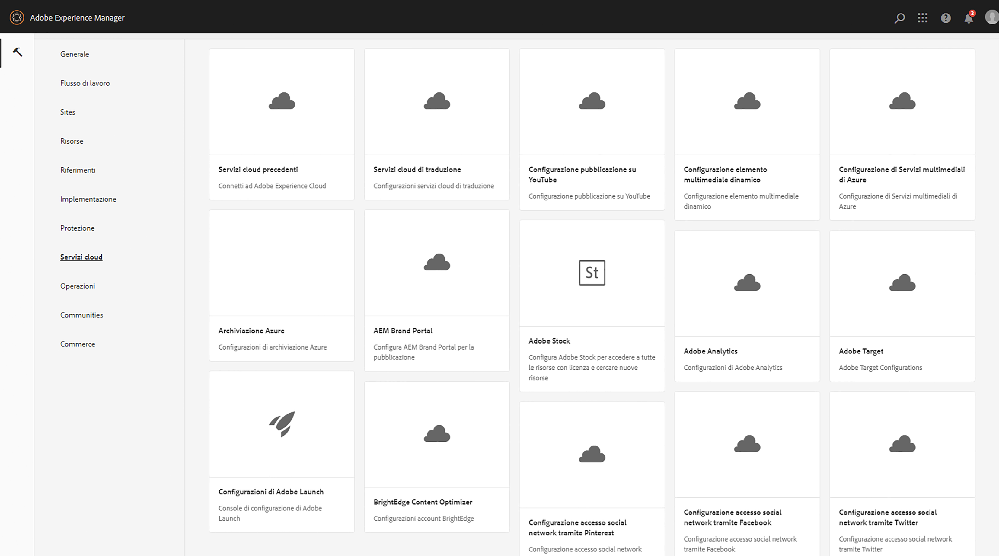
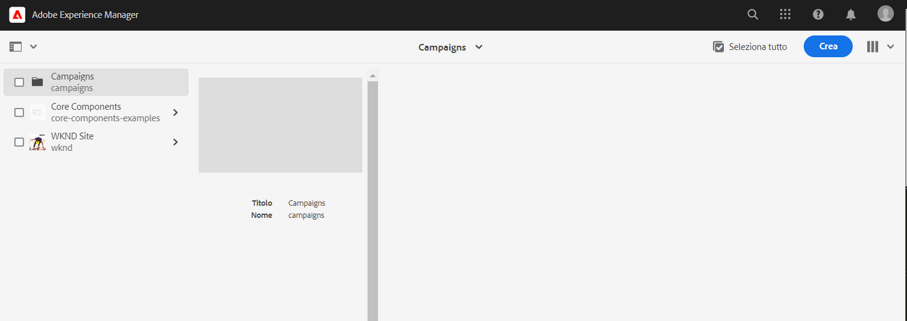
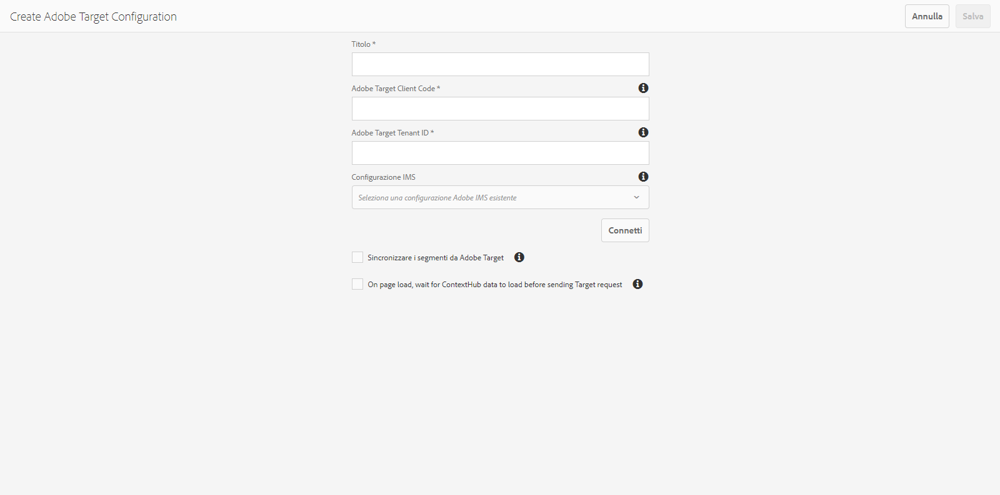

# Integrazione con Adobe Target{#integrating-with-adobe-target}

Come parte di Adobe Marketing Cloud, Adobe Target ti consente di aumentare la pertinenza dei contenuti attraverso il targeting e la misurazione su tutti i canali. L’integrazione di Adobe Target e AEM come Cloud Service richiede:

* utilizzo dell’interfaccia utente touch per creare una configurazione di Target in AEM come Cloud Service (è richiesta la configurazione IMS).
* aggiunta e configurazione di Adobe Target come estensione in [Adobe Launch](https://docs.adobe.com/content/help/en/launch/using/intro/get-started/quick-start.html).

Adobe Launch è necessario per gestire le proprietà lato client sia per Analytics che per Target nelle pagine AEM (librerie/tag JS). Detto questo, l’integrazione con Launch è necessaria per il &quot;targeting delle esperienze&quot;. Per l’esportazione dei frammenti esperienza in Target, è necessario solo Adobe Target Configuration e IMS.

>[!NOTE]
>
>I clienti Adobe Experience Manager as a Cloud Service che non dispongono di un account Target esistente possono richiedere l’accesso a Target Foundation Pack, ad Experience Cloud. Foundation Pack fornisce un uso limitato del volume di Target.

## Creazione della configurazione Adobe Target {#create-configuration}

1. Passa a **Strumenti** → **Cloud Services**.
   
2. Seleziona **Adobe Target**.
3. Selezionare il pulsante **Crea**.
   
4. Compila i dettagli (vedi sotto) e seleziona **Connetti**.
   

### Configurazione IMS {#ims-configuration}

Per integrare correttamente Target con AEM e Launch è necessaria una configurazione IMS sia per Launch che per Target. Anche se la configurazione IMS per Launch è preconfigurata in AEM come Cloud Service, è necessario creare la configurazione IMS di Target (dopo il provisioning di Target). Per informazioni su come creare la configurazione IMS di Target, consulta [questo video](https://helpx.adobe.com/experience-manager/kt/sites/using/aem-sites-target-standard-technical-video-understand.html) e [questa pagina](https://docs.adobe.com/content/help/en/experience-manager-65/administering/integration/integration-ims-adobe-io.html) .

### ID tenant Adobe Target e codice client Adobe Target {#tenant-client}

Durante la configurazione dei campi ID tenant di Adobe Target e Codice client di Adobe Target, tieni presente quanto segue:

1. Per la maggior parte dei clienti, l’ID tenant e il codice client sono gli stessi. Ciò significa che entrambi i campi contengono le stesse informazioni e sono identici. Assicurati di inserire l’ID tenant in entrambi i campi.
2. Per scopi precedenti, puoi anche immettere valori diversi nei campi ID tenant e Codice client .

In entrambi i casi, tieni presente che:

* Per impostazione predefinita, anche il codice client (se aggiunto per primo) viene copiato automaticamente nel campo ID tenant.
* Hai la possibilità di modificare il set di ID tenant predefinito.
* Di conseguenza, le chiamate di backend a Target saranno basate sull’ID tenant e le chiamate lato client a Target saranno basate sul codice client.

Come precedentemente affermato, il primo caso è il più comune per AEM come Cloud Service. In entrambi i casi, assicurati che i campi **entrambi** contengano le informazioni corrette a seconda delle tue esigenze.

>[!NOTE]
>
> Per modificare una configurazione di destinazione esistente:
>
> 1. Immetti nuovamente l&#39;ID tenant.
> 2. Riconnettersi a Target.
> 3. Salva la configurazione.

### Modifica della configurazione di destinazione {#edit-target-configuration}

Per modificare la configurazione di Target, segui questi passaggi:

1. Seleziona una configurazione esistente e fai clic su **Proprietà**.
2. Modifica le proprietà.
3. Seleziona **Ricollega ad Adobe Target**.
4. Seleziona **Salva e chiudi**.

### Aggiunta di una configurazione a un sito {#add-configuration}

Per applicare una configurazione dell&#39;interfaccia utente touch a un sito, vai a: **Siti** → **Seleziona una pagina del sito** → **Proprietà** → **Avanzate** → **Configurazione** → Seleziona il tenant di configurazione.

## Integrazione di Adobe Target sui siti AEM utilizzando Adobe Launch {#integrate-target-launch}

AEM offre un’integrazione standard con il Experience Platform Launch. Aggiungendo l’estensione Adobe Target al Experience Platform Launch, puoi utilizzare le funzioni di Adobe Target AEM pagine web. Il rendering delle librerie di Target verrà eseguito solo utilizzando Launch.

>[!NOTE]
>
>I framework esistenti (legacy) continuano a funzionare, ma non possono essere configurati nell’interfaccia utente touch. È consigliabile ricreare le configurazioni di mappatura delle variabili in Launch.

In generale, i passaggi dell’integrazione sono i seguenti:

1. Creare una proprietà Launch
2. Aggiungi le estensioni richieste
3. Crea un elemento dati (per acquisire i parametri dell’hub di contesto)
4. Creare una regola di pagina
5. Creare e pubblicare

### Creazione di una proprietà Launch {#create-property}

Una proprietà è un contenitore contenente estensioni, regole, elementi dati.

1. Selezionare il pulsante **Nuova proprietà**.
2. Specifica un nome per la proprietà.
3. Come dominio, immetti l’IP/host sul quale desideri caricare la libreria di launch.
4. Selezionare il pulsante **Salva**.
   

### Aggiunta delle estensioni richieste {#add-extension}

**** Estensione del contenitore che gestisce le impostazioni della libreria principale. L&#39;estensione Adobe Target supporta implementazioni lato client tramite SDK JavaScript di Target per il moderno Web, at.js. È necessario aggiungere le estensioni **Adobe Target** e **Adobe ContextHub** .

1. Seleziona l’opzione Catalogo estensioni e cerca Target nel filtro.
2. Seleziona **Adobe Target** at.js e fai clic sull’opzione Installa .
   
3. Selezionare il pulsante **Configura**. Osserva la finestra di configurazione con le credenziali dell’account Target importate e la versione at.js per questa estensione.
4. Seleziona **Salva** per aggiungere l’estensione Target alla proprietà Launch. Dovresti essere in grado di visualizzare l&#39;estensione Target elencata nell&#39;elenco **Estensioni installate** .
   
5. Ripeti i passaggi precedenti per cercare l’ estensione **Adobe ContextHub** e installarla (questa operazione è necessaria per l’integrazione con i parametri contexthub, in base a quale targeting verrà eseguito).

### Creazione di un elemento dati {#data-element}

**Gli** elementi dati sono i segnaposto a cui puoi mappare i parametri dell’hub di contesto.

1. Seleziona **Elementi dati**.
2. Seleziona **Aggiungi elemento dati**.
3. Fornisci il nome dell’elemento dati e mappalo su un parametro context hub.
4. Seleziona **Salva**.
   

### Creazione di una regola di pagina {#page-rule}

In **Regola** definiamo e ordiniamo una sequenza di azioni, eseguite sul sito, per ottenere il targeting.

1. Aggiungi un set di azioni come esemplificato nella schermata .
   
2. In Aggiungi parametri a tutte le mbox aggiungi l’elemento dati configurato in precedenza (vedi l’elemento dati sopra) al parametro che verrà inviato nella chiamata mbox.
   

### Creare e pubblicare {#build-publish}

Per informazioni su come generare e pubblicare, consulta questa [pagina](https://docs.adobe.com/content/help/en/experience-manager-learn/aem-target-tutorial/aem-target-implementation/using-launch-adobe-io.html).

## Modifiche alla struttura del contenuto tra configurazioni di interfaccia classica e touch {#changes-content-structure}

| **Cambia** | **Configurazione interfaccia classica** | **Configurazione dell’interfaccia touch** | **Conseguenze** |
|---|---|---|---|
| Posizione della configurazione di Target. | /etc/cloudservices/testandtarget/ | /conf/tenant/settings/cloudservices/target | In precedenza erano presenti più configurazioni sotto /etc/cloudservices/testandtarget, ma ora è presente una singola configurazione sotto un tenant. |

>[!NOTE]
>
>Le configurazioni legacy sono ancora supportate per i clienti esistenti (senza la possibilità di modificarle o crearne di nuove). Le configurazioni legacy faranno parte di pacchetti di contenuti caricati dai clienti che utilizzano VSTS.
