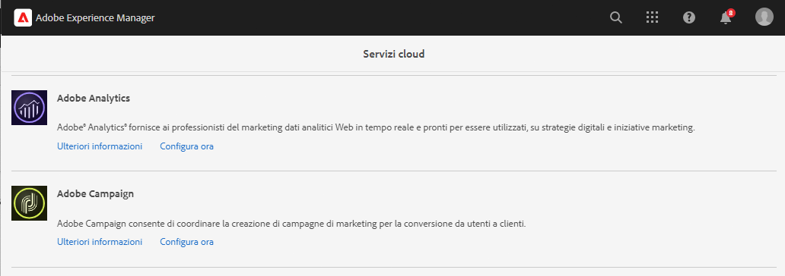
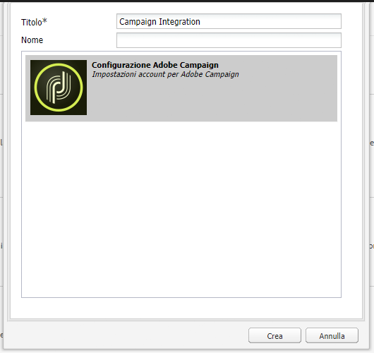
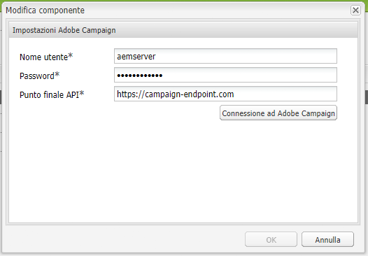

# Integrazione con Adobe Campaign Classic {#integrating-campaign-classic}

Integrando AEM as a Cloud Service con Adobe Campaign, puoi gestire la consegna e-mail, il contenuto e i moduli direttamente in AEM as a Cloud Service. Per consentire la comunicazione bidirezionale tra le soluzioni sono necessari alcuni passaggi di configurazione sia in Adobe Campaign Classic che in AEM as a Cloud Service.

Questa integrazione consente di utilizzare in modo indipendente AEM as a Cloud Service e Adobe Campaign Classic. Gli addetti al marketing possono creare campagne e utilizzare il targeting in Adobe Campaign, mentre i creatori di contenuti possono lavorare contemporaneamente sulla progettazione del contenuto in AEM as a Cloud Service. L’integrazione consente al contenuto e alla progettazione della campagna in AEM di essere mirati e consegnati da Campaign.

## Passaggi dell’integrazione {#integration-steps}

L’integrazione tra AEM e Campaign richiede una serie di passaggi in entrambe le soluzioni.

1. [Installazione del pacchetto di integrazione di AEM in Campaign.](#install-package)
1. [Creare un operatore di AEM in Campaign](#create-operator)
1. [Configurare l’integrazione di Campaign in AEM](#campaign-integration)
1. [Configurare AEM Externalizer](#externalizer)
1. [Configurare l’utente remoto di Campaing in AEM](#configure-user)
1. [Configurare l’account esterno di AEM in Campaign](#acc-setup)

Il presente documento fornisce una guida dettagliata per superare ognuno di questi passaggi

## Prerequisiti {#prerequisites}

* Accesso amministratore ad Adobe Campaign Classic
   * Per eseguire l’integrazione, è necessaria un&#39;istanza Adobe Campaign Classic funzionante, incluso un database configurato.
   * Per ulteriori informazioni su come impostare e configurare Adobe Campaign Classic, consulta la [documentazione di Adobe Campaign Classic,](https://experienceleague.adobe.com/docs/campaign-classic/using/campaign-classic-home.html?lang=it) in particolare la Guida all’installazione e alla configurazione.

* Accesso amministratore ad AEM as a Cloud Service

## Installazione del pacchetto di integrazione di AEM in Campaign {#install-package}

Il pacchetto di **Integrazione di AEM** in Adobe Campaign include diverse configurazioni standard necessarie per la connessione ad AEM.

1. In qualità di amministratore, accedi all’istanza di Adobe Campaign utilizzando la console client.

1. Seleziona **Strumenti** > **Avanzate** > **Importa pacchetto..**.

   

1. Fai clic su **Installa un pacchetto standard** e quindi su **Successivo**.

1. Verifica il pacchetto di **Integrazione di AEM**.

   

1. Fai clic su **Successivo** e quindi su **Avvia** per avviare l’installazione.

   

1. Al completamento dell’installazione, fai clic su **Chiudi**.

Il pacchetto di integrazione adesso è installato.

## Creazione dell’operatore di AEM in Campaign {#create-operator}

Il pacchetto di integrazione crea automaticamente l’operatore `aemserver` che AEM utilizza per connettersi ad Adobe Campaign. È necessario definire un’area di sicurezza per questo operatore e impostarne la password.

1. Accedi ad Adobe Campaign come amministratore utilizzando la console client.

1. Seleziona **Strumenti** -> **Esplora** dalla barra del menu.

1. In Esplora, passa al nodo **Amministrazione** > **Gestione degli accessi** > **Operatori**.

1. Seleziona l’operatore `aemserver`.

1. Nella scheda **Modifica** dell’operatore, seleziona la sotto-scheda **Diritti di accesso** e quindi fai clic sul link **Modifica i parametri di accesso...**.

   

1. Seleziona l’area di sicurezza appropriata e definisci la maschera IP attendibile in base alle esigenze.

1. Fai clic su **Salva**.

1. Esci dal client di Adobe Campaign.

1. Nel file system del server di Adobe Campaign, accedi al percorso di installazione di Campaign e modifica il `serverConf.xml` file come amministratore. Generalmente questo file si trova in:
   * `C:\Program Files\Adobe\Adobe Campaign Classic v7\conf` in Windows.
   * `/usr/local/neolane/nl6/conf/eng` in Linux.

1. Cerca `securityZone` e assicurati che i seguenti parametri siano impostati per l’area di sicurezza dell’operatore AEM.

   * `allowHTTP="true"`
   * `sessionTokenOnly="true"`
   * `allowUserPassword="true"`.

1. Salva il file.

1. Assicurati che l’area di sicurezza non venga sovrascritta dalle rispettive impostazioni nel `config-<server name>.xml` file.

   * Se il file di configurazione contiene un’impostazione separata per l’area di sicurezza, modifica l’attributo `allowUserPassword` in `true`.

1. Se desideri modificare la porta del server Adobe Campaign Classic, sostituisci `8080` con la porta desiderata.

>[!CAUTION]
>
>Per impostazione predefinita, per l’operatore non è configurata alcuna area di sicurezza. Affinché AEM possa connettersi ad Adobe Campaign, devi selezionare un’area come descritto nei passaggi precedenti.
>
>Per evitare problemi di sicurezza, Adobe consiglia vivamente di creare un’area di sicurezza dedicata ad AEM. Per ulteriori informazioni su questo argomento, consulta [Documentazione di Adobe Campaign Classic.](https://experienceleague.adobe.com/docs/campaign-classic/using/installing-campaign-classic/additional-configurations/security-zones.html?lang=it)

1. Nel client Campaign, torna all’operatore `aemserver` e seleziona la scheda **Generale**.

1. Fai clic sul link **Reimpostare la password..**.

1. Specifica una password e conservala in luogo sicuro per utilizzarla in futuro.

1. Fai clic su **OK** per salvare la password per l’operatore `aemserver`.

## Configurazione dell’integrazione di Campaign in AEM {#campaign-integration}

Per comunicare con Campaign, AEM utilizza [l’operatore che hai già configurato in Campaign](#create-operator).

1. Accedi alla tua istanza di authoring di AEM come amministratore.

1. Dalla barra laterale di navigazione globale, seleziona **Strumenti** > **Cloud Services** > **Cloud Services legacy** > **Adobe Campaign**, quindi fai clic su **Configura ora**.

   

1. Nella finestra di dialogo, crea una configurazione del servizio Campaign inserendo un **Titolo** e facendo clic su **Crea**.

   

1. Viene visualizzata una nuova finestra di dialogo per modificare la configurazione. Fornisci le informazioni necessarie.

   * **Nome utente**: corrisponde [all’operatore del pacchetto di integrazione di AEM in Adobe Campaign creato nel passaggio precedente.](#create-operator)Per impostazione predefinita, è `aemserver`.
   * **Password**: corrisponde alla password per l’[operatore del pacchetto di integrazione di AEM in Adobe Campaign creato nel passaggio precedente.](#create-operator)
   * **Endpoint API**: corrisponde all’URL dell’istanza di Adobe Campaign.

   

1. Seleziona **Connetti ad Adobe Campaign** per verificare la connessione, quindi fai clic su **OK**.

AEM adesso può comunicare con Adobe Campaign.

>[!NOTE]
>
>Assicurati che il server di Adobe Campaign sia raggiungibile tramite Internet. AEM as a Cloud Service non può accedere a reti private.

## Configurazione di AEM Externalizer {#externalizer}

Externalizer è un servizio OSGi di AEM che trasforma un percorso di risorsa in un URL esterno e assoluto, necessario perché AEM possa distribuire i contenuti utilizzabili da Campaign.

1. Accedi all’istanza di authoring di AEM come amministratore.
1. Conferma l’istanza di pubblicazione nella configurazione di Externalizer controllando il dump dello stato dei servizi OSGi nella [console per sviluppatori.](https://experienceleague.adobe.com/docs/experience-manager-learn/cloud-service/debugging/debugging-aem-as-a-cloud-service/developer-console.html?lang=it#osgi-services)
1. Se non è corretta, apporta le modifiche necessarie nell’archivio Git dell’istanza corrispondente e quindi [distribuendo la configurazione utilizzando Cloud Manager.](/help/implementing/cloud-manager/deploy-code.md)

```text
Service 3310 - [com.day.cq.commons.externalizer] (pid: com.day.cq.commons.impl.externalizerImpl)",
"  from Bundle 420 - Day Communique 5 Commons Library (com.day.cq.cq-commons), version 5.12.16",
"    component.id: 2149",
"    component.name: com.day.cq.commons.impl.externalizerImpl",
"    externalizer.contextpath: ",
"    externalizer.domains: [local https://author-p17558-e33255-cmstg.adobeaemcloud.com, author https://author-p17558-e33255-cmstg.adobeaemcloud.com,
     publish https://publish-p17558-e33255-cmstg.adobeaemcloud.com]",
"    externalizer.encodedpath: false",
"    externalizer.host: ",
"    feature-origins: [com.day.cq:cq-quickstart:slingosgifeature:cq-platform-model_quickstart_author:6.6.0-V23085]",
"    service.bundleid: 420",
"    service.description: Creates absolute URLs",
"    service.scope: bundle",
"    service.vendor: Adobe Systems Incorporated",
```

>[!NOTE]
>
>L’stanza di pubblicazione deve essere raggiungibile dal server di Adobe Campaign.

## Configurazione dell’utente remoto di Campaign in AEM {#configure-user}

Per consentire a Campaign di comunicare con AEM, devi impostare una password per l’utente `campaign-remote` in AEM.

1. Accedi ad AEM come amministratore.
1. Nella console di navigazione principale, fai clic su **Strumenti** nella barra a sinistra.
1. Quindi fai clic su **Sicurezza** -> **Utenti** per aprire la console di amministrazione degli utenti.
1. Individua l’utente `campaign-remote`.
1. Seleziona l’utente `campaign-remote` e fai clic su **Proprietà** per modificarlo.
1. Nella finestra **Modifica impostazioni utente**, fai clic su **Cambia password**.
1. Fornisci una nuova password per l’utente, annota la password e conservala in un luogo sicuro per utilizzarla in futuro.
1. Fai clic su **Salva** per salvare il cambiamento della password.
1. Fai clic su **Salva e chiudi** per salvare le modifiche apportate all’utente `campaign-remote`.

## Configurazione dell’account esterno di AEM in Campaign {#acc-setup}

Durante l’[installazione del pacchetto di **Integrazione di AEM** in Campaign,](#install-package) viene creato un account esterno per AEM. Configurando questo account esterno, Adobe Campaign può connettersi ad AEM as a Cloud Service, abilitando la comunicazione bidirezionale tra le soluzioni.

1. Accedi ad Adobe Campaign come amministratore utilizzando la console client.

1. Seleziona **Strumenti** -> **Esplora** dalla barra del menu.

1. In Esplora, passa al nodo **Amministrazione** > **Piattaforma** > **Account esterni**.

   

1. Individua l’account di AEM esterno. Per impostazione predefinita, tale account ha i seguenti valori:

   * **Tipo**: AEM
   * **Etichetta**: istanza AEM
   * **Nome interno**: aemInstance

1. Nella scheda **Generale** di questo account, inserisci le informazioni utente definite nel passaggio [Imposta password utente remoto di Campaign](#set-campaign-remote-password).

   * **Server**: l’indirizzo server di authoring di AEM
      * Il server di authoring di AEM deve essere raggiungibile dall’stanza del server di Adobe Campaign Classic.
      * Verificare che l’indirizzo del server **non** termini con una barra finale.
   * **Account**: per impostazione predefinita, rappresenta  l’utente `campaign-remote` che hai impostato in AEM nel passaggio [Imposta password utente remoto di Campaign](#set-campaign-remote-password).
   * **Password**: questa password è la stessa `campaign-remote` dell’utente che hai impostato in AEM nel passaggio [Imposta password utente remoto di Campaign](#set-campaign-remote-password).

1. Seleziona la casella di controllo **Abilitato**.

1. Fai clic su **Salva**.

Adobe Campaign adesso può comunicare con AEM.

## Passaggi successivi {#next-steps}

Adobe Campaign Classic e AEM as a Cloud Service sono stati configurati, quindi ora l’integrazione è completa.

Per scoprire come creare una newsletter in Adobe Experience Manager, prosegui con [il presente documento.](/help/sites-cloud/authoring/campaign/creating-newsletters.md)
