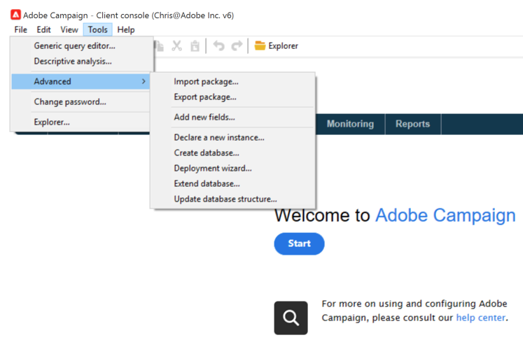

# Integrazione con Adobe Campaign Classic {#integrating-campaign-classic}

Integrando AEM as a Cloud Service con Adobe Campaign, puoi gestire e-mail, contenuti e moduli direttamente in AEM as a Cloud Service. Per consentire la comunicazione bidirezionale tra le soluzioni sono necessari passaggi di configurazione sia in Adobe Campaign Classic che in AEM as a Cloud Service.

Questa integrazione consente AEM utilizzo indipendente di as a Cloud Service e Adobe Campaign Classic. Gli addetti al marketing possono creare campagne e utilizzare il targeting in Adobe Campaign, mentre i creatori di contenuti in parallelo possono lavorare sulla progettazione dei contenuti in AEM as a Cloud Service. L’integrazione consente al contenuto e alla progettazione della campagna in AEM di essere mirati e consegnati da Campaign.

## Passaggi di integrazione {#integration-steps}

L’integrazione tra AEM e Campaign richiede una serie di passaggi in entrambe le soluzioni.

1. [Installa il pacchetto di integrazione AEM in Campaign.](#install-package)
1. [Creare un operatore per AEM in Campaign](#create-operator)
1. [Configurare l’integrazione di Campaign in AEM](#campaign-integration)
1. [Configurare l’esternalizzatore AEM](#externalizer)
1. [Configurare l’utente remoto della campagna in AEM](#configure-user)
1. [Configurare l’account esterno AEM in Campaign](#acc-setup)

Questo documento ti guida nel dettaglio in ognuno di questi passaggi

## Prerequisiti {#prerequisites}

* Accesso amministratore a Adobe Campaign Classic
   * Per eseguire l&#39;integrazione, è necessaria un&#39;istanza Adobe Campaign Classic funzionante, incluso un database configurato.
   * Per ulteriori informazioni su come configurare e configurare Adobe Campaign Classic, consulta la [documentazione Adobe Campaign Classic,](https://experienceleague.adobe.com/docs/campaign-classic/using/campaign-classic-home.html) in particolare la guida all&#39;installazione e alla configurazione.

* Accesso amministratore a AEM as a Cloud Service

## Installazione del pacchetto di integrazione AEM in Campaign {#install-package}

La **Integrazione AEM** In Adobe Campaign sono incluse diverse configurazioni standard necessarie per la connessione a AEM.

1. In qualità di amministratore, accedi all’istanza di Adobe Campaign utilizzando la console client.

1. Seleziona **Strumenti** > **Avanzate** > **Importa pacchetto..**.

   

1. Fai clic su **Installare un pacchetto standard** quindi fai clic su **Successivo**.

1. Controlla la **Integrazione AEM** pacchetto.

   

1. Fai clic su **Successivo** e quindi **Inizio** per avviare l&#39;installazione.

   

1. Fai clic su **Chiudi** al completamento dell&#39;installazione.

Il pacchetto di integrazione è ora installato.

## Creazione dell’operatore per la AEM in Campaign {#create-operator}

Il pacchetto di integrazione crea automaticamente il `aemserver` che AEM utilizzato per connettersi ad Adobe Campaign. È necessario definire una zona di protezione per questo operatore e impostarne la password.

1. Accedi ad Adobe Campaign come amministratore utilizzando la console client.

1. Seleziona **Strumenti** -> **Esplora risorse** dalla barra dei menu.

1. Nell’esploratore, passa alla **Amministrazione** > **Gestione degli accessi** > **Operatori** nodo.

1. Seleziona la `aemserver` operatore.

1. Sulla **Modifica** , seleziona la scheda dell’operatore **Diritti di accesso** sottoscheda e quindi fai clic su **Modifica i parametri di accesso...** link.

   

1. Seleziona la zona di sicurezza appropriata e definisci la maschera IP attendibile in base alle esigenze.

1. Fai clic su **Salva**.

1. Esci dal client Adobe Campaign.

1. Nel file system del server Adobe Campaign, accedi al percorso di installazione di Campaign e modifica il `serverConf.xml` come amministratore. Questo file si trova in genere in:
   * `C:\Program Files\Adobe\Adobe Campaign Classic v7\conf` in Windows.
   * `/usr/local/neolane/nl6/conf/eng` in Linux.

1. Cerca `securityZone` e assicurati che i seguenti parametri siano impostati per la zona di sicurezza dell’operatore AEM.

   * `allowHTTP="true"`
   * `sessionTokenOnly="true"`
   * `allowUserPassword="true"`.

1. Salva il file.

1. Assicurati che la zona di sicurezza non venga sovrascritta dalle rispettive impostazioni nella `config-<server name>.xml` file.

   * Se il file di configurazione contiene un&#39;impostazione separata per l&#39;area di sicurezza, modificare la `allowUserPassword` attributo a `true`.

1. Se si desidera modificare la porta del server Adobe Campaign Classic, sostituire `8080` con la porta desiderata.

>[!CAUTION]
>
>Per impostazione predefinita, non è configurata alcuna zona di sicurezza per l’operatore . Affinché AEM possa connettersi ad Adobe Campaign, devi selezionare una zona come descritto nei passaggi precedenti.
>
>L’Adobe consiglia vivamente di creare un’area di sicurezza dedicata a AEM per evitare problemi di sicurezza. Per ulteriori informazioni su questo argomento, consulta [Documentazione Adobe Campaign Classic.](https://experienceleague.adobe.com/docs/campaign-classic/using/installing-campaign-classic/additional-configurations/security-zones.html)

1. Nel client Campaign, torna al `aemserver` e seleziona la **Generale** scheda .

1. Fai clic sul pulsante **Reimposta password..** link.

1. Specifica una password e memorizzala in un percorso sicuro per un utilizzo futuro.

1. Fai clic su **OK** per salvare la password del `aemserver` operatore.

## Configurazione dell’integrazione di Campaign in AEM {#campaign-integration}

AEM [l’operatore già configurato in Campaign](#create-operator) per comunicare con Campaign

1. Accedi alla tua istanza di authoring AEM come amministratore.

1. Dalla barra laterale di navigazione globale, seleziona **Strumenti** > **Cloud Services** > **Cloud Services legacy** > **Adobe Campaign**, quindi fai clic su **Configura ora**.

   

1. Nella finestra di dialogo, crea una configurazione del servizio Campaign immettendo un **Titolo** e fai clic su **Crea**.

   

1. Viene visualizzata una nuova finestra di dialogo per modificare la configurazione. Fornire le informazioni necessarie.

   * **Nome utente** - Questo è [l’operatore del pacchetto di integrazione di Adobe Campaign AEM creato nel passaggio precedente.](#create-operator) Per impostazione predefinita `aemserver`.
   * **Password** - Password [l’operatore del pacchetto di integrazione di Adobe Campaign AEM creato nel passaggio precedente.](#create-operator)
   * **Punto finale API** - Questo è l’URL dell’istanza di Adobe Campaign.

   

1. Seleziona **Connettersi ad Adobe Campaign** per verificare la connessione, quindi fare clic su **OK**.

AEM comunicare con Adobe Campaign.

>[!NOTE]
>
>Assicurati che il server Adobe Campaign sia raggiungibile tramite Internet. AEM as a Cloud Service non può accedere a reti private.

## Configurazione di AEM Externalizer {#externalizer}

L’esternalizzatore è un servizio OSGi in AEM che trasforma un percorso di risorsa in un URL esterno e assoluto, necessario per AEM servire il contenuto utilizzabile da Campaign.

1. Accedi all’istanza di authoring AEM come amministratore.
1. Conferma l’istanza di pubblicazione nella configurazione Externalizer controllando l’immagine di stato dei servizi OSGi nella [console per sviluppatori.](https://experienceleague.adobe.com/docs/experience-manager-learn/cloud-service/debugging/debugging-aem-as-a-cloud-service/developer-console.html#osgi-services)
1. Se non è corretto, apporta le modifiche necessarie nel repository Git dell’istanza corrispondente e quindi [distribuire la configurazione utilizzando cloud manager.](/help/implementing/cloud-manager/deploy-code.md)

```text
Service 3310 - [com.day.cq.commons.externalizer] (pid: com.day.cq.commons.impl.externalizerImpl)",
"  from Bundle 420 - Day Communique 5 Commons Library (com.day.cq.cq-commons), version 5.12.16",
"    component.id: 2149",
"    component.name: com.day.cq.commons.impl.externalizerImpl",
"    externalizer.contextpath: ",
"    externalizer.domains: [local https://author-p17558-e33255-cmstg.adobeaemcloud.com, author https://author-p17558-e33255-cmstg.adobeaemcloud.com,
     publish https://publish-p17558-e33255-cmstg.adobeaemcloud.com]",
"    externalizer.encodedpath: false",
"    externalizer.host: ",
"    feature-origins: [com.day.cq:cq-quickstart:slingosgifeature:cq-platform-model_quickstart_author:6.6.0-V23085]",
"    service.bundleid: 420",
"    service.description: Creates absolute URLs",
"    service.scope: bundle",
"    service.vendor: Adobe Systems Incorporated",
```

>[!NOTE]
>
>L’istanza di pubblicazione deve essere raggiungibile dal server Adobe Campaign.

## Configurazione dell’utente remoto della campagna in AEM {#configure-user}

Per consentire a Campaign di comunicare con AEM, devi impostare una password per il `campaign-remote` in AEM.

1. Accedi a AEM come amministratore.
1. Nella console di navigazione principale, fai clic su **Strumenti** nella barra a sinistra.
1. Quindi fai clic su **Sicurezza** -> **Utenti** per aprire la console di amministrazione utente.
1. Individua il `campaign-remote` utente.
1. Seleziona la `campaign-remote` utente e fai clic su **Proprietà** per modificare l&#39;utente.
1. In **Modifica impostazioni utente** finestra, fai clic su **Modifica password**.
1. Fornisci una nuova password per l’utente e annota la password in un percorso sicuro da utilizzare in futuro.
1. Fai clic su **Salva** per salvare la modifica della password.
1. Fai clic su **Salva e chiudi** per salvare le modifiche apportate al `campaign-remote` utente.

## Configurazione dell’account esterno AEM in Campaign {#acc-setup}

Quando [installazione di **Integrazione AEM** pacchetto in Campaign,](#install-package) viene creato un account esterno per AEM. Configurando questo account esterno, Adobe Campaign può connettersi a AEM as a Cloud Service, abilitando la comunicazione bidirezionale tra le soluzioni.

1. Accedi ad Adobe Campaign come amministratore utilizzando la console client.

1. Seleziona **Strumenti** -> **Esplora risorse** dalla barra dei menu.

1. Nell’esploratore, passa alla **Amministrazione** > **Piattaforma** > **Account esterni** nodo.

   

1. Individua l’account AEM esterno. Per impostazione predefinita ha i valori seguenti:

   * **Tipo** - AEM
   * **Etichetta** - Istanza AEM
   * **Nome interno** - aemInstance

1. Sulla **Generale** scheda di questo account, immetti le informazioni utente definite nella [Imposta password utente remota della campagna](#set-campaign-remote-password) passo.

   * **Server** - Indirizzo server autore AEM
      * Il server di authoring AEM deve essere raggiungibile dall’istanza del server Adobe Campaign Classic.
      * Verificare che l&#39;indirizzo del server **not** finisce in una barra finale.
   * **Account** - Per impostazione predefinita, questa è la `campaign-remote` utente impostato in AEM nel [Imposta password utente remota della campagna](#set-campaign-remote-password) passo.
   * **Password** - Questa password è la stessa del `campaign-remote` utente impostato in AEM nel [Imposta password utente remota della campagna](#set-campaign-remote-password) passo.

1. Seleziona la **Abilitato** casella di controllo.

1. Fai clic su **Salva**.

Adobe Campaign può ora comunicare con AEM.

## Passaggi successivi {#next-steps}

Con Adobe Campaign Classic e AEM as a Cloud Service configurati, l’integrazione è ora completa.

Per scoprire come creare una newsletter in Adobe Experience Manager, continua con [presente documento.](/help/sites-cloud/integrating/creating-newsletter.md)
