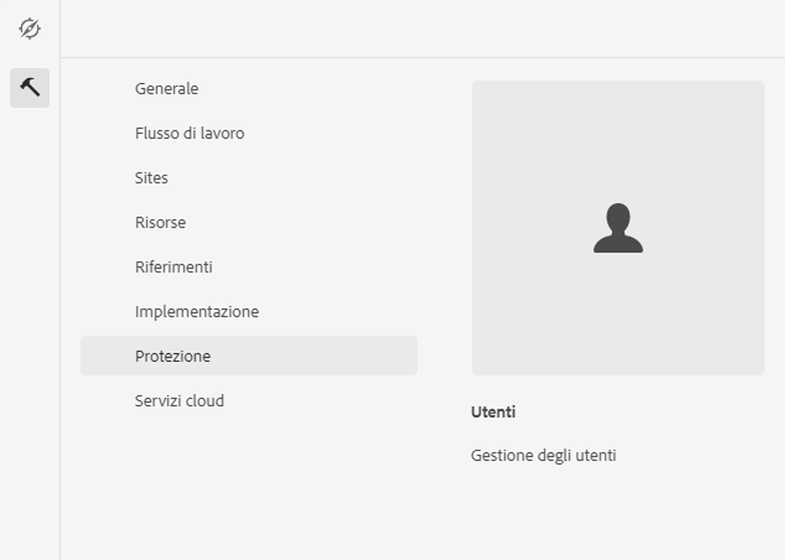

# Integrazione con Adobe Campaign Classic {#integrating-campaign-classic}

Integrando con Adobe Campaign è possibile gestire la distribuzione delle e-mail, i contenuti e i moduli direttamente in AEM as a Cloud Service. Per abilitare la comunicazione bidirezionale tra le soluzioni sono necessari passaggi di configurazione sia in Adobe Campaign Classic che in AEM as a Cloud Service.

Tieni presente che AEM as a Cloud Service e Adobe Campaign Classic possono essere utilizzati anche in modo indipendente. Ad esempio, gli esperti di marketing possono creare campagne e utilizzare il targeting in Adobe Campaign, mentre i creatori di contenuti possono lavorare sulla progettazione in AEM as a Cloud Service.

## Flusso di lavoro di integrazione {#integration-workflow}

Nei capitoli seguenti viene descritto come integrare le soluzioni. Questo richiede passaggi di configurazione sia in Adobe Campaign Classic che AEM as a Cloud Service. Come tale, imparerai come:

* [Creare l’utente operatore](#create-operator)
* [Configurare AEM as a Cloud Service per l’integrazione](#aem-configuration)
* [Configurare l’utente remoto della campagna](#configure-user)
* [Configurazione dell’account esterno Adobe Campaign Classic](#acc-setup)

### Prerequisiti {#prerequisites}

**Adobe Campaign Classic**

Per eseguire l&#39;integrazione è necessaria un&#39;istanza Adobe Campaign Classic funzionante, incluso un database. Per ulteriori informazioni su come configurare e configurare Adobe Campaign Classic, consulta il funzionario [Documentazione di Adobe Campaign Classic](https://experienceleague.adobe.com/docs/campaign-classic/using/campaign-classic-home.html) in particolare la guida all&#39;installazione e alla configurazione. Tieni presente che per eseguire le operazioni riportate di seguito è necessario disporre anche del ruolo di amministratore.

**AEM as a Cloud Service**

Hai bisogno del [AEM as a Cloud Service](https://experienceleague.adobe.com/docs/experience-manager-cloud-service/content/overview/introduction.html) soluzione.

### Creazione dell’utente Operatore in Adobe Campaign Classic {#create-operator}

Apri la console del client Adobe Campaign Classic dal menu Start ed effettua l’accesso. Viene visualizzata la home page.

1. Fai clic su **Esplora risorse** per aprire la visualizzazione Esplora risorse.
   
1. Nella vista ad albero a sinistra, seleziona **Amministrazione->Gestione accessi->Operatori**.
1. Fai doppio clic sul pulsante `aemserver` nell&#39;elenco Operatori a destra.
1. Passa alla **Modifica** scheda . Imposta la password per aemserver.
   
1. Fai clic sul pulsante **Diritti di accesso** e fai clic su **Modificare i parametri di accesso** link sotto le impostazioni di sicurezza.
1. In Crittografia, selezionare Rete pubblica come zona di connessione autorizzata. Fai clic su **OK**.
   
1. Fai clic su **Salva**.
1. Esci.
1. Vai al percorso di installazione di Adobe Campaign Classic v7, ad esempio `C:\Program Files\Adobe\Adobe Campaign Classic v7\conf` e aprire `serverConf.xml` come amministratore.
   * Cerca **zona di sicurezza**.
   * Imposta i seguenti parametri `allowHTTP="true"` `sessionTokenOnly="true"` `allowUserPassword="true"`.
   * Salva il file.
1. Assicurati che la zona di sicurezza non venga sovrascritta dalle rispettive impostazioni in `config-<server name>.xml` file (C:\Program Files\Adobe\Adobe Campaign Classic v7\conf\config_acc-test.xml).
   * Se il file di configurazione contiene un&#39;impostazione di zona di sicurezza separata, modifica la `allowUserPassword` Attribuisci a true.
1. Per modificare la porta del server Adobe Campaign Classic, sostituisci 8080 con la porta desiderata (ad esempio: 80).

>[!NOTE]
>
>Per impostazione predefinita, non è configurata alcuna zona di sicurezza per l’operatore . Per collegarti ad Adobe Campaign con AEM as a Cloud Service, devi selezionarne uno (vedi i passaggi precedenti). Consigliamo vivamente di creare una zona di sicurezza dedicata a AEM per evitare problemi di sicurezza.

### Configurazione di AEM as a Cloud Service {#aem-configuration}

1. Accedi a cloud manager e avvia l’istanza di authoring AEM as a Cloud Service.
1. Vai a **Strumenti → Cloud Service → Cloud Service legacy**.
   
1. Scorri verso il basso fino ad Adobe Campaign e fai clic sul pulsante **Configura ora** link.
   * Inserisci un titolo.
   * Immetti un nome.
   * Fai clic su **Crea**.
1. Nella schermata Modifica componente
   * Inserisci il nome utente, vedi [Creare l’utente operatore](#create-operator).
   * Immettere la password.
   * Inserisci il punto finale dell’API del server Adobe Campaign Classic (ad esempio, `http://3.22625.51:80`).
   * Fai clic su **Connettersi ad Adobe Campaign**.
   * Fai clic su **OK**.

   >[!NOTE]
   >
   >Assicurati che il server Adobe Campaign sia raggiungibile su Internet perché AEM as a Cloud Service non può raggiungere reti private.
1. Controlla l’istanza di pubblicazione nella configurazione di Link Externalizer.
Puoi visualizzare questa configurazione controllando il dump di stato dei servizi OSGi nel [console per sviluppatori](https://experienceleague.adobe.com/docs/experience-manager-learn/cloud-service/debugging/debugging-aem-as-a-cloud-service/developer-console.html#osgi-services).
Se non è corretto, apporta modifiche nell’archivio Git dell’istanza corrispondente e quindi distribuisci la configurazione utilizzando [cloud manager](https://experienceleague.adobe.com/docs/experience-manager-cloud-service/content/implementing/using-cloud-manager/deploy-code.html).

```
Service 3310 - [com.day.cq.commons.Externalizer] (pid: com.day.cq.commons.impl.ExternalizerImpl)",
"  from Bundle 420 - Day Communique 5 Commons Library (com.day.cq.cq-commons), version 5.12.16",
"    component.id: 2149",
"    component.name: com.day.cq.commons.impl.ExternalizerImpl",
"    externalizer.contextpath: ",
"    externalizer.domains: [local https://author-p17558-e33255-cmstg.adobeaemcloud.com, author https://author-p17558-e33255-cmstg.adobeaemcloud.com,
     publish https://publish-p17558-e33255-cmstg.adobeaemcloud.com]",
"    externalizer.encodedpath: false",
"    externalizer.host: ",
"    feature-origins: [com.day.cq:cq-quickstart:slingosgifeature:cq-platform-model_quickstart_author:6.6.0-V23085]",
"    service.bundleid: 420",
"    service.description: Creates absolute URLs",
"    service.scope: bundle",
"    service.vendor: Adobe Systems Incorporated",
```

>[!NOTE]
>
>L’istanza di pubblicazione deve essere raggiungibile anche dal server Adobe Campaign.

### Configurazione dell’utente remoto di Adobe Campaign {#configure-user}

È necessario impostare una password per l’utente remoto della campagna. È necessario per collegare Adobe Campaign Classic con AEM as a Cloud Service.

1. Vai a **AEM → Strumenti → Sicurezza → Utenti**.
   
1. Cerca il `campaign-remote` e clicca su di esso.
1. Fai clic su Cambia password
   * Immetti la nuova password due volte.
   * Immetti la tua password AEM.
   * Fai clic su **Salva**.

### Configurazione dell’account esterno Adobe Campaign Classic {#acc-setup}

È inoltre necessario configurare un account esterno per collegare Adobe Campaign Classic all’istanza as a Cloud Service AEM.

1. Accedi al server Adobe Campaign Classic utilizzando la console client.
1. Passare alla visualizzazione Esplora risorse.
1. Nella vista struttura a sinistra, vai a **Amministrazione → Piattaforma → Account esterni**.
1. Nella vista a elenco in alto a destra, fai clic su AEM’istanza.
1. Nella configurazione dell’istanza AEM
   * Ad esempio, AEM l’autore as a Cloud Service IP/FALN `https://author-p17558-e33255-cmstg.adobeaemcloud.com`.
   * Inserisci l’utente e l’account.
   * Immetti la password per l&#39;utente remoto della campagna impostata nell&#39;istanza AEM as a Cloud Service (consulta la procedura precedente).
   * Seleziona la **Abilitato** casella di controllo.
   * Fai clic su **Salva**.

   >[!NOTE]
   >
   >È necessario che l’IP/FQDN del server AEM Author sia raggiungibile dall’istanza del server Adobe Campaign Classic. Inoltre, non aggiungere il carattere barra rovesciata nell’IP/FQDN del server AEM Author.

Dopo aver configurato sia Adobe Campaign Classic che AEM as a Cloud Service, l’integrazione è ora completa. Inoltre, puoi anche imparare a creare una newsletter Adobe Experience Manager leggendo [questa pagina](/help/sites-cloud/integrating/creating-newsletter.md).
