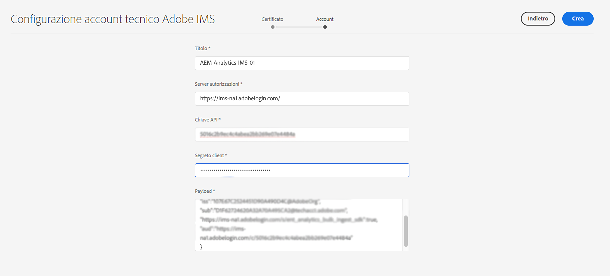

# Configurazione IMS da utilizzare per l’integrazione con Adobe Analytics {#ims-configuration-for-integration-with-adobe-analytics}

L’integrazione di Adobe Experience Manager as a Cloud Service (AEMaaCS) con Adobe Analytics tramite l’API Analytics Standard richiede la configurazione di Adobe IMS (Identity Management System). La configurazione viene realizzata con la console Adobe Developer.

>[!NOTE]
>
>Il supporto per l’API Adobe Analytics Standard 2.0 è una novità di AEMaaCS 2022.2.0. Questa versione dell’API supporta l’autenticazione IMS.
>
>La selezione API è guidata dal metodo di autenticazione utilizzato per l’integrazione AEM/Analytics.
>
>Ulteriori informazioni sono disponibili su [Migrazione alle API 2.0](https://developer.adobe.com/analytics-apis/docs/2.0/guides/migration/).

## Prerequisiti {#prerequisites}

Prima di iniziare questa procedura:

* Il [Supporto Adobe](https://helpx.adobe.com/it/contact/enterprise-support.ec.html) deve effettuare il provisioning del tuo account per:

   * Console Adobe
   * Console per sviluppatori di Adobe
   * Adobe Analytics e
   * Adobe IMS (Identity Management System)

* L’amministratore di sistema della tua organizzazione deve utilizzare l’Admin Console per aggiungere gli sviluppatori necessari ai profili di prodotto pertinenti.

   * Questo fornisce agli sviluppatori specifici le autorizzazioni per abilitare le integrazioni tramite la console Adobe Developer.
   * Per maggiori dettagli vedi [Gestire gli sviluppatori](https://helpx.adobe.com/it/enterprise/admin-guide.html/enterprise/using/manage-developers.ug.html).

## Impostare una configurazione IMS - Generare una chiave pubblica {#configuring-ims-generating-a-public-key}

La prima fase consiste nel creare una configurazione IMS in AEM e generare la chiave pubblica.

1. In AEM apri il menu **Strumenti**.
1. Nella sezione **Sicurezza** seleziona **Configurazioni Adobe IMS**.
1. Seleziona **Crea** per aprire **Configurazione dell’account tecnico Adobe IMS**.
1. Dal menu a discesa in **Configurazione cloud**, seleziona **Adobe Analytics**.
1. Attiva **Crea nuovo certificato** e inserisci un nuovo alias.
1. Conferma con **Crea certificato**.

   

1. Seleziona **Scarica** (o **Scarica chiave pubblica**) per scaricare il file sull&#39;unità locale, in modo che sia pronto per l&#39;uso durante la [configurazione di IMS per l’integrazione di Adobe Analytics con AEM](#configuring-ims-adobe-analytics-integration-with-aem).

   >[!CAUTION]
   >
   >Tieni aperta questa configurazione, sarà necessaria di nuovo quando [Completamento della configurazione IMS in AEM](#completing-the-ims-configuration-in-aem).

   

## Configurazione di IMS per l’integrazione di Adobe Analytics con AEM {#configuring-ims-adobe-analytics-integration-with-aem}

Utilizzando Adobe Developer Console è necessario creare un progetto (integrazione) con Adobe Analytics (affinché AEM lo possa utilizzare) e assegnare i privilegi richiesti.

### Creazione del progetto {#creating-the-project}

Apri la console Adobe Developer per creare un progetto con Adobe Analytics che AEM utilizzerà:

1. Apri la console Adobe Developer per progetti:

   [https://developer.adobe.com/console/projects](https://developer.adobe.com/console/projects)

1. Vengono visualizzati tutti i progetti che hai. Seleziona **Crea nuovo progetto**; la posizione e l’utilizzo dipenderanno da:

   * Se non hai ancora un progetto, **Crea nuovo progetto** è al centro, in basso.
     
   * Se disponi già di progetti esistenti, questi vengono elencati e **Crea nuovo progetto** è in alto a destra.
     

1. Seleziona **Aggiungi a progetto** seguito da **API**:

   

1. Seleziona **Adobe Analytics**, quindi **Successivo**:

   >[!NOTE]
   >
   >Se sei abbonato a Adobe Analytics ma non lo vedi nell’elenco, controlla nei [Prerequisiti](#prerequisites).

   

1. Seleziona **Account di servizio (JWT)** come tipo di autenticazione, quindi continua con **Successivo**:

   

1. **Carica la chiave pubblica**, e una volta fatto, continua con **Successivo**:

   

1. Controlla le credenziali e continua con **Successivo**:

   

1. Seleziona i profili di prodotto richiesti e continua con **Salva API configurata**:

   

1. La configurazione viene confermata.

### Assegnazione di privilegi all&#39;integrazione {#assigning-privileges-to-the-integration}

Ora devi assegnare i privilegi richiesti all’integrazione:

1. Apri l’**Admin Console** Adobe:

   * [https://adminconsole.adobe.com](https://adminconsole.adobe.com/)

1. Passa a **Prodotti** (barra degli strumenti in alto), quindi seleziona **Adobe Analytics - &lt;*tuo-id-tenant*>** (dal pannello a sinistra).
1. Seleziona **Profili di prodotto**, quindi l’area di lavoro richiesta dall’elenco mostrato. Ad esempio, Area di lavoro predefinita.
1. Seleziona **Credenziali API**, quindi la configurazione di integrazione richiesta.
1. Seleziona **Editor** come **Ruolo del prodotto**; anziché **Osservatore**.

## Dettagli memorizzati per il progetto di integrazione della console Adobe Developer {#details-stored-for-the-ims-integration-project}

Dalla Console Adobe Developer - Progetti è disponibile un elenco di tutti i progetti di integrazione:

* [https://developer.adobe.com/console/projects](https://developer.adobe.com/console/projects)

Seleziona una voce di progetto specifica per visualizzare ulteriori dettagli sulla configurazione. Comprendono:

* Panoramica del progetto
* Approfondimenti
* Credenziali 
   * Account servizio (JWT)
      * Dettagli delle credenziali
      * Genera JWT
* API
   * Ad esempio, Adobe Analytics

Alcune di queste sono necessarie per completare l’integrazione di Adobe Analytics in AEM basato su IMS.

## Completamento della configurazione IMS in AEM {#completing-the-ims-configuration-in-aem}

Per AEM è possibile completare la configurazione IMS aggiungendo i valori richiesti dall’integrazione IMS per Analytics:

1. Torna a [Configurazione IMS aperta in AEM](#configuring-ims-generating-a-public-key).
1. Seleziona **Avanti**.

1. Qui puoi utilizzare i [dettagli dalla configurazione del progetto in Adobe Developer Console](#details-stored-for-the-ims-integration-project):

   * **Titolo**: testo.
   * **Server di autorizzazione**: copia/incolla questo dato dalla riga `aud` della sezione **Payload** sottostante, ad esempio `https://ims-na1.adobelogin.com` nell’esempio seguente
   * **Chiave API**: copia questo dato dalla sezione **Credenziali** della [Panoramica del progetto](#details-stored-for-the-ims-integration-project)
   * **Segreto cliente**: generalo nella scheda [Segreto cliente della sezione Account di servizio (JWT)](#details-stored-for-the-ims-integration-project) e copialo
   * **Payload**: copia questo dato dalla scheda [Genera JWT della sezione Account di servizio (JWT)](#details-stored-for-the-ims-integration-project)

   

1. Conferma con **Crea**.

1. La configurazione di Adobe Analytics viene visualizzata nella console AEM.

   

## Conferma della configurazione IMS {#confirming-the-ims-configuration}

Per confermare che la configurazione funziona come previsto:

1. Apri:

   * `https://localhost<port>/libs/cq/adobeims-configuration/content/configurations.html`

   Esempio:

   * `https://localhost:4502/libs/cq/adobeims-configuration/content/configurations.html`

1. Seleziona la configurazione.
1. Seleziona **Verifica stato** dalla barra degli strumenti, seguito da **Verifica**.

   

1. In caso di esito positivo, verrà visualizzato un messaggio di conferma.

## Completare l’integrazione con Adobe Analytics {#complete-the-integration-with-adobe-analytics}

Ora puoi utilizzare questa configurazione IMS per completare l&#39;[Integrazione con Adobe Analytics](/help/sites-cloud/integrating/integrating-adobe-analytics.md).

<!--
## Configuring the Adobe Analytics Cloud Service {#configuring-the-adobe-analytics-cloud-service}

The configuration can now be referenced for a Cloud Service to use the Analytics Standard API:

1. Open the **Tools** menu. Then, within the **Cloud Services** section, select **Legacy Cloud Services**.
1. Scroll down to **Adobe Analytics** and select **Configure now**.

   The **Create Configuration** dialog will open.

1. Enter a **Title** and, if you want, a **Name** (if left blank, it is generated from the title).

   You can also select the required template (if more than one is available).

1. Confirm with **Create**.

   The **Edit Component** dialog will open.

1. Enter the details in the **Analytics Settings** tab:

    * **Authentication**: IMS

    * **IMS Configuration**: select the name of the IMS Configuration

1. Click **Connect to Analytics** to initialize the connection with Adobe Analytics.

   If the connection is successful, the message **Connection successful** is displayed.

1. Select **OK** on the message.

1. Complete other parameters as required, followed by **OK** on the dialog to confirm the configuration.

1. You can now proceed to [Adding an Analytics Framework](/help/sites-administering/adobeanalytics-connect.md) to configure parameters that are sent to Adobe Analytics. 
-->
