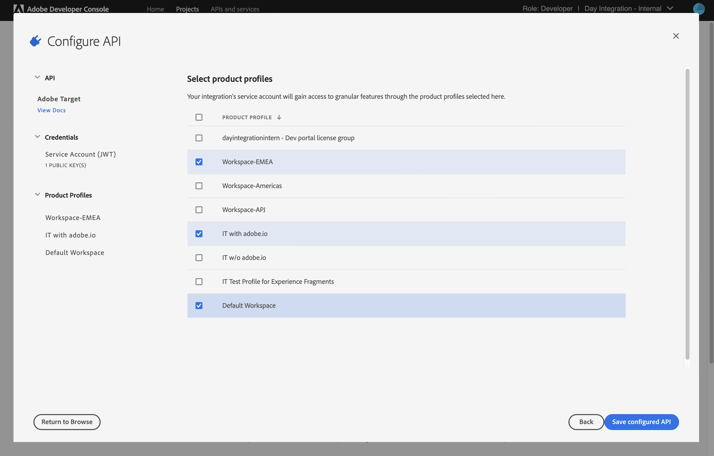
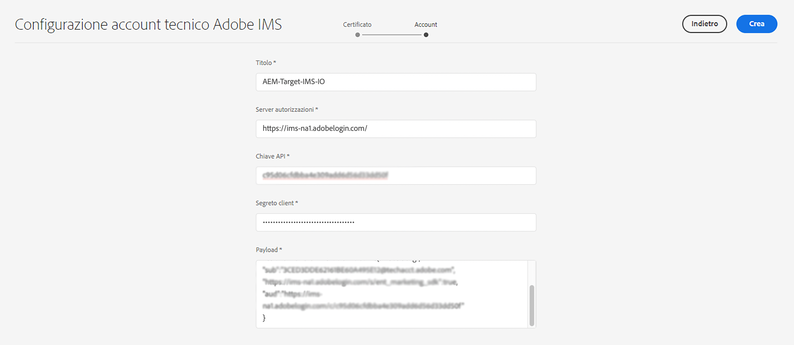

# Configurazione IMS da utilizzare per l’integrazione con Adobe Target{#ims-configuration-for-integration-with-adobe-target}

L’integrazione di AEM con Adobe Target tramite l’API di Target Standard richiede la configurazione di Adobe IMS (Identity Management System). La configurazione viene realizzata con la console Adobe Developer.

>[!NOTE]
>
>Il supporto per l’API Adobe Target Standard è una novità di AEMaaCS. L’API di Target Standard utilizza l’autenticazione IMS.
>
>La selezione API è guidata dal metodo di autenticazione utilizzato per l’integrazione AEM/Target.

## Prerequisiti {#prerequisites}

Prima di iniziare questa procedura:

* Il [Supporto Adobe](https://helpx.adobe.com/it/contact/enterprise-support.ec.html) deve effettuare il provisioning del tuo account per:

   * Console Adobe
   * Console per sviluppatori di Adobe
   * Adobe Target e
   * Adobe IMS (Identity Management System)

* L’amministratore di sistema della tua organizzazione deve utilizzare l’Admin Console per aggiungere gli sviluppatori necessari ai profili di prodotto pertinenti.

   * Questo fornisce agli sviluppatori specifici le autorizzazioni per abilitare le integrazioni tramite la console Adobe Developer.
   * Per maggiori dettagli vedi [Gestire gli sviluppatori](https://helpx.adobe.com/it/enterprise/admin-guide.html/enterprise/using/manage-developers.ug.html).

## Impostare una configurazione IMS - Generare una chiave pubblica {#configuring-an-ims-configuration-generating-a-public-key}

La prima fase consiste nel creare una configurazione IMS in AEM e generare la chiave pubblica.

1. In AEM apri il menu **Strumenti**.
1. Nella sezione **Sicurezza** seleziona **Configurazioni Adobe IMS**.
1. Seleziona **Crea** per aprire **Configurazione dell’account tecnico Adobe IMS**.
1. Utilizzando il menu a discesa in **Configurazione cloud**, seleziona **Adobe Target**.
1. Attiva **Crea nuovo certificato** e immetti un nuovo alias.
1. Conferma con **Crea certificato**.

   

1. Seleziona **Scarica** (o **Scarica chiave pubblica**) per scaricare il file sull&#39;unità locale, in modo che sia pronto per l&#39;uso durante la [configurazione di IMS per l’integrazione di Adobe Target con AEM](#configuring-ims-adobe-target-integration-with-aem).

   >[!CAUTION]
   >
   >Tieni aperta questa configurazione, sarà necessaria di nuovo quando [Completamento della configurazione IMS in AEM](#completing-the-ims-configuration-in-aem).

   

## Configurazione di IMS per l’integrazione di Adobe Target con AEM {#configuring-ims-adobe-target-integration-with-aem}

Progetto Adobe Developer Console (integrazione) con Adobe Target che AEM utilizzerà, quindi assegna i privilegi richiesti.

### Creazione del progetto {#creating-the-project}

Apri Adobe Developer Console per creare un progetto con Adobe Target che AEM utilizzerà:

1. Apri la console Adobe Developer per progetti:

   [https://developer.adobe.com/console/projects](https://developer.adobe.com/console/projects)

1. Vengono visualizzati tutti i progetti che hai. Seleziona **Crea nuovo progetto**; la posizione e l’utilizzo dipenderanno da:

   * Se non hai ancora un progetto, **Crea nuovo progetto** è al centro, in basso.
     
   * Se disponi già di progetti esistenti, questi vengono elencati e **Crea nuovo progetto** è in alto a destra.
     

1. Seleziona **Aggiungi a progetto** seguito da **API**:

   

1. Seleziona **Adobe Target**, quindi **Successivo**:

   >[!NOTE]
   >
   >Se sei abbonato a Adobe Target ma non lo vedi nell’elenco, controlla i [Prerequisiti](#prerequisites).

   

1. **Carica la chiave pubblica** e, una volta completato, continua con **Successivo**:

   

1. Controlla le credenziali e continua con **Successivo**:

   

1. Seleziona i profili di prodotto richiesti e continua con **Salva API configurata**:

   >[!NOTE]
   >
   >I profili di prodotto visualizzati dipendono dall’esistenza o meno di:
   >
   >* Adobe Target Standard: è disponibile solo l&#39;**area di lavoro predefinita**
   >* Adobe Target Premium: vengono elencate tutte le aree di lavoro disponibili, come illustrato di seguito

   

1. La creazione viene confermata.

<!--
1. The creation is confirmed, you can now **Continue to integration details**; these are needed for [Completing the IMS Configuration in AEM](#completing-the-ims-configuration-in-aem).

   
-->

<!-- could not verify - only saw Adobe Target Classic -->

### Assegnazione di privilegi all&#39;integrazione {#assigning-privileges-to-the-integration}

Ora devi assegnare i privilegi richiesti all’integrazione:

1. Apri l’**Admin Console** Adobe:

   * [https://adminconsole.adobe.com](https://adminconsole.adobe.com/)

1. Passa a **Prodotti** (barra degli strumenti superiore), quindi seleziona **Adobe Target - &lt;*tuo-id-tenant*>** (dal pannello a sinistra).
1. Seleziona **Profili di prodotto**, quindi l’area di lavoro richiesta dall’elenco presentato. Ad esempio, Area di lavoro predefinita.
1. Seleziona **Credenziali API**, quindi la configurazione di integrazione richiesta.
1. Seleziona **Editor** come **Ruolo del prodotto**; anziché **Osservatore**.

## Dettagli memorizzati per il progetto di integrazione della console Adobe Developer {#details-stored-for-the-ims-integration-project}

Dalla console Progetti di Adobe Developer Console è disponibile un elenco di tutti i progetti di integrazione:

* [https://developer.adobe.com/console/projects](https://developer.adobe.com/console/projects)

Seleziona **Visualizza** (a destra di una specifica voce progetto) per visualizzare ulteriori dettagli sulla configurazione. Comprendono:

* Panoramica del progetto
* Approfondimenti
* Credenziali 
   * Account servizio (JWT)
      * Dettagli delle credenziali
      * Genera JWT
* API
   * Ad esempio, Adobe Target

Alcune di queste sono necessarie per completare l’integrazione di Adobe Target in AEM basato su IMS.

## Completamento della configurazione IMS in AEM {#completing-the-ims-configuration-in-aem}

Tornando a AEM puoi completare la configurazione IMS aggiungendo i valori richiesti dall’integrazione IMS per Target:

1. Torna a [Configurazione IMS aperta in AEM](#configuring-an-ims-configuration-generating-a-public-key).
1. Seleziona **Avanti**.

1. Qui puoi utilizzare i [dettagli dalla configurazione del progetto nella console Adobe Developer](#details-stored-for-the-ims-integration-project):

   * **Titolo**: il tuo testo.
   * **Server di autorizzazione**: copia/incolla dalla riga `aud` della sezione **Payload** qui sotto (in questo esempio: `https://ims-na1.adobelogin.com`).
   * **Chiave API**: copiala dalla sezione [Panoramica](#details-stored-for-the-ims-integration-project) del progetto
   * **Segreto client**: generalo nella sezione [Panoramica](#details-stored-for-the-ims-integration-project) del progetto e copialo
   * **Payload**: copialo dalla sezione [Genera JWT](#details-stored-for-the-ims-integration-project)

   

1. Conferma con **Crea**.

1. La configurazione di Adobe Target viene visualizzata nella console AEM.

   

## Conferma della configurazione IMS {#confirming-the-ims-configuration}

Per confermare che la configurazione funziona come previsto:

1. Apri:

   * `https://localhost<port>/libs/cq/adobeims-configuration/content/configurations.html`

   Esempio:

   * `https://localhost:4502/libs/cq/adobeims-configuration/content/configurations.html`

1. Seleziona la configurazione.
1. Seleziona **Verifica stato** dalla barra degli strumenti, seguita da **Verifica**.

   

1. In caso di esito positivo, verrà visualizzato un messaggio di conferma.

## Completare l’integrazione con Adobe Target {#complete-the-integration-with-adobe-target}

Adesso puoi utilizzare questa configurazione IMS per completare l’[Integrazione con Adobe Target](/help/sites-cloud/integrating/integrating-adobe-target.md).

<!--

## Configuring the Adobe Target Cloud Service {#configuring-the-adobe-target-cloud-service}

The configuration can now be referenced for a Cloud Service to use the Target Standard API:

1. Open the **Tools** menu. Then, within the **Cloud Services** section, select **Legacy Cloud Services**.
1. Scroll down to **Adobe Target** and select **Configure now**.

   The **Create Configuration** dialog will open.

1. Enter a **Title** and, if you want, a **Name** (if left blank it is generated from the title).

   You can also select the required template (if more than one is available).

1. Confirm with **Create**.

   The **Edit Component** dialog will open.

1. Enter the details in the **Adobe Target Settings** tab:

    * **Authentication**: IMS

    * **Client Code**: See the [Tenant ID and Client Code](#tenant-client) section.

    * **Tenant ID**: the Adobe IMS Tenant ID. See also the [Tenant ID and Client Code](#tenant-client) section.

      >[!NOTE]
      >
      >For IMS this value needs to be taken from Target itself. You can log into Target and extract the Tenant ID from the URL.
      >
      >For example, if the URL is:
      >
      >`https://experience.adobe.com/#/@yourtenantid/target/activities`
      >
      >Then you would use `yourtenantid`.

    * **IMS Configuration**: select the name of the IMS Configuration

    * **API Type**: REST

    * **A4T Analytics Cloud Configuration**: Select the Analytics cloud configuration that is used for target activity goals and metrics. You need this if you are using Adobe Analytics as the reporting source when targeting content.   

      <!--
      If you do not see your cloud configuration, see note in [Configuring A4T Analytics Cloud Configuration](/help/sites-administering/target-configuring.md#configuring-a-t-analytics-cloud-configuration).
      -- >

    * **Use accurate targeting**: By default this check box is selected. If selected, the cloud service configuration will wait for the context to load before loading content. See note that follows.

    * **Synchronize segments from Adobe Target**: Select this option to download segments that are defined in Target to use them in AEM. You must select this option when the API Type property is REST, because inline segments are not supported and you always need to use segments from Target. (Note that the AEM term of 'segment' is equivalent to the Target 'audience'.)

    * **Client library**: Select whether you want the AT.js client library, or mbox.js (deprecated).

    * **Use Tag Management System to deliver client library**: Use DTM (deprecated), Adobe Launch or any other tag management system.

    * **Custom AT.js**: Leave blank if you checked the Tag Management box or to use the default AT.js. Alternatively upload your custom AT.js. Only appears if you have selected AT.js.

   <!--
   >[!NOTE]
   >
   >[Configuration of a Cloud Service to use the Target Classic API](/help/sites-administering/target-configuring.md#manually-integrating-with-adobe-target) has been deprecated (uses the Adobe Recommendations Settings tab).
   -- >

1. Click **Connect to Adobe Target** to initialize the connection with Adobe Target.

   If the connection is successful, the message **Connection successful** is displayed.

1. Select **OK** on the message, followed by **OK** on the dialog to confirm the configuration.

1. You can now proceed to [Adding a Target Framework](/help/sites-administering/target-configuring.md#adding-a-target-framework) to configure ContextHub or ClientContext parameters that are sent to Target. Note this may not be required for exporting AEM Experience Fragments to Target.

### Tenant ID and Client Code {#tenant-client}

With [Adobe Experience Manager as a Cloud Service](/help/release-notes/release-notes-cloud/release-notes-current.md), the Client Code field had been added to the Target configuration window.

When configuring the Tenant ID and Client Code fields, please be aware of that for most customers, the **Tenant ID** and the **Client Code** are the same. This means that both fields contain the same information and are identical. Make sure you enter the Tenant ID in both fields.

>[!NOTE]
>
>For legacy purposes, you can also enter different values in the Tenant ID and the Client Code fields.

In both cases, be aware that:

* By default, the Client Code (if added first) will also be automatically copied into the Tenant ID field.
* You have the option to change the default Tenant ID set.
* Accordingly, the backend calls to Target are based on the **Tenant ID** and the client side calls to Target are based on the **Client Code**.

As stated previously, the default case is the most common for AEM as a Cloud Service. Either way, make sure **both** fields contain the correct information depending on your requirements.

>[!NOTE]
>
> If you want to change an existing Target Configuration:
>
> 1. Re-enter the Tenant ID.
> 2. Re-connect to Target.
> 3. Save the configuration.
-->
