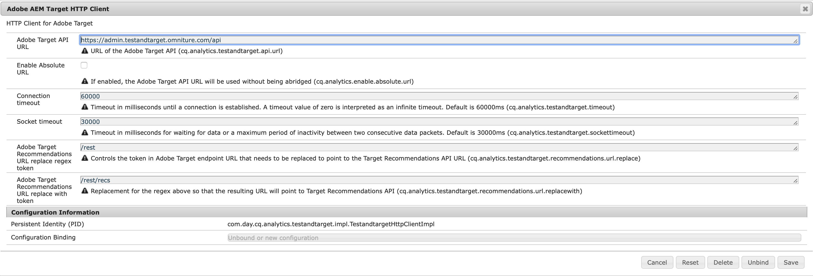

# Introduzione {#introduction}

Questa pagina descrive i parametri configurabili presenti nell’Adobe AEM finestra HTTP di Target.

## Parametri {#parameters}

La finestra contiene i seguenti parametri configurabili:

| Parametro | Descrizione |
|---|---|
| URL API di Adobe Target | URL dell’API Adobe Target. |
| Abilita URL assoluto | Determina se utilizzare la parte host dell&#39;URL o l&#39;URL completo. Attiva la casella di controllo se desideri utilizzare l’URL completo (non abbreviato). Per impostazione predefinita, la casella di controllo è disabilitata. |
| Timeout della connessione | Timeout (in millisecondi) fino a quando non viene stabilita una connessione. Il valore predefinito è 60000 millisecondi. Il valore 0 viene interpretato come un timeout infinito. |
| Timeout socket | Timeout (in millisecondi) di attesa dei dati o di un periodo massimo di inattività tra due pacchetti di dati consecutivi. Il valore predefinito è 30000 millisecondi. |
| Adobe Target Recommendations URL Sostituisci token regex | Controlla il token nell&#39;URL dell&#39;endpoint Adobe Target che deve essere sostituito per puntare all&#39;URL API dei consigli di Target. |
| URL di Adobe Target Recommendations Sostituisci con token | Sostituzione del regex descritto nel parametro precedente, in modo che l’URL risultante punti all’API di consigli di Target. |
