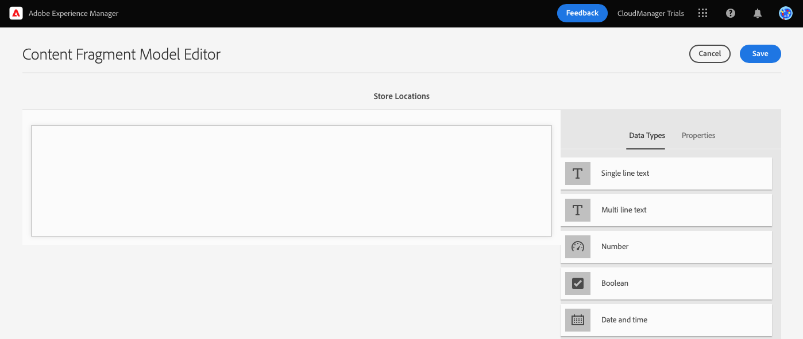
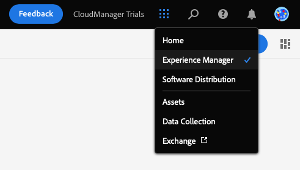

# Creare la struttura del contenuto per l’app {#content-structure}

I Frammenti di contenuto ti consentono di progettare, creare, curare e pubblicare contenuti indipendenti dalle pagine. Il loro utilizzo consente di preparare contenuti pronti per l’uso in più posizioni e su più canali, ideali per la distribuzione headless. I modelli di frammento di contenuto vengono utilizzati per definire la struttura del contenuto e sono la prima cosa da creare per gestire il contenuto headless.

Per aiutarti a capire come si esegue questa operazione, questo modulo di AEM prove ti guida attraverso il processo con un tour rapido e interattivo che prima crea il modello e poi ne aggiunge la struttura. Il presente documento funge da complemento del tour interno del prodotto, che comprende gli stessi passaggi e, se del caso, il collegamento a risorse aggiuntive.

>[!CONTEXTUALHELP]
>id="aemcloud_sites_trial_admin_content_fragments_overview_guide_br_test"
>title="Avvia l&#39;editor modelli"
>abstract="La creazione di un modello di frammento di contenuto inizia con la creazione di un elemento modello nel flusso di lavoro di amministrazione del modello, e quindi con l’aggiunta di elementi struttura tramite l’editor del modello di frammento di contenuto.  Fai clic qui sotto per avviare la funzione in una nuova scheda e segui questo documento di apprendimento per creare il tuo primo frammento di contenuto."

>[!CONTEXTUALHELP]
>id="aemcloud_sites_trial_admin_content_fragments_overview_guide_newline_test"
>title="Avvia l&#39;editor modelli"
>abstract="La creazione di un modello di frammento di contenuto inizia con la creazione di un elemento modello nel flusso di lavoro di amministrazione del modello, e quindi con l’aggiunta di elementi struttura tramite l’editor del modello di frammento di contenuto.\n\nFate clic qui sotto per avviare la funzione in una nuova scheda e seguite questo documento di apprendimento per creare il primo frammento di contenuto."

>[!CONTEXTUALHELP]
>id="aemcloud_sites_trial_admin_content_fragments_overview"
>title="Creare la struttura del contenuto per l’app"
>abstract="Seguendo la nostra serie di guide interattive imparerai a creare la struttura (nota anche come modello per frammenti di contenuto) che funge da base per tutti i contenuti headless."

## Console del modello per frammenti di contenuto {#content-fragment-model-console}

Inizia dalla console Modelli di frammento di contenuto . La console Modelli per frammenti di contenuto è paragonabile alla libreria di modelli. Utilizza la console per creare nuovi modelli e gestire quelli esistenti. La console inizia vuota, quindi creiamo un nuovo modello!

Per passare direttamente alla console del modello Frammento di contenuto al di fuori della guida in-app, utilizza l’icona di Adobe in alto a sinistra nella pagina. Viene aperta la navigazione globale di AEM. Da qui puoi scegliere il **Strumenti** e quindi **Generale** -> **Modelli per frammenti di contenuto**.

>[!TIP]
>
>Per ulteriori informazioni sulla navigazione in AEM, consulta la sezione [Sezione Risorse aggiuntive](#additional-resources) di questo documento per ulteriori informazioni AEM gestione di base.

## Creare un modello {#create-model}

Una volta nella console del modello Frammento di contenuto , puoi creare un nuovo modello per rappresentare il tuo contenuto headless.

1. Nella console del modello Frammento di contenuto , fai clic sul pulsante **Crea** in alto a destra dello schermo per iniziare a creare un modello di frammento di contenuto.

1. Viene avviata la procedura guidata Crea modello , che guida l’utente attraverso la creazione di un modello di frammento di contenuto.

   

   Fornire le informazioni obbligatorie.

   * **Titolo modello** - Questa è una breve descrizione del modello e in genere ne indica lo scopo.
   * **Abilita modello** - Questa opzione è selezionata per impostazione predefinita e deve essere selezionata per poter creare frammenti di contenuto in un secondo momento in base a questo modello.

   Puoi anche scegliere di aggiungere un valore più lungo **Descrizione** al modello e **Tag** per suddividerlo in categorie e differenziarlo per gli utenti in un secondo momento nella console del modello Frammento di contenuto .

   >[!TIP]
   >
   >Per informazioni su come i tag possono organizzare i contenuti, consulta [Sezione Risorse aggiuntive](#additional-resources) di questo documento per ulteriori informazioni sull’assegnazione tag in AEM.

1. Una volta compilati i campi obbligatori, fai clic su **Crea** in alto a sinistra per creare il modello.

1. La **Completato** viene confermato che il modello è stato creato.

   

1. Prima di poter utilizzare il modello, è necessario definire anche la struttura dei relativi dati. Fai clic su **Apri** nella finestra di dialogo per aprirla e continuare a definire il modello.

## Aggiungi campi al modello {#configure-model}

Il modello Frammento di contenuto è essenzialmente uno schema per i frammenti di contenuto. Ad esempio, definisce i campi/tipi di dati contenuti nel modello.

Utilizzando l’editor modelli Frammento di contenuto , puoi definire i campi per il modello Frammento di contenuto mediante un’interfaccia a trascinamento della selezione.

1. Trascina un campo dalla **Tipi di dati** a destra dello schermo e rilascialo sul modello Frammento di contenuto. È possibile scegliere tra più tipi di dati, ad esempio un testo a riga singola, un testo a più righe, un numero e riferimenti ad altri frammenti.

   

   >[!TIP]
   >
   >Per ulteriori informazioni sui tipi di dati disponibili, consulta la sezione [Sezione Risorse aggiuntive](#additional-resources) di questo documento per la documentazione dettagliata sui modelli di frammenti di contenuto .

1. Una volta inserito un tipo di dati, il **Tipi di dati** viene automaticamente modificata nella colonna **Proprietà** , che ti consente di definire i dettagli del tipo di dati appena inserito.

   

   Le proprietà del modello possono includere il nome del campo, il tipo di campo, la lunghezza del campo, se obbligatorio, ecc.

1. Utilizza la **Proprietà** scheda del tipo di dati selezionato per definire proprietà quali valore predefinito, lunghezza massima, se si tratta di un campo obbligatorio, ecc.

   >[!TIP]
   >
   >Per ulteriori informazioni sulle proprietà disponibili, consulta la sezione [Sezione Risorse aggiuntive](#additional-resources) di questo documento per la documentazione dettagliata sui modelli di frammenti di contenuto .

1. Dopo aver aggiunto tutti i campi necessari per il modello Frammento di contenuto, fai clic su **Salva** in alto a destra nella finestra.

1. Questo consente di salvare il modello e di tornare alla console del modello di frammento di contenuto, dove è possibile aggiungere altri modelli necessari.

## Hai imparato a creare un modello per frammenti di contenuto {#conclusion}

In questo modulo hai imparato a creare un modello di frammento di contenuto per rappresentare la struttura dei dati headless. Innanzitutto, hai creato il modello e poi lo hai popolato con i tipi di dati e le relative proprietà, definendo così uno schema per il contenuto headless.

Ora che disponi di un modello per frammenti di contenuto personalizzato, puoi utilizzare il modello per creare frammenti di contenuto. Modulo [Crea nuovo contenuto](create-content.md) dettagli per utilizzare il nuovo modello Frammento di contenuto per creare contenuti headless.

Per tornare alla schermata iniziale di prova, fai clic su **Soluzioni** in alto a destra nella barra di navigazione e selezionando **Experience Manager**.

## Risorse aggiuntive {#additional-resources}

Per ulteriori informazioni su Frammenti di contenuto e AEM, consulta questa documentazione aggiuntiva.

* [Operazioni di base](/help/sites-cloud/authoring/getting-started/basic-handling.md) - Documentazione su come navigare e utilizzare i AEM per i nuovi utenti
* [Utilizzo dei tag](/help/sites-cloud/authoring/features/tags.md) - Documentazione su come utilizzare i tag in AEM per organizzare i contenuti
* [Frammenti di contenuto](/help/assets/content-fragments/content-fragments.md) - Panoramica dei frammenti di contenuto e collegamenti alla documentazione completa sui frammenti di contenuto
* [Modelli per frammenti di contenuto](/help/assets/content-fragments/content-fragments-models.md) - Documentazione completa sui modelli di frammenti di contenuto
* [Modelli per frammenti di contenuto - Tipi di dati](/help/assets/content-fragments/content-fragments-models.md#data-types) - Dettagli sui vari tipi di dati disponibili per i modelli di frammenti di contenuto
* [Modelli per frammenti di contenuto - Proprietà](/help/assets/content-fragments/content-fragments-models.md#data-types) - Dettagli sulle varie proprietà disponibili per i tipi di dati dei modelli di frammento di contenuto
