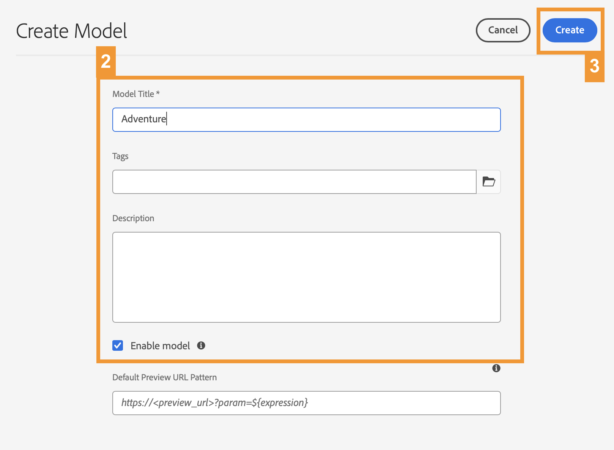

# Creare la struttura del contenuto per l’app {#content-structure}

>[!CONTEXTUALHELP]
>id="aemcloud_sites_trial_admin_content_fragments_overview"
>title="Creare la struttura del contenuto per l’app"
>abstract="Seguendo questa serie di guide interattive imparate a creare una struttura, nota come modello per frammenti di contenuto, che funge da struttura di base per i contenuti headless."

>[!CONTEXTUALHELP]
>id="aemcloud_sites_trial_admin_content_fragments_overview_guide"
>title="Avviare la console del modello"
>abstract="Scopriamo come creare uno schema riutilizzabile, denominato modello per frammenti di contenuto, per il contenuto in Adobe Experience Manager as a Cloud Service. Guarda il video per capire perché questo è un passo importante.   In questo modulo di apprendimento utilizzeremo un sito di viaggio come nostro esempio e cammineremo attraverso la creazione di un modello che rappresenta un viaggio. Faremo riferimento a questo modello in moduli successivi, quindi assicurati di seguire lo schema di denominazione fornito.  Avvia questo modulo in una nuova scheda facendo clic sul pulsante sottostante e quindi segui questa guida."
>additional-url="https://video.tv.adobe.com/v/3413261?captions=ita" text="Video introduttivo sulla struttura dei contenuti"

>[!CONTEXTUALHELP]
>id="aemcloud_sites_trial_admin_content_fragments_overview_guide_footer"
>title="Congratulazioni. Hai imparato a creare un modello per frammenti di contenuto per rappresentare la struttura dei dati headless e hai fatto il primo passo per distribuire contenuti omni-channel in modo scalato e standard."
>abstract=""

## Creare un modello {#create-model}

La console Modelli per frammenti di contenuto si apre in una nuova scheda. Considera la console Modelli per frammenti di contenuto come una libreria di modelli, in cui puoi crearne di nuovi e gestire quelli esistenti.

Per il nostro esempio, creeremo un modello che rappresenta la struttura dati di un viaggio presentato su un sito web di viaggio. Ci riferiremo a un viaggio in questo modello come **Avventura.**

1. Fai clic sul pulsante **Crea** in alto a destra dello schermo per iniziare a creare un modello di frammento di contenuto.

1. Viene avviata la procedura guidata Crea modello, che guida l&#39;utente attraverso la creazione del modello. Fornisci le seguenti informazioni obbligatorie.

   * **Titolo modello** - Questa è una breve descrizione del modello e in genere indica lo scopo del modello. Chiameremo il nostro nuovo modello `Adventure`.
   * **Abilita modello** - Questa opzione è selezionata per impostazione predefinita e deve essere selezionata per poter creare frammenti di contenuto in base a questo modello.

1. Una volta compilati i campi obbligatori, fai clic su **Crea** in alto a sinistra per creare il modello.

1. La finestra di dialogo **Completato** conferma che il modello è stato creato. Fai clic su **Apri** nella finestra di dialogo per aprire il nuovo modello di frammento di contenuto nell’editor in una nuova scheda. Quindi passa al passaggio successivo per aggiungere campi di dati al modello.

## Utilizzo dell’Editor modelli {#configure-model}

Ora abbiamo un modello chiamato **Avventura** per rappresentare viaggi su un sito web di viaggio, ma non ha dettagli come la durata, la destinazione, le attività, ecc. Prima di poter utilizzare il modello, è necessario definire la struttura dei relativi dati.

Nell’editor modelli di frammento di contenuto è possibile configurare i tipi di dati e le proprietà che definiscono il contenuto del modello.

>[!TIP]
>
>Aggiungeremo alcuni campi importanti per la **Avventura**. Nei moduli successivi utilizzeremo e aggiungeremo al modello, quindi segui lo schema di denominazione fornito.

1. Trascina un **Testo a riga singola** dal campo **Tipi di dati** a destra dell’editor e rilascialo sul modello per frammenti di contenuto.

1. Una volta inserito un tipo di dati, la colonna **Tipi di dati** viene automaticamente modificata nella scheda **Proprietà**, che ti consente di definire i dettagli del tipo di dati appena inserito. Per questo primo campo, vogliamo memorizzare il titolo del viaggio o dell&#39;avventura. Immetti le seguenti proprietà.

   * **Rendering come:** **Campo di testo** - Quando si crea un&#39;avventura, questo campo memorizzerà il titolo dell&#39;avventura.
   * **Etichetta campo:** `Title` - Questa è l&#39;etichetta che viene visualizzata per questo campo quando si crea una nuova avventura.

1. Una volta definite le proprietà del campo, puoi tornare alla **Tipi di dati** nel pannello a destra e aggiungi altri campi trascinando e rilasciando.

1. Tocca o fai clic su **Salva** per salvare il modello.

In questo modo, puoi aggiungere al modello tutti i campi necessari per supportare qualsiasi tipo di struttura dati necessaria. I tipi di campi dati variano, ma il processo di aggiunta al modello rimane lo stesso.

Procedi alla sezione successiva per aggiungere i campi necessari per completare il **Avventura** modello.

## Aggiungere campi al modello {#additional-fields}

Hai già un campo per il titolo dell&#39;avventura. Ora devi aggiungere dei campi per acquisire la descrizione, il prezzo e un’immagine rappresentativa del viaggio.

>[!TIP]
>
>La **Avventura** Il modello si basa sul sito di esempio WKND per AEM. È possibile [visita il sito qui](https://wknd.site/us/en/adventures/yosemite-backpacking.html) per saperne di più, se lo desideri, ma la sua conoscenza non è necessaria per questi moduli di apprendimento.

Segui gli stessi passaggi indicati sopra per aggiungere questi campi aggiuntivi. L’unica differenza sono le proprietà da impostare.

1. Aggiungi un campo per memorizzare la descrizione dell’avventura trascinando e rilasciando un **Testo a più righe** e immetti le seguenti proprietà:

   * **Rendering come:** **Area di testo** - Quando si crea un&#39;avventura, questo campo memorizzerà una breve descrizione del viaggio.
   * **Etichetta campo:** `Description` - Questa è l&#39;etichetta che viene visualizzata per questo campo quando si crea una nuova avventura.

1. Aggiungi un campo per memorizzare il prezzo dell’avventura trascinando e rilasciando un **Testo a riga singola** e immetti le seguenti proprietà:

   * **Rendering come:** **Campo di testo** - Quando si crea un&#39;avventura, questo campo memorizzerà il prezzo del viaggio.
   * **Etichetta campo:** `Price` - Questa è l&#39;etichetta che viene visualizzata per questo campo quando si crea una nuova avventura.

1. Aggiungi un campo per memorizzare un’immagine che rappresenta il viaggio. Le immagini in AEM vengono memorizzate come un altro tipo di contenuto denominato **Risorse**. Per creare un campo per loro devi trascinare e rilasciare un **Riferimento contenuto** campo che farà riferimento alla risorsa dell’immagine.

   * **Rendering come:** **Riferimento contenuto** - Quando crei un’avventura, questo campo punta alla risorsa immagine che rappresenta questo viaggio.
   * **Etichetta campo:** `Image` - Questa è l&#39;etichetta che viene visualizzata per questo campo quando si crea una nuova avventura.

1. Dopo aver aggiunto tutti i campi necessari per il modello Frammento di contenuto, fai clic su **Salva** in alto a destra nella finestra.

1. Il modello viene salvato e si torna alla console del modello di frammento di contenuto.

