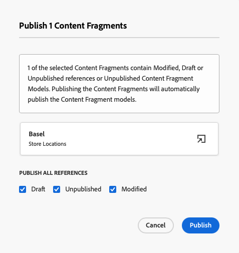

# Crea contenuto headless {#create-content}

Seguendo il modulo di apprendimento interno al prodotto, scopri come utilizzare [Modelli di frammento di contenuto creati in precedenza](content-structure.md) per creare contenuti che possono essere utilizzati per l’authoring delle pagine o come base per i contenuti headless. Il presente documento funge da complemento del tour interattivo, che copre gli stessi passaggi e collega, se del caso, a risorse aggiuntive.

>[!CONTEXTUALHELP]
>id="aemcloud_sites_trial_admin_content_fragments_create_content"
>title="Crea nuovo contenuto"
>abstract="Basandosi sui modelli creati nel modulo 1, imparerai a creare contenuti che possono essere utilizzati per l’authoring delle pagine o come base per il contenuto headless."

>[!CONTEXTUALHELP]
>id="aemcloud_sites_trial_admin_content_fragments_create_content_guide"
>title="Avvia la console Frammento di contenuto"
>abstract="In AEM CMS headless, i &quot;frammenti di contenuto&quot; sono tutti i contenuti che si adattano alla struttura predefinita denominata &quot;modello di frammento di contenuto&quot;. Questa procedura dettagliata illustra come creare contenuti per il modello di frammento di contenuto.  Fai clic qui sotto per avviare la funzione in una nuova scheda e segui questo documento di apprendimento per creare il tuo primo frammento di contenuto."
>additional-url="https://video.tv.adobe.com/v/328618" text="Segnaposto per il video introduttivo"
>additional-url="https://experienceleague.adobe.com/docs/experience-manager-cloud-service/assets/home_c1.png" text="Miniatura video: Aggiunta di contenuti - la ricetta vincente"

## Frammenti di contenuto {#introduction}

In AEM as a Cloud Service, i frammenti di contenuto sono parti di contenuto headless in base alla struttura definita da un modello di frammento di contenuto. Puoi creare un frammento di contenuto personalizzato iniziando dalla console Frammento di contenuto . La console Frammento di contenuto è paragonabile a una libreria di contenuti headless. Puoi utilizzare la console per creare nuovi frammenti di contenuto e gestire i frammenti esistenti. La console inizia a essere vuota, quindi creiamo un nuovo frammento!

Per passare direttamente alla console Frammento di contenuto al di fuori delle linee guida in-app, utilizza l’icona di Adobe in alto a sinistra nella pagina. Viene aperta la navigazione globale di AEM. Da qui puoi scegliere il **Navigazione** e quindi **Frammenti di contenuto**.

>[!TIP]
>
>Per ulteriori informazioni sulla navigazione in AEM, consulta la sezione [Sezione Risorse aggiuntive](#additional-resources) di questo documento per ulteriori informazioni AEM gestione di base.

## Creare un frammento di contenuto {#create-fragment}

I frammenti di contenuto rappresentano il contenuto headless. ma possono essere create solo in base a una struttura di contenuto predefinita. Il modello Frammento di contenuto creato in precedenza funge da struttura specifica.

1. Tocca o fai clic sul pulsante **Crea** in alto a destra nella console per aprire **Nuovo frammento di contenuto** per iniziare a creare un nuovo frammento di contenuto.

   

1. Se segui le indicazioni in-app, **Posizione** verrà compilato automaticamente.

   1. Se non segui le indicazioni, utilizza il browser percorsi per selezionare la cartella del progetto.

   1. In **Nuovo frammento di contenuto** , tocca o fai clic sul pulsante **Scegli posizione** , ovvero l’icona che assomiglia a una cartella **Posizione** campo .

      
   * In alternativa, seleziona il percorso nel pannello di navigazione a sinistra della console Frammento di contenuto prima di fare clic su **Crea**.

1. In **Modello a frammento di contenuto** a discesa, seleziona dal menu a discesa il modello frammento di contenuto creato in precedenza.

1. Aggiungi un **Titolo** per il frammento di contenuto.

1. Tocca o fai clic su **Crea e apri**.

## Editor frammento di contenuto {#edit-fragment}

Una volta salvato il nuovo frammento di contenuto, viene aperto l’editor Frammento di contenuto, in cui è possibile fornire il contenuto effettivo del frammento.

1. L’editor mostra i campi definiti nel modello selezionato. Qui puoi modificarli per completare il frammento di contenuto. L&#39;avanzamento viene salvato automaticamente.

   

1. Se il modello del frammento di contenuto include molti campi, puoi passare rapidamente a qualsiasi campo utilizzando **Variabili** sul lato sinistro dell’editor. I campi con errori verranno contrassegnati qui.

1. Affinché il frammento di contenuto sia disponibile per l’utilizzo da parte di un’app esterna, è necessario pubblicarlo. Tocca o fai clic sul pulsante **Pubblica** in alto a destra dell’editor.

1. Seleziona **Ora** dal menu a discesa. Puoi anche pianificarlo per la pubblicazione in un secondo momento.

   

   >[!TIP]
   >
   >Per ulteriori informazioni sulla pubblicazione dei contenuti in AEM, consulta la sezione [Sezione Risorse aggiuntive](#additional-resources) di questo documento per ulteriori informazioni sulla pubblicazione.

1. AEM esegue automaticamente un controllo di riferimento per verificare che tutte le risorse necessarie siano pubblicate per il frammento di contenuto. In questo caso, dovrai anche pubblicare il modello creato. Tocca o fai clic su **Pubblica**.

   

1. La pubblicazione è confermata da un banner.

   

## Hai imparato a creare un frammento di contenuto! {#conclusion}

In questo modulo hai imparato a creare un frammento di contenuto basato sul modello creato in precedenza. In questo modo un autore di contenuti può creare contenuti strutturati headless.

Ora che il contenuto viene creato e pubblicato, puoi estrarlo tramite Graph QL tramite API AEM. Questo argomento verrà illustrato nel modulo . [Estrarre contenuti tramite l’API GraphQL.](extract-content.md)

Per tornare alla schermata iniziale di prova, fai clic su **Soluzioni** in alto a destra nella barra di navigazione e selezionando **Experience Manager**.

## Risorse aggiuntive {#additional-resources}

Per ulteriori informazioni su Frammenti di contenuto e AEM, consulta questa documentazione aggiuntiva.

* [Operazioni di base](/help/sites-cloud/authoring/getting-started/basic-handling.md) - Documentazione su come navigare e utilizzare i AEM per i nuovi utenti
* [Gestione dei frammenti di contenuto - Pubblicazione e riferimento](/help/assets/content-fragments/content-fragments-managing.md#publishing-and-referencing-a-fragment) - Dettagli su come pubblicare contenuti in AEM
* [Frammenti di contenuto](/help/assets/content-fragments/content-fragments.md) - Panoramica dei frammenti di contenuto e collegamenti alla documentazione completa sui frammenti di contenuto
* [Gestione dei frammenti di contenuto](/help/assets/content-fragments/content-fragments-managing.md) - Creazione e gestione di frammenti di contenuto
