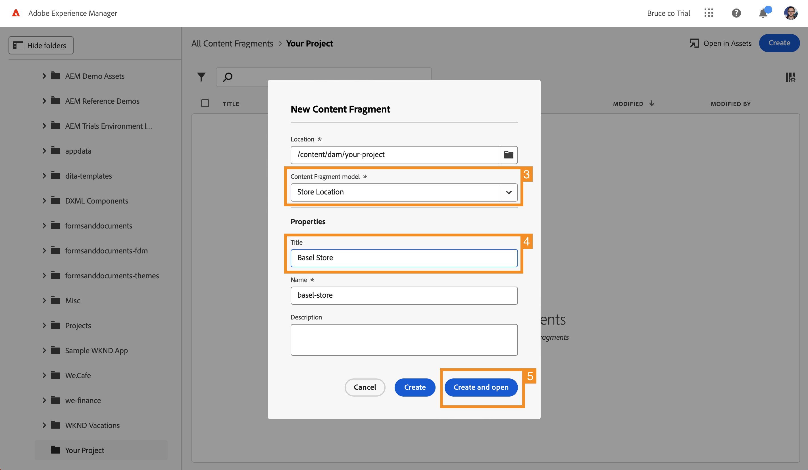

# Creare contenuti headless {#create-content}

>[!CONTEXTUALHELP]
>id="aemcloud_sites_trial_admin_content_fragments_create_content"
>title="Creare nuovi contenuti"
>abstract="Basandoti sui modelli creati nel modulo, imparerai a creare contenuti che possono essere utilizzati per l’authoring delle pagine o come base per contenuti headless."

>[!CONTEXTUALHELP]
>id="aemcloud_sites_trial_admin_content_fragments_create_content_guide"
>title="Avvio della console Frammenti di contenuto"
>abstract="La creazione di contenuti coerenti e di alta qualità che funzionano perfettamente nelle applicazioni e nei siti web ti permette di offrire ai tuoi clienti esperienze eccezionali. Questo modulo ti guida attraverso la creazione del primo frammento di contenuto per illustrare come eseguire questa operazione.  Avvia questo modulo in una nuova scheda facendo clic sul pulsante sottostante, quindi segui questa guida."

>[!CONTEXTUALHELP]
>id="aemcloud_sites_trial_admin_content_fragments_create_content_guide_footer"
>title="Ottimo lavoro In questo modulo hai imparato a creare un frammento di contenuto basato sul modello creato in precedenza. Ora puoi comprendere come i team di contenuti possono creare e gestire contenuti per app e siti web indipendentemente dai cicli di sviluppo."
>abstract=""

## Creare un frammento di contenuto {#create-fragment}

I frammenti di contenuto rappresentano il contenuto headless dell’utente e si basano su strutture predefinite, denominate modelli di frammenti di contenuto. Considera la console Frammenti di contenuto come una libreria di contenuti headless. Utilizzala per creare nuovi frammenti di contenuto e gestire i frammenti esistenti.

1. Tocca o fai clic sul pulsante **Crea** in alto a destra nella console.

1. La finestra di dialogo **Nuovo frammento di contenuto** si apre e lì puoi iniziare a creare un nuovo frammento di contenuto. **Posizione** viene compilata automaticamente con le posizioni in cui verranno salvati i nuovi contenuti.

1. Nel menu a discesa **Modello del frammento di contenuto**, seleziona il modello Frammento di contenuto creato in precedenza.

1. Aggiungi un **Titolo** per il frammento di contenuto.

1. Tocca o fai clic su **Crea e apri**.

## Aggiungere contenuto al frammento di contenuto {#add-content}

Dopo aver salvato e aperto il nuovo frammento di contenuto, l’editor frammento di contenuto si apre in una nuova scheda. Qui puoi aggiungere il contenuto del nuovo frammento.

1. L’editor Frammento di contenuto mostra i campi definiti nel modello selezionato. Qui puoi aggiungere contenuto a ogni campo per completare il frammento di contenuto. L’avanzamento viene salvato automaticamente.

1. Al termine dell’aggiunta di contenuto, tocca o fai clic sul pulsante **Pubblica** in alto a destra dell’editor. Questo rende il frammento di contenuto disponibile per il consumo da parte di app esterne.

1. Seleziona **Ora** dal menu a discesa. Puoi anche pianificarlo per la pubblicazione in un secondo momento.

   

1. Viene visualizzata la finestra di dialogo **Pubblica frammenti di contenuto**. AEM esegue automaticamente un controllo di riferimento per verificare che tutte le risorse necessarie siano pubblicate per il frammento di contenuto. In questo caso, dovrai anche pubblicare il modello creato. Tocca o fai clic su **Pubblica**.

   

1. La pubblicazione è confermata da un banner.

Il contenuto è pubblicato e pronto per essere consegnato all’app o al sito web come frammento di contenuto.
