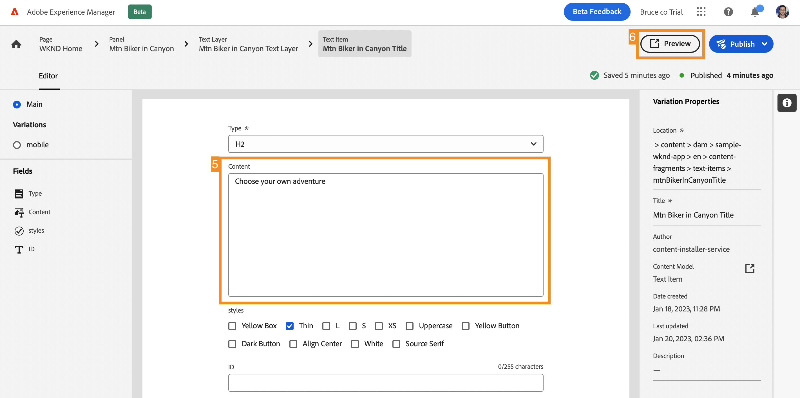

# Personalizzare il contenuto di un’app React di esempio {#customize-app}

>[!CONTEXTUALHELP]
>id="aemcloud_sites_trial_admin_content_fragments_react_app"
>title="Personalizzare il contenuto di un’app React di esempio"
>abstract="La tua versione di prova di AEM headless dispone di un’app React di esempio, personalizzabile."

>[!CONTEXTUALHELP]
>id="aemcloud_sites_trial_admin_content_fragments_react_app_guide"
>title="Avvia l’editor dei frammenti di contenuto"
>abstract="Ora vediamo come funziona l’authoring di contenuti headless. La tua versione di prova AEM headless dispone di un’app React di esempio, utile per capire quanto è facile gestire i contenuti in modo indipendente e veloce, senza i tempi solitamente associati allo sviluppo di app.  Per avviare questo modulo in una nuova scheda, fai clic qui sotto, quindi segui questa guida."

>[!CONTEXTUALHELP]
>id="aemcloud_sites_trial_admin_content_fragments_react_app_guide_footer"
>title="In questo modulo hai imparato a personalizzare un’app React di esempio.  Time-to-market: accelerato Cicli di sviluppo: ridotti  Ora sai quanto sia semplice gestire i contenuti headless per siti web e app basati su funzionalità AEM headless."
>abstract=""

## Anteprima dell’app {#preview}

Inizia nell’editor frammenti di contenuto con l’app di esempio fornita con la versione di prova di AEM headless già caricata. L’app di esempio è basata su frammenti di contenuto forniti tramite GraphQL. Utilizza l’editor frammenti di contenuto per acquisire familiarità con l’editor esaminando l’anteprima dell’app di esempio.

1. Seleziona il pulsante **Anteprima** in alto a destra nella schermata dell’editor.

1. L’app di dimostrazione si apre in una nuova scheda. L’app è per il brand fittizio WKND outdoor lifestyle. Scorri verso il basso la pagina per passare al contenuto di esempio.

1. Torna alla scheda del browser dell’editor frammenti di contenuto per continuare.

## Modifica un’intestazione nell’app {#edit-app}

L’editor frammenti di contenuto mostra il layout di base dell’app come frammento di contenuto di una pagina. I **pannelli** rappresentano le varie pagine dell’app, ciascuna delle quali è costituita da un proprio frammento di contenuto. Modificando questi frammenti, puoi modificare il contenuto dell’app.

1. Seleziona **Mtn Biker in Canyon** nella sezione **Pannelli**.

   

1. L’editor apre il pannello di intestazione dell’app per la mountain bike. Ogni pannello è costituito da livelli, che rappresentano le immagini e il testo di cui è composta l’esperienza.

1. Seleziona il livello di testo **Mtn Biker in Canyon Text Layer** per aprire i dettagli del livello nell’editor. Il livello è costituito da più frammenti di contenuto che controllano il testo visualizzato in questo pannello dell’app.

1. Seleziona l’elemento di testo **Mtn Biker in Canyon Title**. Viene aperto l’editor frammenti di contenuto che mostra il contenuto del frammento e consente di modificarlo.

1. Modifica il testo da `Your next great adventure is calling` a `Choose your own adventure`. La modifica viene salvata automaticamente dall’editor.

1. Per visualizzare le modifiche, seleziona **Anteprima** in alto a destra nella finestra. L’anteprima dell’app demo si apre in una nuova scheda.

   

Come vedi, è davvero semplice aggiornare i contenuti all&#39;interno di un&#39;app React integrata nel CMS AEM headless.

## Cambia un’immagine nell’app {#change-image}

Ora che hai modificato un titolo nell’app, prova a cambiare un’immagine.

1. Dall’anteprima, torna alla scheda del browser dell’editor frammenti di contenuto.

1. È necessario tornare alla posizione corretta nell’editor frammenti di contenuto. Le breadcrumb in alto a sinistra nell’editor mostrano dove ti trovi nella gerarchia dei contenuti. Seleziona **Mtn Biker in Canyon** nelle breadcrumb per tornare a tale pagina.

   

1. Seleziona il livello di immagine **Mtn Biking - Biker**. Viene aperto l’editor frammenti di contenuto

1. Seleziona la **X** per rimuovere l’immagine del biker. L’immagine scompare e l’editor presenta un errore, in quanto l’immagine rappresenta dati obbligatori per questo modello di frammento di contenuto.

   

1. Seleziona **Aggiungi risorsa** e poi **Sfoglia risorse** nel menu a comparsa.

1. La finestra di dialogo **Seleziona risorsa** si apre e il percorso **sample-wknd-app** > **en** > **image-files** viene selezionato automaticamente.

1. Seleziona l’immagine `biker-yellow.png` e quindi scegli **Seleziona**.

1. L’immagine del biker viene sostituita con l’immagine selezionata. Le modifiche vengono salvate automaticamente dall’editor.

1. Per visualizzare le modifiche, seleziona **Anteprima** in alto a destra nella finestra. L’anteprima dell’app demo si apre in una nuova scheda. Fai clic su Aggiorna nel browser per vedere nell’app la nuova immagine del biker con pantaloncini gialli.

Come vedi, è davvero facile aggiornare immagini e risorse nelle app con il CMS AEM headless.

## Aggiungi all’app un riferimento a un nuovo frammento di contenuto {#create-moment}

Ora che hai aggiornato l’immagine del biker, vediamo come aggiungere nuovi contenuti a un’app creando e facendo riferimento a un nuovo frammento di contenuto. Aggiungi una chiamata al prodotto gestita da un frammento di contenuto “opportunità di acquisto” al secondo pannello dell’app.

1. Torna alla scheda del browser dell’editor frammenti di contenuto dalla scheda anteprima.

1. È necessario tornare alla posizione corretta nell’editor frammenti di contenuto. Le breadcrumb in alto a sinistra nell’editor mostrano dove ti trovi nella gerarchia dei contenuti. Seleziona **WKND Home** nelle breadcrumb per tornare a tale pagina.

1. Seleziona il pannello **Mtn Biker on WKND Yellow**.

1. Seleziona il livello **Mtn Biking - Shoppable**.

1. Per creare una didascalia su questo pannello, crea un frammento di contenuto per opportunità di acquisto. Seleziona il pulsante **+ Crea frammento di contenuto**.

   

1. Innanzitutto, scegli un modello su cui basare il nuovo frammento di contenuto. Seleziona il modello **Shoppable Moment Item** dal menu a discesa **Modello per frammenti di contenuto**.

1. Assegna un nome al frammento di contenuto. Ad esempio, immetti `Shorts` nel campo **Nome**.

1. Seleziona **Crea e apri**.

   

1. Viene aperto l’editor per il nuovo frammento di contenuto.

1. Assegna un nome all’opportunità di acquisto nel campo **Testo**, ad esempio `Yellow shorts`.

1. Imposta i valori **X** e **Y**. Questi valori rappresentano il punto in cui la didascalia dovrà essere sovrapposta sul pannello. Le modifiche apportate al frammento vengono salvate automaticamente dall’editor

   * **X**: `-5`
   * **Y**: `-10`

1. Per visualizzare le modifiche, seleziona **Anteprima** in alto a destra nella finestra. L’anteprima dell’app demo si apre in una nuova scheda. Fai clic su Aggiorna nel browser per verificare il posizionamento, quindi apporta eventuali modifiche nell’editor.

   

Ora sai come creare nuovi contenuti e farvi riferimento nell’app come frammento di contenuto, senza alcun ciclo di sviluppo.
