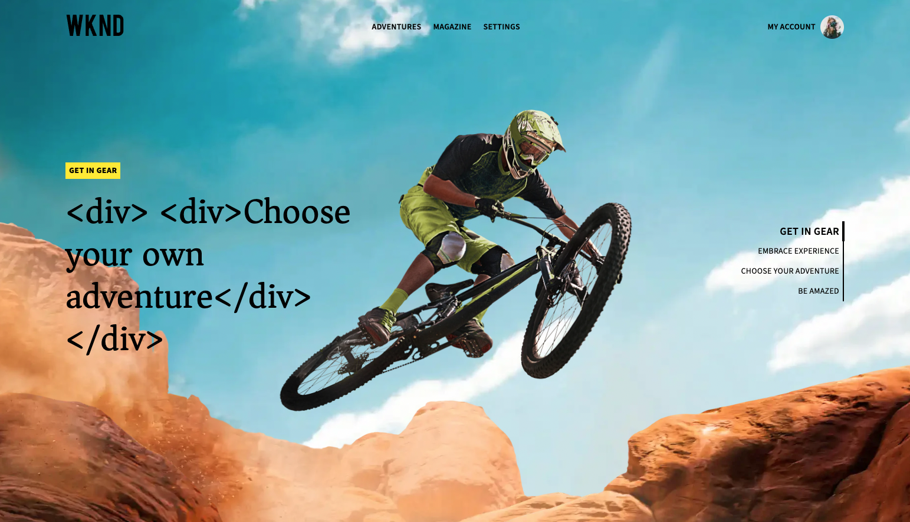
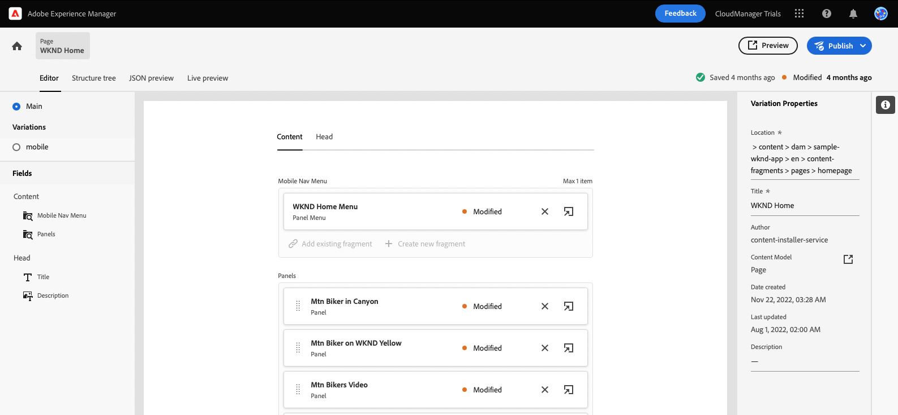
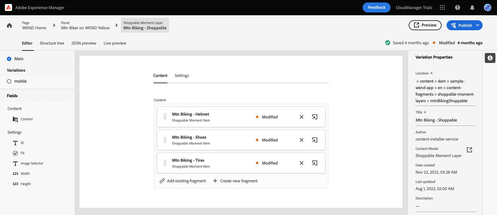

# Personalizzare il contenuto di un’app a reazione di esempio {#customize-app}

AEM Trials for headless viene precaricato con una semplice app React per mostrare contenuti headless. In questo modulo imparerai come visualizzare in anteprima l’app e modificarne il contenuto sostituendo un’immagine e creando un momento acquistabile per essa.

L’app stessa si basa sulla struttura dei frammenti di contenuto. Utilizzando l’editor Frammento di contenuto in AEM, puoi modificare il contenuto delle app. Per aiutarti a capire come si fa, questo modulo di AEM prove ti accompagna attraverso il processo con un tour rapido e interattivo. Il presente documento funge da complemento del tour interattivo, che copre gli stessi passaggi e collega, se del caso, a risorse aggiuntive.

>[!CONTEXTUALHELP]
>id="aemcloud_sites_trial_admin_content_fragments_react_app"
>title="Personalizzare il contenuto di un’app React di esempio"
>abstract="Abbiamo impostato una moderna app React che puoi utilizzare per imparare a personalizzare i contenuti utilizzando le funzioni headless impostate."

## Editor frammento di contenuto {#fragment-editor}

Inizia dall’editor Frammento di contenuto per l’app di esempio.

Per passare direttamente all’editor dei frammenti di contenuto al di fuori della guida in-app, utilizza l’icona di Adobe in alto a sinistra della pagina. Viene aperta la navigazione globale di AEM. Da qui puoi scegliere il **Navigazione** e quindi **Frammenti di contenuto**.

Viene visualizzata la console Frammento di contenuto . Da lì, utilizza la struttura del contenuto nel pannello a sinistra per spostarti nella posizione del contenuto dell’app. In questo caso, **Frammenti di contenuto** -> **App WKND di esempio** -> **Inglese** -> **Frammenti di contenuto** -> **pagine**.

Tocca o fai clic sul pulsante **Pagina principale WKND** frammento di pagina visualizzato nella console a destra della struttura del contenuto per avviare l’editor per il contenuto dell’app.

>[!TIP]
>
>Per ulteriori informazioni sulla navigazione in AEM, consulta la sezione [Sezione Risorse aggiuntive](#additional-resources) di questo documento per ulteriori informazioni AEM gestione di base.

## Anteprima dell’app {#preview}

Prima di iniziare a modificare l’app, acquisisci familiarità con l’anteprima del relativo stato corrente. Tocca o fai clic sul pulsante **Anteprima** in alto a destra nella schermata dell’editor.

L’app di dimostrazione si apre in una nuova scheda.

L&#39;app stessa è una semplice applicazione di e-commerce per il brand fittizio WKND outdoor lifestyle implementato in React. Fai clic su per navigare nel contenuto di esempio.

Torna alla scheda dell’editor Frammento di contenuto per continuare.

## Modificare il testo nell’app {#edit-app}

Come accennato in precedenza, l’app stessa è composta da Frammenti di contenuto. Questi frammenti sono collegati tra loro in una struttura per creare l’app.

L’editor Frammento di contenuto visualizza il layout di base dell’app sotto forma di pagina. Questa pagina è un frammento di contenuto, che a sua volta è costituito da una raccolta di altri frammenti. La **Pannelli** rappresentano pagine diverse dell’app, ciascuna delle quali è un proprio frammento di contenuto. Modificando questi frammenti, puoi modificare il contenuto dell’app.

1. Tocca o fai clic su **Mtn Biker a Canyon** in **Pannelli** sezione .

   

1. L&#39;editor apre il pannello di intestazione per il mountain bike. Ogni pannello è costituito da livelli che rappresentano contenuti diversi all’interno di una pagina dell’app.

   

1. Selezionare il livello di testo **Mtn Biker nel livello di testo di Canyon**. Questo apre i dettagli del livello nell’editor. Il livello è costituito da più frammenti di contenuto.

   

1. Seleziona la **Mtn Biker nel titolo di Canyon** elemento di testo. Viene aperto l’editor Frammento di contenuto, con il contenuto del frammento e la possibilità di modificarlo.

   

1. Modificare il testo da `Your next great adventure is calling` a `Choose your own adventure`. La modifica viene salvata automaticamente dall’editor.

1. Fai clic su anteprima per visualizzare le modifiche. L’app di dimostrazione si apre in una nuova scheda.

   

Torna alla scheda dell’editor Frammento di contenuto per continuare il modulo.

## Modificare l’immagine principale dell’app {#change-image}

Ora che hai modificato del testo nell&#39;app, prova a cambiare l&#39;immagine principale dell&#39;app. Innanzitutto, devi individuare il contenuto.

Le breadcrumb in alto a sinistra nell’editor mostrano dove ti trovi nella gerarchia dei contenuti.

1. Tocca o fai clic su **Mtn Biker a Canyon** nelle breadcrumb per tornare a tale pagina.

   

1. Torna al pannello con i vari livelli dell’app. I livelli non rappresentano solo il contenuto del testo. Rappresentano tutti i contenuti dell’app. Pertanto, puoi scambiare le immagini anche utilizzando l’editor Frammento di contenuto .

   

1. Seleziona la **Mtn Biking - Bike** livello immagine. Viene aperto l’editor Frammento di contenuto, con il contenuto del frammento e la possibilità di modificarlo.

   

1. Tocca o fai clic sul pulsante **X** per rimuovere l&#39;immagine del biker. L’immagine scompare e l’editor mostra un errore, in quanto l’immagine è i dati necessari per questo modello di frammento di contenuto.

   

1. Tocca o fai clic su **Aggiungi risorsa** e individuare l&#39;immagine del biker giallo in **sample-wknd-app** > **en** > **file di immagini**. Utilizzare la vista ad albero sul lato sinistro del **Seleziona risorse** per navigare nella gerarchia dei contenuti.

   

1. Filtro per il testo `yellow`. Utilizza la **Cercare tutte le risorse** campo nella parte superiore del **Seleziona risorse** per cercare l&#39;immagine. Inserisci il testo di ricerca e premi Invio o torna alla ricerca.

   

1. Tocca o fai clic per selezionare la `biker-yellow.png` immagine, quindi tocca o fai clic su **Seleziona**.

   

1. L&#39;immagine del biker è stata sostituita con l&#39;immagine selezionata. Le modifiche vengono salvate automaticamente dall’editor.

   

## Creare un momento acquistabile {#create-moment}

Ora che hai aggiornato l’immagine del biker, puoi aggiungere un momento acquistabile per i pantaloncini gialli del biker.

1. Per iniziare, torna all’editor Frammento di contenuto per il frammento di pagina. Le breadcrumb in alto a sinistra nell’editor mostrano dove ti trovi nella gerarchia dei contenuti. Tocca o fai clic su **Pagina principale WKND** nelle breadcrumb per tornare a tale pagina.

   

1. Seleziona la **Mtn Biker su WKND giallo** pannello.

   

1. Ora potete vedere i livelli che compongono l&#39;immagine del biker. Aggiungi un momento acquistabile ai pantaloncini gialli del biker selezionando la **Mtn Bike - Shopable** strato.

   

1. Per creare un momento acquistabile, devi creare un nuovo frammento di contenuto che rappresenti tale momento. Tocca o fai clic sul pulsante **+ Crea nuovo frammento** pulsante per aggiungere un momento acquistabile per i pantaloncini del biker.

   

1. Poiché i frammenti di contenuto rappresentano dati strutturati headless, ogni volta che crei un frammento di contenuto devi prima scegliere un modello su cui basarlo. Seleziona la **Articolo Momento Negoziabile** dal modello **Modello a frammento di contenuto** a discesa.

   

1. Assegna un nome al frammento di contenuto che rappresenterà questo nuovo momento acquistabile. Ad esempio, immetti `Shorts` nel **Nome** campo .

   

1. Tocca o fai clic su **Crea e apri**.

1. Viene aperto l’editor per il nuovo frammento di contenuto.
   * Dai un nome al momento dell&#39;acquisto nel **Testo** ad esempio `Yellow shorts`.
   * Imposta una X e una Y, posizione in cui sovrapporre questo momento acquistabile.
      * **X**: `-18`
      * **Y**: `-28`
   * Le modifiche al frammento vengono salvate automaticamente dall’editor

   

1. Tocca o fai clic su **Anteprima** per verificare questo posizionamento e apportare le regolazioni necessarie.

   

## Hai imparato a personalizzare un’app React di esempio! {#conclusion}

In questo modulo hai imparato a personalizzare un’app React di esempio. Innanzitutto hai imparato a modificare il testo esistente. Poi un&#39;immagine è stata scambiata con un&#39;altra istanza di quell&#39;immagine. Finalmente hai visto come viene creato e posizionato un oggetto momento acquistabile.

Assicurati di controllare il [Sezione Risorse aggiuntive](#additional-resources) per ulteriori risorse sull’utilizzo di AEM e dei relativi frammenti di contenuto.

Per scoprire in che modo Frammenti di contenuto e contenuti headless vengono creati per il consumo da applicazioni personalizzate, puoi iniziare revisionando il modulo [Crea la struttura del contenuto per l’app.](content-structure.md)

Per tornare alla schermata iniziale di prova, fai clic su **Soluzioni** in alto a destra nella barra di navigazione e selezionando **Experience Manager**.

## Risorse aggiuntive {#additional-resources}

Per ulteriori informazioni su Frammenti di contenuto e AEM, consulta questa documentazione aggiuntiva.

* [Modelli per frammenti di contenuto](/help/assets/content-fragments/content-fragments-models.md) - Documentazione completa sui modelli di frammenti di contenuto
* [Frammenti di contenuto](/help/assets/content-fragments/content-fragments.md) - Panoramica dei frammenti di contenuto e collegamenti alla documentazione completa sui frammenti di contenuto
* [Operazioni di base](/help/sites-cloud/authoring/getting-started/basic-handling.md) - Documentazione su come navigare e utilizzare i AEM per i nuovi utenti
