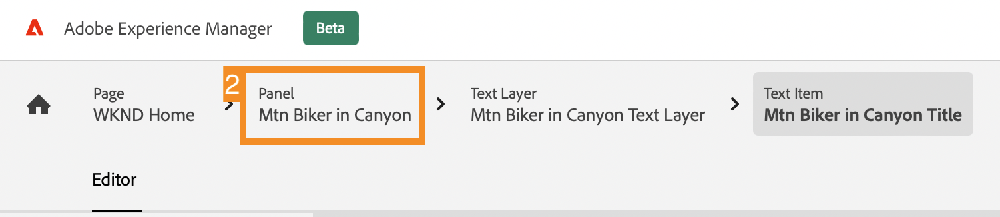

# Personalizzare il contenuto di un’app a reazione di esempio {#customize-app}

>[!CONTEXTUALHELP]
>id="aemcloud_sites_trial_admin_content_fragments_react_app"
>title="Personalizzare il contenuto di un’app React di esempio"
>abstract="La tua versione di prova AEM senza testa viene integrata con un&#39;app React di esempio, personalizzabile."

>[!CONTEXTUALHELP]
>id="aemcloud_sites_trial_admin_content_fragments_react_app_guide"
>title="Avvia l’editor dei frammenti di contenuto"
>abstract="La tua versione di prova AEM headless viene integrata con un’app React di esempio, per consentirti di gestire i contenuti in modo indipendente senza tempi di sviluppo.  Avvia questo modulo in una nuova scheda facendo clic qui sotto, quindi segui questa guida."

>[!CONTEXTUALHELP]
>id="aemcloud_sites_trial_admin_content_fragments_react_app_guide_footer"
>title="In questo modulo hai imparato a personalizzare un’app React di esempio.  Tempo di commercializzazione: Accelerato! Cicli di sviluppo: Ridotto!  Ora capisci quanto sia semplice gestire i contenuti headless per siti web e app basati su funzionalità AEM headless."
>abstract=""

## Anteprima dell’app {#preview}

Inizia nell’editor Frammento di contenuto con l’app di esempio fornita con la versione di prova AEM headless già caricata. L’app di esempio è basata su frammenti di contenuto forniti tramite GraphQL. Utilizza l’editor Frammento di contenuto per acquisire familiarità con l’editor tramite l’anteprima dell’app di esempio.

1. Tocca o fai clic sul pulsante **Anteprima** in alto a destra nella schermata dell’editor.

1. L’app di dimostrazione si apre in una nuova scheda. L&#39;app è per il brand fittizio WKND outdoor lifestyle. Fai clic su per navigare nel contenuto di esempio.

1. Torna alla scheda del browser dell’editor Frammento di contenuto per continuare.

## Modificare un’intestazione nell’app {#edit-app}

L’editor Frammento di contenuto visualizza il layout di base dell’app come frammento di contenuto di una pagina. La **Pannelli** rappresentano pagine diverse dell’app, ciascuna delle quali è un proprio frammento di contenuto. Modificando questi frammenti, puoi modificare il contenuto dell’app.

1. Tocca o fai clic su **Mtn Biker a Canyon** in **Pannelli** sezione .

   

1. L’editor apre il pannello di intestazione dell’app per il mountain bike. Ogni pannello è costituito da livelli, che rappresentano diverse immagini e testo che compongono l’esperienza.

1. Selezionare il livello di testo **Mtn Biker nel livello di testo di Canyon** per aprire i dettagli del livello nell’editor. Il livello è costituito da più frammenti di contenuto che controllano il testo visualizzato in questo pannello dell’app.

1. Seleziona la **Mtn Biker nel titolo di Canyon** elemento di testo. Viene aperto l’editor Frammento di contenuto che mostra il contenuto del frammento e consente di modificarlo.

1. Modificare il testo da `Your next great adventure is calling` a `Choose your own adventure`. La modifica viene salvata automaticamente dall’editor.

1. Tocca o fai clic su **Anteprima** in alto a destra nella finestra per visualizzare le modifiche. L’anteprima dell’app dimostrativa si apre in una nuova scheda.

   

È così semplice aggiornare contenuti all&#39;interno di un&#39;app React quando viene integrata in AEM CMS headless.

## Scambiare un’immagine nell’app {#change-image}

Ora che hai modificato un titolo nell’app, prova a cambiare un’immagine.

1. Torna alla scheda del browser dell’editor Frammento di contenuto dall’anteprima.

1. È necessario tornare alla posizione corretta nell’editor frammento di contenuto. Le breadcrumb in alto a sinistra nell’editor mostrano dove ti trovi nella gerarchia dei contenuti. Tocca o fai clic su **Mtn Biker a Canyon** nelle breadcrumb per tornare a tale pagina.

   

1. Seleziona la **Mtn Biking - Bike** livello immagine. Viene aperto l’editor Frammento di contenuto

1. Tocca o fai clic sul pulsante **X** per rimuovere l&#39;immagine del biker. L’immagine scompare e l’editor mostra un errore, in quanto l’immagine è i dati necessari per questo modello di frammento di contenuto.

   

1. Tocca o fai clic su **Aggiungi risorsa**.

1. La **Seleziona risorsa** apre la finestra di dialogo e il percorso **sample-wknd-app** > **en** > **file di immagini** viene selezionato automaticamente.

1. Seleziona l’immagine `biker-yellow.png` quindi tocca o fai clic su **Seleziona**.

1. L&#39;immagine del biker viene sostituita con l&#39;immagine selezionata. Le modifiche vengono salvate automaticamente dall’editor.

1. Tocca o fai clic su **Anteprima** in alto a destra nella finestra per visualizzare le modifiche. L’anteprima dell’app dimostrativa si apre in una nuova scheda. Fai clic su aggiorna sul browser e dovresti visualizzare la tua nuova immagine del biker con i pantaloncini gialli nell&#39;app.

È così facile aggiornare immagini e risorse nelle tue app con AEM CMS headless.

## Aggiungere un riferimento a un nuovo frammento di contenuto nell’app {#create-moment}

Ora che hai aggiornato l’immagine del biker, vediamo come aggiungere nuovi contenuti a un’app creando e facendo riferimento a un nuovo frammento di contenuto. Aggiungi una chiamata al prodotto gestita da un frammento di contenuto &quot;momento acquistabile&quot; al secondo pannello dell’app.

1. Torna alla scheda del browser dell’editor Frammento di contenuto dalla scheda anteprima.

1. È necessario tornare alla posizione corretta nell’editor frammento di contenuto. Le breadcrumb in alto a sinistra nell’editor mostrano dove ti trovi nella gerarchia dei contenuti. Tocca o fai clic su **Pagina principale WKND** nelle breadcrumb per tornare a tale pagina.

1. Seleziona la **Mtn Biker su WKND giallo** pannello.

1. Seleziona la **Mtn Bike - Shopable** strato.

1. Per creare una nuova chiamata di uscita su questo pannello, devi creare un nuovo frammento di contenuto nel momento dell’acquisto. Tocca o fai clic sul pulsante **+ Crea nuovo frammento** pulsante .

   

1. Devi innanzitutto scegliere un modello su cui basare il nuovo frammento di contenuto. Seleziona la **Articolo Momento Negoziabile** dal modello **Modello a frammento di contenuto** a discesa.

1. Assegna un nome al frammento di contenuto. Ad esempio, immetti `Shorts` nel **Nome** campo .

1. Tocca o fai clic su **Crea e apri**.

   

1. Viene aperto l’editor per il nuovo frammento di contenuto.

1. Dai un nome al momento dell&#39;acquisto nel **Testo** ad esempio `Yellow shorts`.

1. Imposta valori per **X** e **Y**. Questo è il punto in cui questa chiamata dovrebbe essere sovrapposta sul pannello. Le modifiche al frammento vengono salvate automaticamente dall’editor

   * **X**: `-5`
   * **Y**: `-10`

1. Tocca o fai clic su **Anteprima** in alto a destra nella finestra per visualizzare le modifiche. L’anteprima dell’app dimostrativa si apre in una nuova scheda. Fai clic su aggiorna nel browser per verificare il posizionamento e apportare le modifiche necessarie nell’editor.

   

Ora puoi comprendere come creare nuovi contenuti e farvi riferimento come frammento di contenuto nell’app, senza alcun ciclo di sviluppo.
