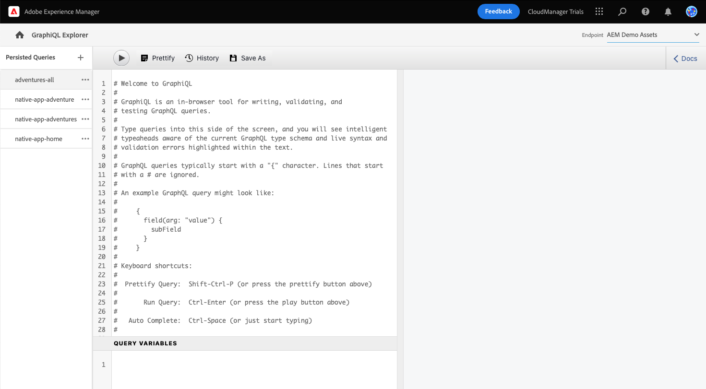
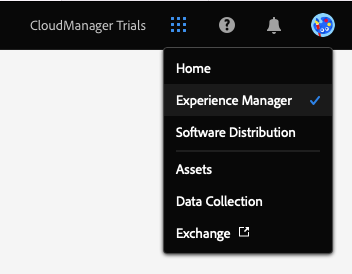

# Estrarre contenuti tramite l’API di GraphQL {#extract-content}

Fino ad ora in AEM Trial for headless, avete [creazione di modelli di frammenti di contenuto personalizzati](content-structure.md) e creare il proprio contenuto headless [Frammenti di contenuto.](create-content.md) Ora puoi imparare a utilizzare Frammenti di contenuto e l’API GraphQL come sistema di gestione dei contenuti headless per distribuire i tuoi contenuti.

GraphQL fornisce un’API basata su query che consente alle applicazioni client esterne di eseguire query AEM solo per il contenuto necessario utilizzando una singola chiamata API.

In primo luogo, verrà illustrato come eseguire due diversi tipi di query: **elenco** e **byPath** query. Quindi imparerai a recuperare il contenuto dal frammento di contenuto creato in precedenza. Il presente documento funge da complemento del tour interattivo, che copre gli stessi passaggi e collega, se del caso, a risorse aggiuntive.

>[!TIP]
>
>Per ulteriori dettagli sull’API di GraphQL, consulta la sezione [Sezione Risorse aggiuntive](#additional-resources) alla fine di questo modulo per la guida API di GraphQL.

## GraphQL Explorer {#graphql-explorer}

Viene avviato GraphQL Explorer. Qui puoi creare ed eseguire query sul tuo contenuto headless.



Per passare direttamente a GraphQL Explorer al di fuori della guida in-app, utilizza l’icona di Adobe in alto a sinistra della pagina. Viene aperta la navigazione globale di AEM. Da qui puoi scegliere il **Strumenti** e quindi **Generale** -> **Editor query GraphQL**.

>[!TIP]
>
>Per ulteriori informazioni sulla navigazione in AEM, consulta la sezione [Sezione Risorse aggiuntive](#additional-resources) di questo documento per ulteriori informazioni AEM gestione di base.

AEM versione di prova viene fornito con un endpoint precaricato con contenuto da cui è possibile estrarre contenuto a scopo di test.


Seleziona la **AEM risorse dimostrative** dall&#39;endpoint **Endpoint** menu a discesa nell’angolo in alto a destra dell’editor, se non lo è già.

## Copiare ed eseguire una query di elenco {#list-query}

Inizia con una semplice query di elenco per orientarti al funzionamento delle API GraphQL di AEM as a Cloud Service. Questo esempio di query elenco restituisce un elenco di tutto il contenuto che utilizza un modello specifico di frammento di contenuto. Le pagine di inventario e categoria in genere utilizzano questo formato di query.

1. Copia il seguente frammento di codice.

   ```text
   {
       adventureList {
         items {
            _path
            adventureTitle
            adventurePrice
            adventureTripLength
            adventurePrimaryImage {
              ... on ImageRef {
               _path
               mimeType
               width
               height
             }
           }
         }
      }
    }
   ```

1. Quindi sostituisci il contenuto esistente nell’editor delle query incollando il codice copiato.

   

1. Una volta incollato, fai clic sul pulsante **Play** in alto a sinistra dell’editor delle query per eseguire la query.

1. Una volta eseguita correttamente la query, i risultati vengono visualizzati nel pannello di destra, accanto all’editor delle query. Se la query non è corretta, viene visualizzato un errore nel pannello di destra.

   

Hai appena convalidato una query di elenco per un elenco completo di tutti i frammenti di contenuto. Questo processo consente di garantire che la risposta sia ciò che l&#39;app si aspetta, con risultati che illustrano come le app e i siti web recupereranno il contenuto creato in AEM.

I diversi canali e piattaforme in cui il contenuto deve essere visualizzato ora possono utilizzare questa query o simili per recuperare il contenuto headless.

## Copiare ed eseguire una query byPath {#bypath-query}

L’esecuzione di una query byPath consente di recuperare le risorse per un frammento di contenuto specifico. Le pagine di dettaglio del prodotto e le pagine che si concentrano su un set specifico di contenuto in genere richiedono questo tipo di query.

1. Copia il seguente frammento di codice.

   ```text
    {
     adventureByPath(
       _path: "/content/dam/aem-demo-assets/en/adventures/bali-surf-camp/bali-surf-camp"
     ) {
       item {
         _path
         adventureTitle
         adventureDescription {
           json
         }
         adventurePrimaryImage {
           ... on ImageRef {
             _path
             width
             height
           }
         }
       }
     }
   }
   ```

1. Quindi sostituisci il contenuto esistente nell’editor delle query incollando il codice copiato.

   

1. Una volta incollato, fai clic sul pulsante **Play** in alto a sinistra dell’editor delle query per eseguire la query.

1. Una volta eseguita correttamente la query, i risultati vengono visualizzati nel pannello di destra, accanto all’editor delle query. Se la query non è corretta, viene visualizzato un errore nel pannello di destra.

1. Una volta eseguita correttamente la query, i risultati vengono visualizzati nel pannello di destra, accanto all’editor delle query. Se la query non è corretta, viene visualizzato un errore nel pannello di destra.

   

Hai appena convalidato una query di elenco per un elenco completo di tutti i frammenti di contenuto. Questo processo consente di garantire che la risposta sia ciò che l&#39;app si aspetta, con risultati che illustrano come le app e i siti web recupereranno il contenuto creato in AEM.

I diversi canali e piattaforme in cui il contenuto deve essere visualizzato ora possono utilizzare questa query o simili per recuperare il contenuto headless.

## Eseguire query sul proprio contenuto {#own-queries}

Dopo aver eseguito i due tipi principali di query, puoi impostare ed eseguire query per il contenuto creato da te.

1. Per eseguire query con frammenti di contenuto personalizzati, modifica l’endpoint dalla **AEM Demo Assets** nella cartella **Il progetto** cartella.

   

1. Inizia selezionando ed eliminando tutto il contenuto esistente nell’editor delle query. Quindi digitare parentesi graffa aperta `{` e premi Ctrl+Spazio o Opzione+Spazio per un elenco completo automatico dei modelli definiti nel modello Frammento di contenuto. Seleziona il modello creato che termina in `List` dall&#39;elenco.

   

1. Definisci gli elementi che la query deve contenere per il modello di frammento di contenuto selezionato. Di nuovo, digitare la parentesi aperta `{`, quindi premere Ctrl+Spazio o Opzione+Spazio per un elenco di completamento automatico. Seleziona `items` dall&#39;elenco.

   

1. Definisci i campi che la query deve contenere per il modello di frammento di contenuto selezionato. Di nuovo, digitare la parentesi aperta `{`, quindi premere Ctrl+Spazio o Opzione+Spazio per un elenco completo automatico dei campi disponibili nel modello Frammento di contenuto. Selezionare dall&#39;elenco i campi desiderati dal modello.

   

1. Delimitare più campi con una virgola (`,`) o spazio e premere nuovamente Ctrl+Spazio o Opzione+Spazio per selezionare altri campi.

1. Quando lavori, puoi toccare o fare clic sul pulsante **Prettificare** per formattare automaticamente il codice in modo da facilitarne la lettura.

   

1. Al termine, tocca o fai clic sul pulsante **Play** in alto a sinistra dell’editor per eseguire la query.

   

In questo modo i contenuti possono essere inviati a esperienze digitali omnicanale. Consulta la sezione [Sezione Risorse aggiuntive](#additional-resources) per ulteriori query di esempio e scopri quanto altro puoi fare con l’API GraphQL.

## Hai imparato a eseguire query sul contenuto! {#conclusion}

Ottimo lavoro! Hai imparato i due tipi di query di base e come eseguire query sul tuo contenuto. Assicurati di controllare il [Sezione Risorse aggiuntive](#additional-resources) per ulteriori query di esempio e scopri quanto altro puoi fare con l’API GraphQL.

Per scoprire come viene utilizzato il contenuto estratto in un’app React personalizzata, controlla il modulo [Personalizzare il contenuto in un’app a reazione di esempio.](customize-app.md)

Per tornare alla schermata iniziale di prova, fai clic su **Soluzioni** in alto a destra nella barra di navigazione e selezionando **Experience Manager**.



## Risorse aggiuntive {#additional-resources}

Per ulteriori informazioni su Frammenti di contenuto e AEM, consulta questa documentazione aggiuntiva.

* [Guida all’API GraphQL](https://experienceleague.adobe.com/docs/experience-manager-learn/getting-started-with-aem-headless/graphql/multi-step/explore-graphql-api.html)
* [Operazioni di base](/help/sites-cloud/authoring/getting-started/basic-handling.md) - Documentazione su come navigare e utilizzare i AEM per i nuovi utenti
* [Imparare a utilizzare GraphQL con AEM: contenuto di esempio e query](https://experienceleague.adobe.com/docs/experience-manager-cloud-service/content/headless/graphql-api/sample-queries.html)
