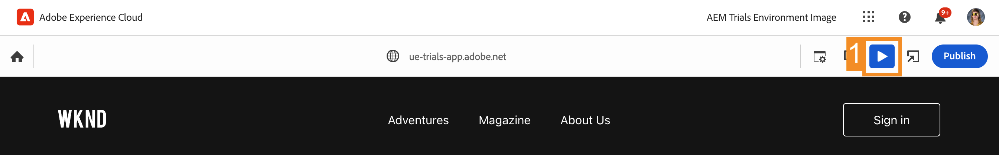

# Modificare nel contesto con l’Editor universale {#editing-in-context}

>[!CONTEXTUALHELP]
>id="aemcloud_sites_trial_edit_inline_universal_editor"
>title="Modificare nel contesto con l’Editor universale"
>abstract="Scopri in che modo le app headless possono utilizzare l’Editor universale per consentire agli autori di apportare facilmente modifiche nel contesto stesso dei contenuti."

>[!CONTEXTUALHELP]
>id="aemcloud_sites_trial_edit_inline_universal_editor_guide"
>title="Avvia l’Editor universale"
>abstract="Questa guida descrive l’Editor universale e come consente a chiunque di modificare ogni aspetto del contenuto in qualsiasi implementazione, per velocizzare le operazioni.  Per avviare questo modulo in una nuova scheda, fai clic qui sotto, quindi segui questa guida."

>[!CONTEXTUALHELP]
>id="aemcloud_sites_trial_edit_inline_universal_editor_guide_footer"
>title="In questo modulo hai imparato a personalizzare il contenuto direttamente nel suo contesto, utilizzando l’Editor universale."
>abstract=""

## Modificare il testo nel contesto {#edit-text}

La modifica diretta e nel contesto può spesso presentare vantaggi rispetto alla modifica strutturata di contenuti headless, come nell’Editor frammento di contenuto visualizzato nei moduli precedenti.

>[!NOTE]
>
>Per utilizzare l’editor universale in questa versione di prova, è necessario utilizzare Chrome come browser e non in modalità di navigazione in incognito. Si tratta di una limitazione dell’esperienza della versione di prova, non dell’editor universale.

L’editor universale consente una modifica del testo veloce, diretta e nel contesto, consentendo un authoring dei contenuti semplice e intuitivo.

1. Fai doppio clic per selezionare il titolo dell’articolo più recente per modificarlo.

   

1. Il componente viene selezionato come indicato da un bordo blu con una linguetta che indica che si tratta di un componente testo. Il cursore si trova sul bordo in attesa di immissione testo. Modifica il testo in `Aloha Spirit in Lofoten`.

   

1. Seleziona all’esterno del componente testo per salvare automaticamente le modifiche.

L’editor universale salva automaticamente le modifiche all’interno dell’ambiente di authoring. Devi comunque pubblicarle per consentire ai lettori di visualizzarle, operazione che eseguiremo in un passaggio successivo.

## Modificare i contenuti multimediali nel contesto {#edit-media}

Utilizzando l’editor universale è inoltre possibile sostituire le immagini rimanendo nel contesto del contenuto.

1. Seleziona l’immagine del surfista per selezionarla.

1. Nella barra dei componenti puoi visualizzare i dettagli della risorsa. Seleziona la miniatura dell’**Immagine in primo piano**.

   

1. Nella finestra **Seleziona risorse**, scorri verso il basso e seleziona l’immagine `surfer-wave-02.JPG` per selezionarla.

1. Seleziona **Seleziona** nella finestra **Seleziona risorse**.

   

L’immagine viene sostituita con quella selezionata.

## Scopri i contenuti allo stesso modo dei tuoi lettori {#emulators}

L’editor universale consente di interagire con il contenuto all’interno del relativo contesto, visualizzandolo così come viene consegnato ai dispositivi degli utenti.

1. Per impostazione predefinita, l’editor esegue il rendering della versione desktop del contenuto. Seleziona il pulsante dell’emulatore in alto a destra della barra degli strumenti dell’editor universale per cambiare il dispositivo di destinazione.

   

1. I lettori possono essere su dispositivi diversi con proporzioni diverse, pertanto l’editor offre modalità di emulazione che mostrano come verrà presentata la pagina agli utenti. Ad esempio, seleziona l’opzione per dispositivo mobile in modalità verticale.

   

1. Puoi visualizzare la modifica del contenuto nell’editor. Anche l’icona dell’emulatore cambia per riflettere la modalità in cui si trova. Seleziona un punto qualsiasi al di fuori del menu dell’emulatore per chiuderlo e interagire con il contenuto.

1. Ripristina l’emulatore in modalità desktop.

Puoi anche specificare le dimensioni esatte dell’emulatore e ruotare il dispositivo emulato per visualizzare il contenuto su qualsiasi potenziale dispositivo di destinazione.

## Anteprima e pubblicazione {#preview}

Poiché devi selezionare il contenuto per modificarlo nell’editor, quest’ultimo non ti consente di seguire i collegamenti o interagire con il contenuto con il tocco o il clic. In modalità anteprima, è possibile seguire i collegamenti all’interno dei contenuti e visualizzarli prima della pubblicazione così come verranno presentati agli utenti.

1. Nella barra degli strumenti dell’editor universale, seleziona **Anteprima**.

1. Ora seleziona il collegamento **Read More** (Leggi) per l’articolo principale.

   

1. Sfoglia l’articolo, quindi utilizza il collegamento **Indietro** per tornare alla pagina principale.

   

1. Ora seleziona il pulsante **Pubblica** in alto a destra nell’editor per pubblicare i contenuti.

   

Il contenuto viene pubblicato.

## Modificare i frammenti di contenuto {#editing-fragments}

Per velocizzare l’authoring dei contenuti quando la modifica strutturata di contenuti headless risulta più vantaggiosa della modifica diretta, dall’editor universale puoi accedere rapidamente anche all’editor di frammenti di contenuto.

1. Disattiva la modalità anteprima toccando il pulsante **Anteprima** sulla barra degli strumenti dell’editor universale.

   

1. Scorri la pagina verso il basso fino alla sezione **Adventures** (Avventure).

1. Seleziona una delle avventure come **Bali Surf Camp** (Campo da surf di Bali) per selezionarla.

   * Osserva il contorno blu del componente selezionato. Quando viene selezionato un frammento di contenuto, nella scheda deve essere visualizzato il nome del frammento di contenuto. In questo caso, **Bali Surf Camp**.
   * Poiché l’editor universale consente di selezionare qualsiasi oggetto nella pagina, è possibile selezionare singolarmente anche i componenti che fanno parte di un frammento di contenuto. Seleziona dove indicato nell’illustrazione per selezionare tutto il componente Frammento di contenuto.

1. L’icona **Modifica** appare nella barra dei componenti. Seleziona l’cona **Modifica** per aprire l’editor dei frammenti di contenuto in una nuova scheda.

Nella nuova scheda è ora possibile modificare il frammento di contenuto selezionato nell’editor universale.
