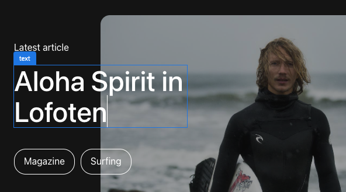

# Modificare nel contesto con l’Editor universale {#editing-in-context}

>[!CONTEXTUALHELP]
>id="aemcloud_sites_trial_edit_inline_universal_editor"
>title="Modificare nel contesto con l’Editor universale"
>abstract="Scopri in che modo le app headless possono utilizzare l’Editor universale per ridurre l’attrito, mentre le modifiche contestuali vengono portate a portata di mano dagli autori."

>[!CONTEXTUALHELP]
>id="aemcloud_sites_trial_edit_inline_universal_editor_guide"
>title="Avviare l’Editor universale"
>abstract="In questa guida, esplori l’Editor universale e il modo in cui consente a chiunque di modificare ogni aspetto del contenuto in qualsiasi implementazione, per velocizzare le operazioni relative ai contenuti.  Per avviare questo modulo in una nuova scheda, fai clic qui sotto, quindi segui questa guida."

>[!CONTEXTUALHELP]
>id="aemcloud_sites_trial_edit_inline_universal_editor_guide_footer"
>title="In questo modulo hai imparato a personalizzare il contenuto direttamente nel suo contesto, utilizzando l’Editor universale."
>abstract=""

## Modifica testo nel contesto {#edit-text}

La modifica diretta e contestuale può spesso essere vantaggiosa rispetto alla modifica strutturata di contenuti headless, come nell’editor dei frammenti di contenuto visualizzato nei moduli precedenti.

>[!NOTE]
>
>Per utilizzare l’Editor universale in questa prova, è necessario utilizzare Chrome come browser e non in modalità di navigazione in incognito. Si tratta di una limitazione dell’esperienza di prova, non dell’editor universale.

Con Universal Editor è possibile modificare il testo in modo semplice e intuitivo.

1. L’editor deve essere caricato per impostazione predefinita in **Componenti** modalità. In caso contrario, selezionare **Componenti** nella barra delle modalità sul lato sinistro dell’editor.

1. Seleziona due volte il titolo dell’articolo più recente da modificare.

   

1. Il componente viene selezionato come indicato da un bordo blu con una scheda che indica che si tratta di un componente testo. Il cursore si trova sul bordo in attesa di immissione testo. Cambia il testo in `Aloha Spirit in Lofoten`.

   

1. Premi il tasto Invio/Ritorna o seleziona all’esterno del componente testo e le modifiche vengono salvate automaticamente.

Universal Editor salva automaticamente le modifiche all&#39;interno dell&#39;ambiente di creazione. Devi comunque pubblicarli per consentire ai tuoi lettori di visualizzarli, operazione che eseguiremo in un passaggio successivo.

## Modifica contenuti multimediali nel contesto {#edit-media}

Utilizzando Universal Editor è inoltre possibile scambiare le immagini rimanendo nel contesto del contenuto.

1. Rimanente in **Componenti** selezionare l&#39;immagine del surfista per selezionarla.

1. Nella barra dei componenti puoi visualizzare i dettagli della risorsa. Seleziona la **Immagine in primo piano** miniatura.

   

1. In **Seleziona risorse** , scorri verso il basso e seleziona la `surfer-wave-02.JPG` per selezionarla.

1. Seleziona **Seleziona** nel **Seleziona risorse** finestra.

   

L’immagine viene sostituita con quella selezionata.

## Scoprite I Contenuti Come I Vostri Reader {#emulators}

L’Editor universale consente di interagire con il contenuto all’interno del suo contesto, visualizzandone il contenuto così come viene distribuito ai dispositivi degli utenti.

1. Per impostazione predefinita, l’editor esegue il rendering della versione desktop del contenuto. Seleziona il pulsante dell’emulatore in alto a destra dell’editor per cambiare il dispositivo di destinazione.

   

1. I Reader possono essere su dispositivi diversi con proporzioni diverse, pertanto l’editor offre modalità di emulazione per vedere come verrà presentata la pagina agli utenti. Ad esempio, seleziona l’opzione per dispositivo mobile in modalità verticale.

   

1. Vedi la modifica del contenuto nell’editor. Anche l’icona dell’emulatore cambia per riflettere la modalità in cui si trova. Seleziona un punto qualsiasi al di fuori del menu dell’emulatore per chiuderlo e interagire con il contenuto.

1. Ripristina l’emulatore in modalità desktop.

Puoi anche specificare le dimensioni esatte dell’emulatore e ruotare il dispositivo emulato per visualizzare il contenuto su qualsiasi potenziale dispositivo di destinazione.

## Anteprima e pubblicazione {#preview}

Poiché devi selezionare il contenuto nell’editor, quest’ultimo non ti consente di seguire i collegamenti o interagire con il contenuto toccando o facendo clic su quando è in modalità di modifica. Utilizzando la modalità anteprima, puoi seguire i collegamenti all’interno dei contenuti e visualizzarli allo stesso modo degli utenti prima della pubblicazione.

1. Nella barra della modalità sul lato sinistro dell’editor, seleziona **Anteprima**.

1. Ora seleziona la **Ulteriori informazioni** collegamento per l’articolo principale.

   

1. Sfoglia l’articolo, quindi utilizza **Indietro** per tornare alla pagina principale.

   

1. Ora seleziona la **Pubblica** in alto a destra nell’editor per pubblicare i contenuti.

   

Il contenuto viene pubblicato.

## Modifica di frammenti di contenuto {#editing-fragments}

Per accelerare l’esperienza di authoring dei contenuti quando la modifica strutturata di contenuti headless è più vantaggiosa della modifica diretta, l’editor universale consente di accedere rapidamente anche all’editor di frammenti di contenuto.

1. Scorri verso il basso nella pagina fino a **Avventure** sezione.

1. Nella barra della modalità sul lato sinistro dell’editor, seleziona **Componenti**. Questo consente di selezionare i componenti della pagina nell’editor.

1. Seleziona una delle avventure come **Campo da surf di Bali** per selezionarlo.

   * Osserva il contorno blu del componente selezionato. Quando viene selezionato un frammento di contenuto, nella scheda deve essere visualizzato il nome del frammento di contenuto. In questo caso **Campo da surf di Bali**.
   * Poiché l’Editor universale consente di selezionare qualsiasi oggetto nella pagina, è possibile selezionare singolarmente anche i componenti che fanno parte di un frammento di contenuto. Seleziona dove indicato nell’illustrazione per selezionare l’intero componente Frammento di contenuto.

1. Il **Modifica** nella barra dei componenti. Seleziona la **Modifica** per aprire l’editor dei frammenti di contenuto in una nuova scheda.

Nella nuova scheda è ora possibile modificare il frammento di contenuto selezionato nell’Editor universale.
